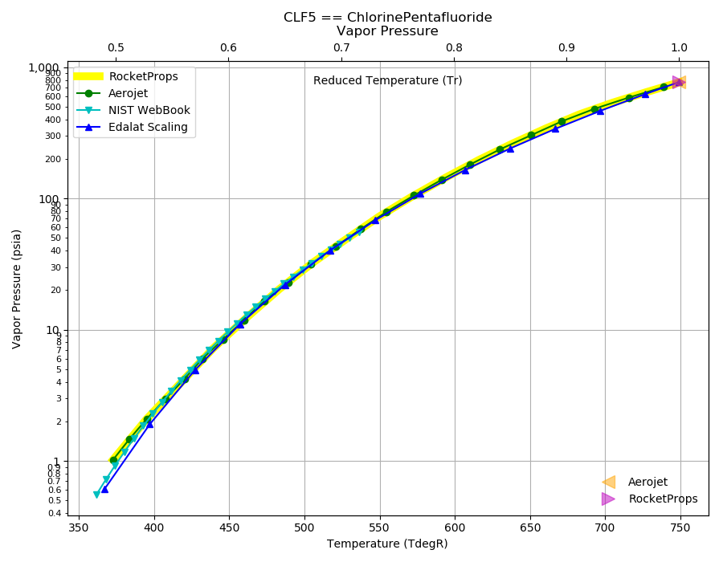
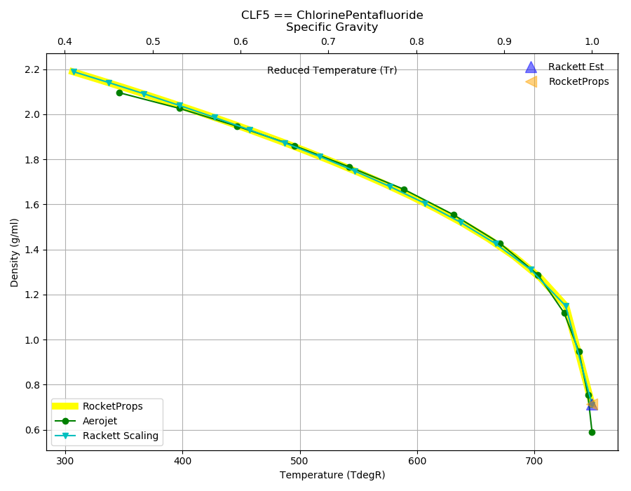
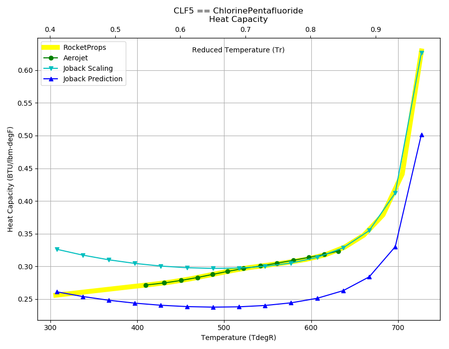
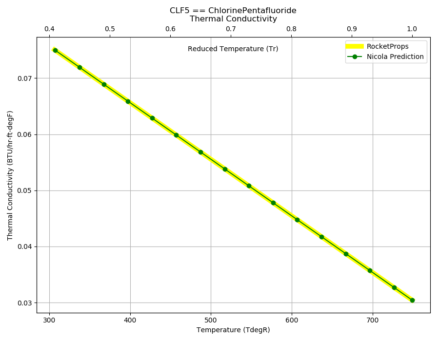

.. clf5_prop

CLF5
====

Reference Points
----------------

CLF5 == ChlorinePentafluoride

`Hover over column headers to see definitions, values to see alternate units`

.. raw:: html

    <table width="100%">
    <tr><th></th>
        <th title="Reference Temperature">Tref</th>
        <th title="Reference Pressure">Pref</th>
        <th title="Specific Gravity">SG</th>
        <th title="Specific Heat">Cp</th>
        <th title="Heat of Vaporization">dHvap</th>
        <th title="Viscosity">Visc</th>
        <th title="Thermal Conductivity">Cond</th>
        <th title="Surface Tension">Surf</th>
    <tr><th>Source</th><th>R</th><th>psia</th><th>g/ml</th><th>BTU/lbm-R</th><th>BTU/lbm</th><th>poise</th><th>BTU/hr-ft-R</th><th>lbf/in</th></tr>

    <tr  style="background-color:#FFFF00"><td><a class="reference external" href="https://pypi.python.org/pypi/rocketprops">RocketProps</a></td><td  title="468.208 degR
    260.116 degK
    8.53824 degF
    -13.0343 degC">468.2</td><td  title="14.6959 psia
    0.999997 atm
    1.01325 bar
    0.101325 MPa">14.7</td><td  title="1.90998 SG
    119.236 lbm/ft**3
    0.0690024 lbm/inch**3
    1909.98 kg/m**3">1.9100</td><td  title="0.282844 BTU/lbm/F
    0.283033 cal/g/C
    0.000283033 kcal/g/C
    1184.21 J/kg/K">0.283</td><td  title="76.0399 BTU/lbm
    42.2727 cal/g
    0.0422727 kcal/g
    176.869 J/g">76.0</td><td  title="0.00464742 poise
    0.464742 cpoise
    0.000464742 Pa*s
    2.60243e-05 lbm/s/inch
    0.0936876 lbm/hr/inch
    1.67307 kg/hr/m
    0.0167307 kg/hr/cm">4.647e-03</td><td  title="0.0587355 BTU/hr/ft/delF
    1.35962e-06 BTU/s/inch/delF
    0.000242963 cal/s/cm/delC
    0.0242963 cal/s/m/delC
    0.00101656 W/cm/delC">0.0587</td><td  title="0.000120409 lbf/in
    0.0210868 N/m
    21.0868 mN/m
    21.0868 dyne/cm">1.204e-04</td></tr>
    <tr ><td><a class="reference external" href="./_static/Aerojet_Propellant_Properties.pdf">Aerojet</a></td><td  title="468.208 degR
    260.116 degK
    8.53824 degF
    -13.0343 degC">468.2</td><td  title="14.6959 psia
    0.999997 atm
    1.01325 bar
    0.101325 MPa">14.7</td><td  title="1.90998 SG
    119.236 lbm/ft**3
    0.0690024 lbm/inch**3
    1909.98 kg/m**3">1.9100</td><td  title="0.28281 BTU/lbm/F
    0.282999 cal/g/C
    0.000282999 kcal/g/C
    1184.07 J/kg/K">0.283</td><td  title="76.04 BTU/lbm
    42.2727 cal/g
    0.0422727 kcal/g
    176.869 J/g">76.0</td><td  title="0.00464708 poise
    0.464708 cpoise
    0.000464708 Pa*s
    2.60224e-05 lbm/s/inch
    0.0936808 lbm/hr/inch
    1.67295 kg/hr/m
    0.0167295 kg/hr/cm">4.647e-03</td><td >---</td><td >---</td></tr>

    </table>

Fluid Properties
----------------

CLF5 == ChlorinePentafluoride

`Hover over column headers to see definitions, values to see alternate units`

.. raw:: html

    <table width="100%">
    <tr><th></th>
        <th title="Molecular Weight">MolWt</th>
        <th title="Critical Temperature">Tc</th>
        <th title="Critical Pressure">Pc</th>
        <th title="Critical Density">SGc</th>
        <th title="Critical Compressibility Factor">Zc</th>
        <th title="Normal Boiling Point">Tnbp</th>
        <th title="Melting/Freezing Point">Tmelt</th>
        <th title="Pitzer Acentric Factor">omega</th></tr>
    <tr><th>Source</th><th>g/gmole</th><th>R</th><th>psia</th><th>g/ml</th><th>(-)</th><th>R</th><th>R</th><th>(-)</th></tr>

    <tr  style="background-color:#FFFF00"><td><a class="reference external" href="https://pypi.python.org/pypi/rocketprops">RocketProps</a></td><td>130.445</td><td  title="749.07 degR
    416.15 degK
    289.4 degF
    143 degC">749.1</td><td  title="771 psia
    52.4634 atm
    53.1586 bar
    5.31586 MPa">771.0</td><td  title="0.712705 SG
    44.4927 lbm/ft**3
    0.0257481 lbm/inch**3
    712.705 kg/m**3">0.7127</td><td>0.2813</td><td  title="466.97 degR
    259.428 degK
    7.3 degF
    -13.7222 degC">467.0</td><td  title="306.27 degR
    170.15 degK
    -153.4 degF
    -103 degC">306.3</td><td>0.22425</td></tr>
    <tr ><td><a class="reference external" href="./_static/Aerojet_Propellant_Properties.pdf">Aerojet</a></td><td>130.445</td><td  title="749.07 degR
    416.15 degK
    289.4 degF
    143 degC">749.1</td><td  title="771 psia
    52.4634 atm
    53.1586 bar
    5.31586 MPa">771.0</td><td  title="0.712705 SG
    44.4927 lbm/ft**3
    0.0257481 lbm/inch**3
    712.705 kg/m**3">0.7127</td><td>0.2813</td><td  title="466.97 degR
    259.428 degK
    7.3 degF
    -13.7222 degC">467.0</td><td  title="306.27 degR
    170.15 degK
    -153.4 degF
    -103 degC">306.3</td><td>0.22425</td></tr>

    </table>

Vapor Pressure
--------------

.. raw:: html

    

        

    

    

.. raw:: html

    

  

| RocketProps Selected Curve
| :ref:`Aerojet Source`
| :ref:`NIST Webbook`
| :ref:`Edalat Source`

.. raw:: html

    

    

    
`Click Image to View Fill Size`

Density
-------

.. raw:: html

    

        

    

    

.. raw:: html

    

  

| RocketProps Selected Curve
| :ref:`Aerojet Source`
| :ref:`Rackett Scaling Source`

.. raw:: html

    

    

    
`Click Image to View Fill Size`

Heat Capacity
-------------

.. raw:: html

    

        

    

    

.. raw:: html

    

  

| RocketProps Selected Curve
| :ref:`Aerojet Source`
| :ref:`Joback Source`

.. raw:: html

    

    

    
`Click Image to View Fill Size`

Viscosity
---------

.. raw:: html

    

        

    
.. image:: ./_static/CLF5_Visc.png
   :target: ./_static/CLF5_Visc.png
    

.. raw:: html

    

  

| RocketProps Selected Curve
| :ref:`Aerojet Source`
| :ref:`Squires Source`

.. raw:: html

    

    

    
`Click Image to View Fill Size`

Heat of Vaporization
--------------------

.. raw:: html

    

        

    
.. image:: ./_static/CLF5_Hvap.png
   :target: ./_static/CLF5_Hvap.png
    

.. raw:: html

    

  

| RocketProps Selected Curve
| :ref:`Aerojet Source`
| :ref:`Pitzer Hvap Source`

.. raw:: html

    

    

    
`Click Image to View Fill Size`

Thermal Conductivity
--------------------

.. raw:: html

    

        

    

    

.. raw:: html

    

  

| RocketProps Selected Curve
| :ref:`Nicola Source`

.. raw:: html

    

    

    
`Click Image to View Fill Size`

Surface Tension
---------------

    

.. raw:: html

    

        

    
.. image:: ./_static/CLF5_Surf.png
   :target: ./_static/CLF5_Surf.png
    

.. raw:: html

    

  

| RocketProps Selected Curve
| :ref:`Pitzer Surf Source`

.. raw:: html

    

    

    
`Click Image to View Fill Size`

