.. high_press

High Pressure
=============

RocketProps contains saturated liquid data and uses the 
`corresponding states principle (CSP) <https://en.wikipedia.org/wiki/Theorem_of_corresponding_states>`_
to extrapolate that data to higher pressure.

Density
-------

For those propellants in `REFPROP <https://www.nist.gov/srd/refprop>`_ 
or `CoolProp <http://www.coolprop.org/index.html#what-is-coolprop>`_,
high pressure density data is curve fit to those high-quality data.

Those data are curve fit to a modified, polynomial version of the 
`Tait equation <https://en.wikipedia.org/wiki/Tait_equation>`_

:ref:`Gas&Liq 5th Ed Source`
defines the Tait equation with equation 4-12.2

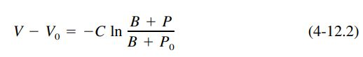

When no data are available, there are a number of correlations available to approximate
the density at high pressure.

COSTALD
```````

The `COSTALD <https://thermo.readthedocs.io/thermo.volume.html#thermo.volume.COSTALD>`_
model is a CSP model taken from the `thermo <https://pypi.org/project/thermo/>`_  project which is an open-source 
project on `pypi.org <https://pypi.org/>`_ developed by Caleb Bell 
and Contributors (2016-2020). 

In the comparison plots below, it seems to be the most accurate model for all propellants,
except for alcohols and parahydrogen.

Chang-Zhao
``````````

The Chang-Zhao is taken from :ref:`Gas&Liq 5th Ed Source`
as defined by equation 4-12.3

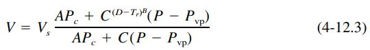

There is a 2nd version of Chang-Zhao
as modified in 
`Journal of Molecular Liquids 160 (2011) 94-102 <./_static/Density_calculation_of_liquid_organic.pdf>`_
that is also made available in RocketProps.

Nasrfar
```````

`Journal of Molecular Liquids 160 (2011) 94-102 <./_static/Density_calculation_of_liquid_organic.pdf>`_
provides another model for compressed density as developed by Nasrfar Moshfeghian.


Model Comparisons
-----------------

The following charts compare high accuracy density calculations 
(`CoolProp <http://www.coolprop.org/index.html#what-is-coolprop>`_)
to the results of RocketProps curve fits and to each of the models mentioned above
`COSTALD <https://thermo.readthedocs.io/thermo.volume.html#thermo.volume.COSTALD>`_,
Chang-Zhao 1, Chang-Zhao 2 and Nasrfar.

Each chart shows the percent standard deviation (%SD) of each model as compared to
`CoolProp <http://www.coolprop.org/index.html#what-is-coolprop>`_.
The error of each model has a 95% chance of being within 2 times %SD,
99.7% chance of being within 3 times %SD.

The charts are shown in order from worst to best in terms of %SD.

Except for the three worst fluids, parahydrogen and the alcohols,
the `COSTALD <https://thermo.readthedocs.io/thermo.volume.html#thermo.volume.COSTALD>`_,
model matches high pressure propellant density better than
Chang-Zhao 1, Chang-Zhao 2 or Nasrfar. Usually with less than 1% error; often much less.

For this reason, 
`COSTALD <https://thermo.readthedocs.io/thermo.volume.html#thermo.volume.COSTALD>`_
is the default model for propellants without detailed high pressure density data within RocketProps.

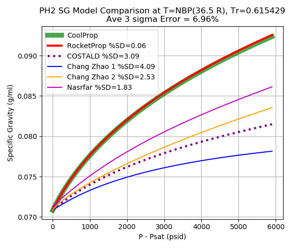
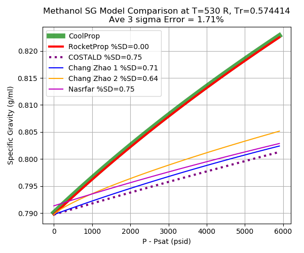
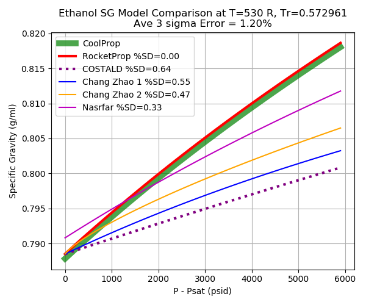
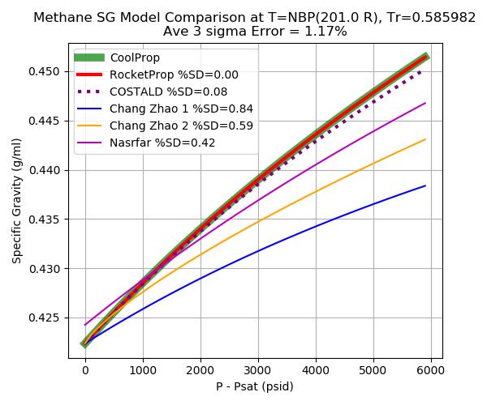
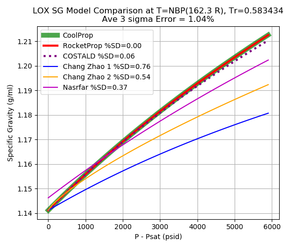
.. image:: ./_static/Water_sg_compare.png
.. image:: ./_static/F2_sg_compare.png
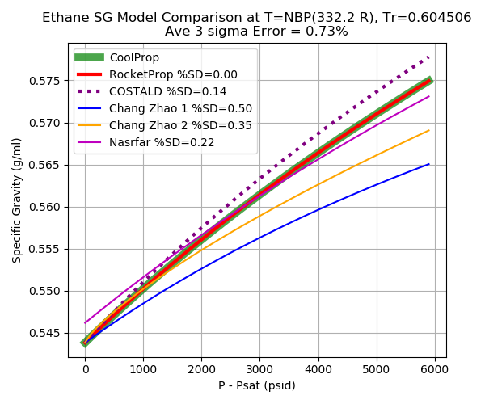
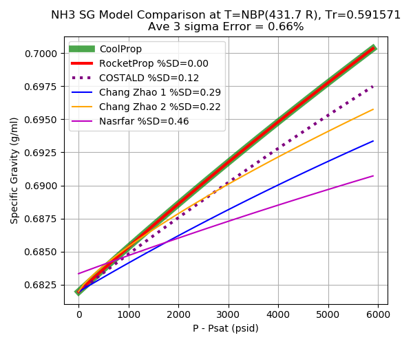
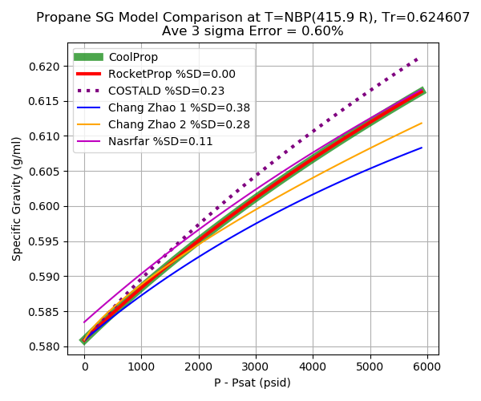
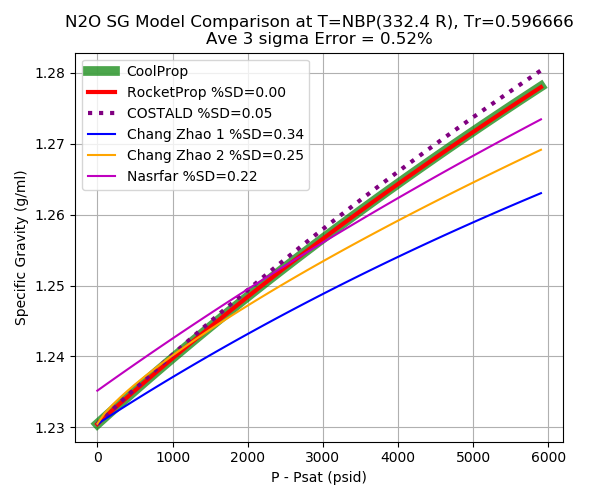

