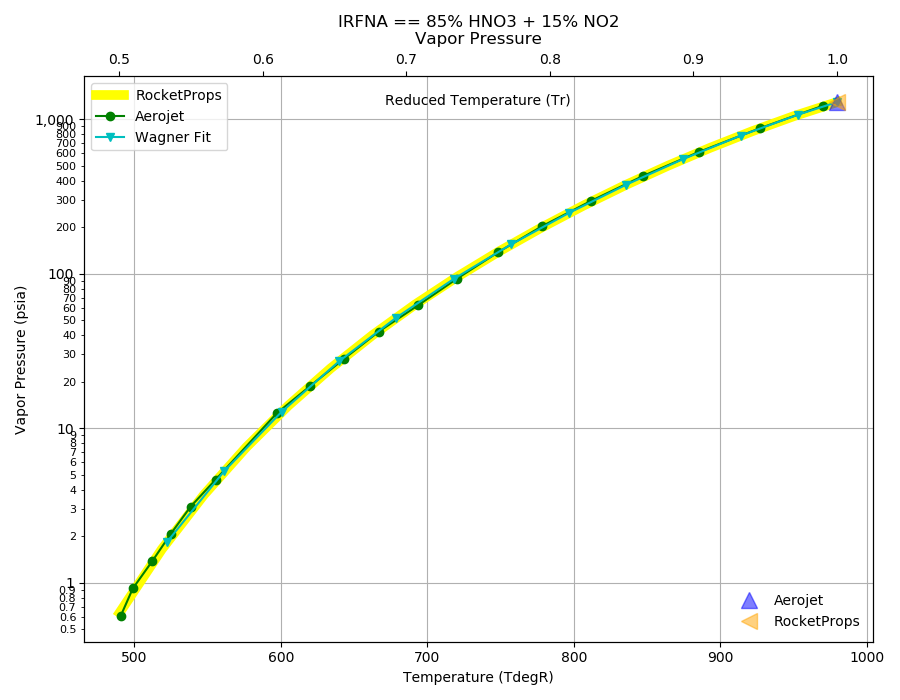
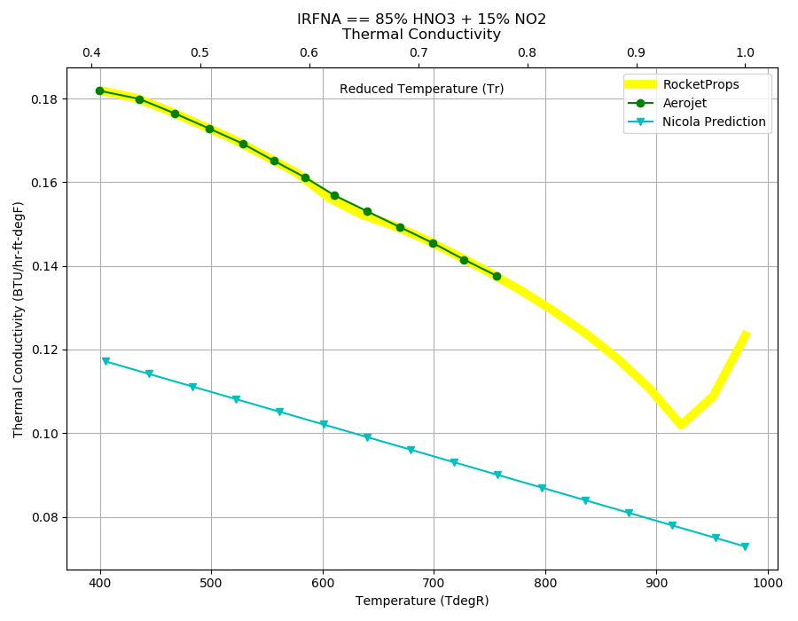

.. irfna_prop

IRFNA
=====

IRFNA is an acronym for Inhibited Red Fuming Nitric Acid.

`IRFNA is largely replaced by N2O4 <http://www.astronautix.com/n/nitricacidkerosene.html>`_ as a storable oxidizer.

Reference Points
----------------

IRFNA == 85% HNO3 + 15% NO2

`Hover over column headers to see definitions, values to see alternate units`

.. raw:: html

    <table width="100%">
    <tr><th></th>
        <th title="Reference Temperature">Tref</th>
        <th title="Reference Pressure">Pref</th>
        <th title="Specific Gravity">SG</th>
        <th title="Specific Heat">Cp</th>
        <th title="Heat of Vaporization">dHvap</th>
        <th title="Viscosity">Visc</th>
        <th title="Thermal Conductivity">Cond</th>
        <th title="Surface Tension">Surf</th>
    <tr><th>Source</th><th>R</th><th>psia</th><th>g/ml</th><th>BTU/lbm-R</th><th>BTU/lbm</th><th>poise</th><th>BTU/hr-ft-R</th><th>lbf/in</th></tr>

    <tr  style="background-color:#FFFF00"><td><a class="reference external" href="https://pypi.python.org/pypi/rocketprops">RocketProps</a></td><td  title="527.67 degR
    293.15 degK
    68 degF
    20 degC">527.7</td><td  title="14.6959 psia
    0.999997 atm
    1.01325 bar
    0.101325 MPa">14.7</td><td  title="1.57624 SG
    98.4014 lbm/ft**3
    0.0569453 lbm/inch**3
    1576.24 kg/m**3">1.5762</td><td  title="0.419083 BTU/lbm/F
    0.419364 cal/g/C
    0.000419364 kcal/g/C
    1754.62 J/kg/K">0.419</td><td  title="247 BTU/lbm
    137.314 cal/g
    0.137314 kcal/g
    574.522 J/g">247.0</td><td  title="0.0131885 poise
    1.31885 cpoise
    0.00131885 Pa*s
    7.38523e-05 lbm/s/inch
    0.265868 lbm/hr/inch
    4.74787 kg/hr/m
    0.0474787 kg/hr/cm">1.319e-02</td><td  title="0.169211 BTU/hr/ft/delF
    3.91693e-06 BTU/s/inch/delF
    0.000699952 cal/s/cm/delC
    0.0699952 cal/s/m/delC
    0.0029286 W/cm/delC">0.1692</td><td  title="0.000266522 lbf/in
    0.0466752 N/m
    46.6752 mN/m
    46.6752 dyne/cm">2.665e-04</td></tr>
    <tr ><td><a class="reference external" href="./_static/Aerojet_Propellant_Properties.pdf">Aerojet</a></td><td  title="527.67 degR
    293.15 degK
    68 degF
    20 degC">527.7</td><td  title="14.6959 psia
    0.999997 atm
    1.01325 bar
    0.101325 MPa">14.7</td><td  title="1.57624 SG
    98.4014 lbm/ft**3
    0.0569453 lbm/inch**3
    1576.24 kg/m**3">1.5762</td><td  title="0.41906 BTU/lbm/F
    0.41934 cal/g/C
    0.00041934 kcal/g/C
    1754.52 J/kg/K">0.419</td><td  title="247 BTU/lbm
    137.314 cal/g
    0.137314 kcal/g
    574.522 J/g">247.0</td><td  title="0.0131799 poise
    1.31799 cpoise
    0.00131799 Pa*s
    7.38042e-05 lbm/s/inch
    0.265695 lbm/hr/inch
    4.74478 kg/hr/m
    0.0474478 kg/hr/cm">1.318e-02</td><td  title="0.169274 BTU/hr/ft/delF
    3.91839e-06 BTU/s/inch/delF
    0.000700213 cal/s/cm/delC
    0.0700213 cal/s/m/delC
    0.00292969 W/cm/delC">0.1693</td><td >---</td></tr>

    </table>

Fluid Properties
----------------

IRFNA == 85% HNO3 + 15% NO2

`Hover over column headers to see definitions, values to see alternate units`

.. raw:: html

    <table width="100%">
    <tr><th></th>
        <th title="Molecular Weight">MolWt</th>
        <th title="Critical Temperature">Tc</th>
        <th title="Critical Pressure">Pc</th>
        <th title="Critical Density">SGc</th>
        <th title="Critical Compressibility Factor">Zc</th>
        <th title="Normal Boiling Point">Tnbp</th>
        <th title="Melting/Freezing Point">Tmelt</th>
        <th title="Pitzer Acentric Factor">omega</th></tr>
    <tr><th>Source</th><th>g/gmole</th><th>R</th><th>psia</th><th>g/ml</th><th>(-)</th><th>R</th><th>R</th><th>(-)</th></tr>

    <tr  style="background-color:#FFFF00"><td><a class="reference external" href="https://pypi.python.org/pypi/rocketprops">RocketProps</a></td><td>59.700</td><td  title="979.67 degR
    544.261 degK
    520 degF
    271.111 degC">979.7</td><td  title="1286 psia
    87.5071 atm
    88.6666 bar
    8.86666 MPa">1286.0</td><td  title="0.53685 SG
    33.5145 lbm/ft**3
    0.0193949 lbm/inch**3
    536.85 kg/m**3">0.5369</td><td>0.2179</td><td  title="607.67 degR
    337.594 degK
    148 degF
    64.4444 degC">607.7</td><td  title="403.67 degR
    224.261 degK
    -56 degF
    -48.8889 degC">403.7</td><td>0.34879</td></tr>
    <tr ><td><a class="reference external" href="./_static/Aerojet_Propellant_Properties.pdf">Aerojet</a></td><td>59.700</td><td  title="979.67 degR
    544.261 degK
    520 degF
    271.111 degC">979.7</td><td  title="1286 psia
    87.5071 atm
    88.6666 bar
    8.86666 MPa">1286.0</td><td  title="0.53685 SG
    33.5145 lbm/ft**3
    0.0193949 lbm/inch**3
    536.85 kg/m**3">0.5369</td><td>0.2179</td><td  title="607.67 degR
    337.594 degK
    148 degF
    64.4444 degC">607.7</td><td  title="403.67 degR
    224.261 degK
    -56 degF
    -48.8889 degC">403.7</td><td>0.36465</td></tr>

    </table>

Vapor Pressure
--------------

.. raw:: html

    

        

    

    

.. raw:: html

    

  

| RocketProps Selected Curve
| :ref:`Aerojet Source`
| :ref:`Wagner Fit Source`

.. raw:: html

    

    

    
`Click Image to View Fill Size`

Density
-------

.. raw:: html

    

        

    
.. image:: ./_static/IRFNA_SG.png
   :target: ./_static/IRFNA_SG.png
    

.. raw:: html

    

  

| RocketProps Selected Curve
| :ref:`Aerojet Source`
| :ref:`Rackett Scaling Source`

.. raw:: html

    

    

    
`Click Image to View Fill Size`

Heat Capacity
-------------

.. raw:: html

    

        

    
.. image:: ./_static/IRFNA_Cp.png
   :target: ./_static/IRFNA_Cp.png
    

.. raw:: html

    

  

| RocketProps Selected Curve
| :ref:`Aerojet Source`
| :ref:`Joback Source`

.. raw:: html

    

    

    
`Click Image to View Fill Size`

Viscosity
---------

.. raw:: html

    

        

    
.. image:: ./_static/IRFNA_Visc.png
   :target: ./_static/IRFNA_Visc.png
    

.. raw:: html

    

  

| RocketProps Selected Curve
| :ref:`Aerojet Source`
| :ref:`Squires Source`

.. raw:: html

    

    

    
`Click Image to View Fill Size`

Heat of Vaporization
--------------------

.. raw:: html

    

        

    
.. image:: ./_static/IRFNA_Hvap.png
   :target: ./_static/IRFNA_Hvap.png
    

.. raw:: html

    

  

| RocketProps Selected Curve
| :ref:`Aerojet Source`
| :ref:`Pitzer Hvap Source`

.. raw:: html

    

    

    
`Click Image to View Fill Size`

Thermal Conductivity
--------------------

.. raw:: html

    

        

    

    

.. raw:: html

    

  

| RocketProps Selected Curve
| :ref:`Aerojet Source`
| :ref:`Nicola Source`

.. raw:: html

    

    

    
`Click Image to View Fill Size`

Surface Tension
---------------

    

.. raw:: html

    

        

    
.. image:: ./_static/IRFNA_Surf.png
   :target: ./_static/IRFNA_Surf.png
    

.. raw:: html

    

  

| RocketProps Selected Curve
| :ref:`Pitzer Surf Source`

.. raw:: html

    

    

    
`Click Image to View Fill Size`

