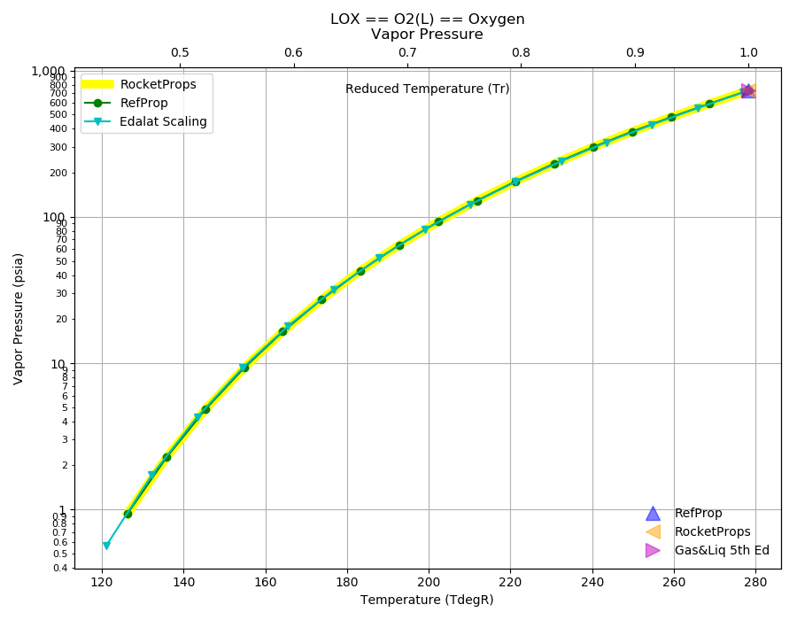
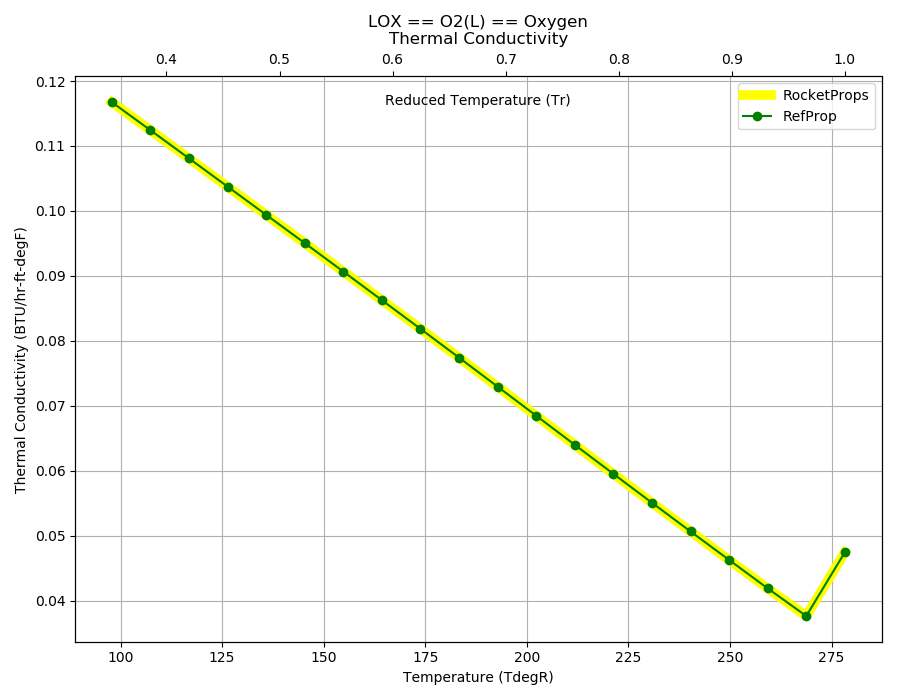

.. lox_prop

LOX
===

`LOX <http://www.astronautix.com/l/lox.html>`_ is used in a very large variety of
space engines. Most commonly with 
`LOX/Kerosene <http://www.astronautix.com/l/loxkerosene.html>`_, 
`LOX/LH2 <http://www.astronautix.com/l/loxlh2.html>`_ and 
`LOX/CH4 <http://www.astronautix.com/l/loxlch4.html>`_ .

Reference Points
----------------

LOX == O2(L) == Oxygen

`Hover over column headers to see definitions, values to see alternate units`

.. raw:: html

    <table width="100%">
    <tr><th></th>
        <th title="Reference Temperature">Tref</th>
        <th title="Reference Pressure">Pref</th>
        <th title="Specific Gravity">SG</th>
        <th title="Specific Heat">Cp</th>
        <th title="Heat of Vaporization">dHvap</th>
        <th title="Viscosity">Visc</th>
        <th title="Thermal Conductivity">Cond</th>
        <th title="Surface Tension">Surf</th>
    <tr><th>Source</th><th>R</th><th>psia</th><th>g/ml</th><th>BTU/lbm-R</th><th>BTU/lbm</th><th>poise</th><th>BTU/hr-ft-R</th><th>lbf/in</th></tr>

    <tr  style="background-color:#FFFF00"><td><a class="reference external" href="https://pypi.python.org/pypi/rocketprops">RocketProps</a></td><td  title="162.338 degR
    90.1878 degK
    -297.332 degF
    -182.962 degC">162.3</td><td  title="14.6959 psia
    0.999997 atm
    1.01325 bar
    0.101325 MPa">14.7</td><td  title="1.14117 SG
    71.2412 lbm/ft**3
    0.0412275 lbm/inch**3
    1141.17 kg/m**3">1.1412</td><td  title="0.405886 BTU/lbm/F
    0.406158 cal/g/C
    0.000406158 kcal/g/C
    1699.37 J/kg/K">0.406</td><td  title="91.6588 BTU/lbm
    50.9557 cal/g
    0.0509557 kcal/g
    213.198 J/g">91.7</td><td  title="0.00194672 poise
    0.194672 cpoise
    0.000194672 Pa*s
    1.09011e-05 lbm/s/inch
    0.0392441 lbm/hr/inch
    0.70082 kg/hr/m
    0.0070082 kg/hr/cm">1.947e-03</td><td  title="0.0871745 BTU/hr/ft/delF
    2.01793e-06 BTU/s/inch/delF
    0.000360602 cal/s/cm/delC
    0.0360602 cal/s/m/delC
    0.00150876 W/cm/delC">0.0872</td><td  title="7.52227e-05 lbf/in
    0.0131735 N/m
    13.1735 mN/m
    13.1735 dyne/cm">7.522e-05</td></tr>
    <tr ><td><a class="reference external" href="https://www.nist.gov/srd/refprop">RefProp</a></td><td  title="162.338 degR
    90.1878 degK
    -297.332 degF
    -182.962 degC">162.3</td><td  title="14.6959 psia
    0.999997 atm
    1.01325 bar
    0.101325 MPa">14.7</td><td  title="1.14117 SG
    71.2412 lbm/ft**3
    0.0412275 lbm/inch**3
    1141.17 kg/m**3">1.1412</td><td  title="0.405886 BTU/lbm/F
    0.406158 cal/g/C
    0.000406158 kcal/g/C
    1699.37 J/kg/K">0.406</td><td  title="91.6588 BTU/lbm
    50.9557 cal/g
    0.0509557 kcal/g
    213.198 J/g">91.7</td><td  title="0.00194672 poise
    0.194672 cpoise
    0.000194672 Pa*s
    1.09011e-05 lbm/s/inch
    0.0392441 lbm/hr/inch
    0.70082 kg/hr/m
    0.0070082 kg/hr/cm">1.947e-03</td><td  title="0.0871745 BTU/hr/ft/delF
    2.01793e-06 BTU/s/inch/delF
    0.000360602 cal/s/cm/delC
    0.0360602 cal/s/m/delC
    0.00150876 W/cm/delC">0.0872</td><td  title="7.52227e-05 lbf/in
    0.0131735 N/m
    13.1735 mN/m
    13.1735 dyne/cm">7.522e-05</td></tr>

    </table>

Fluid Properties
----------------

LOX == O2(L) == Oxygen

`Hover over column headers to see definitions, values to see alternate units`

.. raw:: html

    <table width="100%">
    <tr><th></th>
        <th title="Molecular Weight">MolWt</th>
        <th title="Critical Temperature">Tc</th>
        <th title="Critical Pressure">Pc</th>
        <th title="Critical Density">SGc</th>
        <th title="Critical Compressibility Factor">Zc</th>
        <th title="Normal Boiling Point">Tnbp</th>
        <th title="Melting/Freezing Point">Tmelt</th>
        <th title="Pitzer Acentric Factor">omega</th></tr>
    <tr><th>Source</th><th>g/gmole</th><th>R</th><th>psia</th><th>g/ml</th><th>(-)</th><th>R</th><th>R</th><th>(-)</th></tr>

    <tr  style="background-color:#FFFF00"><td><a class="reference external" href="https://pypi.python.org/pypi/rocketprops">RocketProps</a></td><td>31.999</td><td  title="278.246 degR
    154.581 degK
    -181.424 degF
    -118.569 degC">278.2</td><td  title="731.425 psia
    49.7705 atm
    50.43 bar
    5.043 MPa">731.4</td><td  title="0.436138 SG
    27.2272 lbm/ft**3
    0.0157565 lbm/inch**3
    436.138 kg/m**3">0.4361</td><td>0.2879</td><td  title="162.338 degR
    90.1878 degK
    -297.332 degF
    -182.962 degC">162.3</td><td  title="97.8498 degR
    54.361 degK
    -361.82 degF
    -218.789 degC">97.8</td><td>0.02217</td></tr>
    <tr ><td><a class="reference external" href="https://www.nist.gov/srd/refprop">RefProp</a></td><td>31.999</td><td  title="278.246 degR
    154.581 degK
    -181.424 degF
    -118.569 degC">278.2</td><td  title="731.425 psia
    49.7705 atm
    50.43 bar
    5.043 MPa">731.4</td><td  title="0.436138 SG
    27.2272 lbm/ft**3
    0.0157565 lbm/inch**3
    436.138 kg/m**3">0.4361</td><td>0.2879</td><td  title="162.338 degR
    90.1878 degK
    -297.332 degF
    -182.962 degC">162.3</td><td  title="97.8498 degR
    54.361 degK
    -361.82 degF
    -218.789 degC">97.8</td><td>0.02217</td></tr>
    <tr ><td><a class="reference external" href="./sources.html#gas&liq-5th-ed">Gas&Liq 5th Ed</a></td><td>31.999</td><td  title="278.244 degR
    154.58 degK
    -181.426 degF
    -118.57 degC">278.2</td><td  title="731.425 psia
    49.7705 atm
    50.43 bar
    5.043 MPa">731.4</td><td  title="0.436132 SG
    27.2268 lbm/ft**3
    0.0157563 lbm/inch**3
    436.132 kg/m**3">0.4361</td><td>0.2880</td><td  title="162.306 degR
    90.17 degK
    -297.364 degF
    -182.98 degC">162.3</td><td  title="97.848 degR
    54.36 degK
    -361.822 degF
    -218.79 degC">97.8</td><td>---</td></tr>

    </table>

Vapor Pressure
--------------

.. raw:: html

    

        

    

    

.. raw:: html

    

  

| RocketProps Selected Curve
| :ref:`RefProp Source`
| :ref:`Edalat Source`

.. raw:: html

    

    

    
`Click Image to View Fill Size`

Density
-------

.. raw:: html

    

        

    
.. image:: ./_static/LOX_SG.png
   :target: ./_static/LOX_SG.png
    

.. raw:: html

    

  

| RocketProps Selected Curve
| :ref:`RefProp Source`
| :ref:`Rackett Scaling Source`
| :ref:`Gas&Liq 5th Ed Source`

.. raw:: html

    

    

    
`Click Image to View Fill Size`

Heat Capacity
-------------

.. raw:: html

    

        

    
.. image:: ./_static/LOX_Cp.png
   :target: ./_static/LOX_Cp.png
    

.. raw:: html

    

  

| RocketProps Selected Curve
| :ref:`RefProp Source`

.. raw:: html

    

    

    
`Click Image to View Fill Size`

Viscosity
---------

.. raw:: html

    

        

    
.. image:: ./_static/LOX_Visc.png
   :target: ./_static/LOX_Visc.png
    

.. raw:: html

    

  

| RocketProps Selected Curve
| :ref:`RefProp Source`

.. raw:: html

    

    

    
`Click Image to View Fill Size`

Heat of Vaporization
--------------------

.. raw:: html

    

        

    
.. image:: ./_static/LOX_Hvap.png
   :target: ./_static/LOX_Hvap.png
    

.. raw:: html

    

  

| RocketProps Selected Curve
| :ref:`RefProp Source`
| :ref:`Pitzer Hvap Source`

.. raw:: html

    

    

    
`Click Image to View Fill Size`

Thermal Conductivity
--------------------

.. raw:: html

    

        

    

    

.. raw:: html

    

  

| RocketProps Selected Curve
| :ref:`RefProp Source`

.. raw:: html

    

    

    
`Click Image to View Fill Size`

Surface Tension
---------------

    

.. raw:: html

    

        

    
.. image:: ./_static/LOX_Surf.png
   :target: ./_static/LOX_Surf.png
    

.. raw:: html

    

  

| RocketProps Selected Curve
| :ref:`RefProp Source`
| :ref:`Pitzer Surf Source`

.. raw:: html

    

    

    
`Click Image to View Fill Size`

