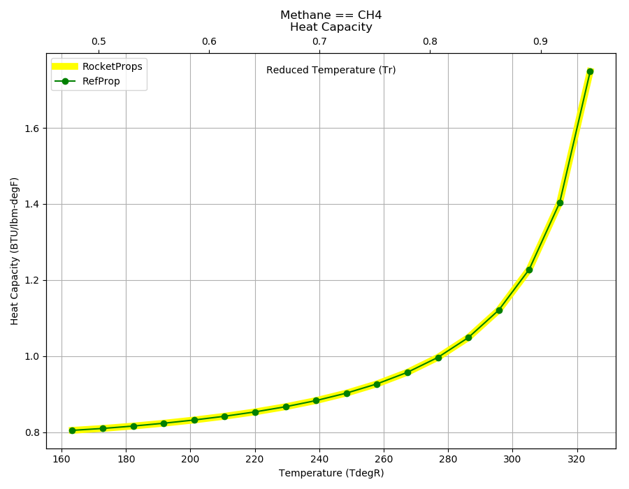

.. methane_prop

Methane
=======

Methane (CH4) is the main constituent of Liquefied natural gas (LNG).
Methane provides longer and easier storage and higher density than hydrogen
for long-duration space missions. Typically used as 
`LOX/CH4 <http://www.astronautix.com/l/loxlch4.html>`_ 

`LOX/CH4 <http://www.astronautix.com/l/loxlch4.html>`_ 
is currently under development for the `SpaceX Raptor <https://en.wikipedia.org/wiki/SpaceX_Raptor>`_

Reference Points
----------------

Methane == CH4

`Hover over column headers to see definitions, values to see alternate units`

.. raw:: html

    <table width="100%">
    <tr><th></th>
        <th title="Reference Temperature">Tref</th>
        <th title="Reference Pressure">Pref</th>
        <th title="Specific Gravity">SG</th>
        <th title="Specific Heat">Cp</th>
        <th title="Heat of Vaporization">dHvap</th>
        <th title="Viscosity">Visc</th>
        <th title="Thermal Conductivity">Cond</th>
        <th title="Surface Tension">Surf</th>
    <tr><th>Source</th><th>R</th><th>psia</th><th>g/ml</th><th>BTU/lbm-R</th><th>BTU/lbm</th><th>poise</th><th>BTU/hr-ft-R</th><th>lbf/in</th></tr>

    <tr  style="background-color:#FFFF00"><td><a class="reference external" href="https://pypi.python.org/pypi/rocketprops">RocketProps</a></td><td  title="201.001 degR
    111.667 degK
    -258.669 degF
    -161.483 degC">201.0</td><td  title="14.6959 psia
    0.999997 atm
    1.01325 bar
    0.101325 MPa">14.7</td><td  title="0.422357 SG
    26.3669 lbm/ft**3
    0.0152586 lbm/inch**3
    422.357 kg/m**3">0.4224</td><td  title="0.831998 BTU/lbm/F
    0.832555 cal/g/C
    0.000832555 kcal/g/C
    3483.41 J/kg/K">0.832</td><td  title="219.764 BTU/lbm
    122.173 cal/g
    0.122173 kcal/g
    511.17 J/g">219.8</td><td  title="0.00116808 poise
    0.116808 cpoise
    0.000116808 Pa*s
    6.54097e-06 lbm/s/inch
    0.0235475 lbm/hr/inch
    0.420511 kg/hr/m
    0.00420511 kg/hr/cm">1.168e-03</td><td  title="0.106233 BTU/hr/ft/delF
    2.45909e-06 BTU/s/inch/delF
    0.000439438 cal/s/cm/delC
    0.0439438 cal/s/m/delC
    0.00183861 W/cm/delC">0.1062</td><td  title="7.59241e-05 lbf/in
    0.0132964 N/m
    13.2964 mN/m
    13.2964 dyne/cm">7.592e-05</td></tr>
    <tr ><td><a class="reference external" href="https://www.nist.gov/srd/refprop">RefProp</a></td><td  title="201.001 degR
    111.667 degK
    -258.669 degF
    -161.483 degC">201.0</td><td  title="14.6959 psia
    0.999997 atm
    1.01325 bar
    0.101325 MPa">14.7</td><td  title="0.422357 SG
    26.3669 lbm/ft**3
    0.0152586 lbm/inch**3
    422.357 kg/m**3">0.4224</td><td  title="0.831998 BTU/lbm/F
    0.832555 cal/g/C
    0.000832555 kcal/g/C
    3483.41 J/kg/K">0.832</td><td  title="219.764 BTU/lbm
    122.173 cal/g
    0.122173 kcal/g
    511.17 J/g">219.8</td><td  title="0.00116808 poise
    0.116808 cpoise
    0.000116808 Pa*s
    6.54097e-06 lbm/s/inch
    0.0235475 lbm/hr/inch
    0.420511 kg/hr/m
    0.00420511 kg/hr/cm">1.168e-03</td><td  title="0.106233 BTU/hr/ft/delF
    2.45909e-06 BTU/s/inch/delF
    0.000439438 cal/s/cm/delC
    0.0439438 cal/s/m/delC
    0.00183861 W/cm/delC">0.1062</td><td  title="7.59241e-05 lbf/in
    0.0132964 N/m
    13.2964 mN/m
    13.2964 dyne/cm">7.592e-05</td></tr>

    </table>

Fluid Properties
----------------

Methane == CH4

`Hover over column headers to see definitions, values to see alternate units`

.. raw:: html

    <table width="100%">
    <tr><th></th>
        <th title="Molecular Weight">MolWt</th>
        <th title="Critical Temperature">Tc</th>
        <th title="Critical Pressure">Pc</th>
        <th title="Critical Density">SGc</th>
        <th title="Critical Compressibility Factor">Zc</th>
        <th title="Normal Boiling Point">Tnbp</th>
        <th title="Melting/Freezing Point">Tmelt</th>
        <th title="Pitzer Acentric Factor">omega</th></tr>
    <tr><th>Source</th><th>g/gmole</th><th>R</th><th>psia</th><th>g/ml</th><th>(-)</th><th>R</th><th>R</th><th>(-)</th></tr>

    <tr  style="background-color:#FFFF00"><td><a class="reference external" href="https://pypi.python.org/pypi/rocketprops">RocketProps</a></td><td>16.043</td><td  title="343.015 degR
    190.564 degK
    -116.655 degF
    -82.586 degC">343.0</td><td  title="667.057 psia
    45.3906 atm
    45.992 bar
    4.5992 MPa">667.1</td><td  title="0.162656 SG
    10.1543 lbm/ft**3
    0.00587631 lbm/inch**3
    162.656 kg/m**3">0.1627</td><td>0.2864</td><td  title="201.001 degR
    111.667 degK
    -258.669 degF
    -161.483 degC">201.0</td><td  title="163.35 degR
    90.75 degK
    -296.32 degF
    -182.4 degC">163.3</td><td>0.01142</td></tr>
    <tr ><td><a class="reference external" href="https://www.nist.gov/srd/refprop">RefProp</a></td><td>16.043</td><td  title="343.015 degR
    190.564 degK
    -116.655 degF
    -82.586 degC">343.0</td><td  title="667.057 psia
    45.3906 atm
    45.992 bar
    4.5992 MPa">667.1</td><td  title="0.162656 SG
    10.1543 lbm/ft**3
    0.00587631 lbm/inch**3
    162.656 kg/m**3">0.1627</td><td>0.2864</td><td  title="201.001 degR
    111.667 degK
    -258.669 degF
    -161.483 degC">201.0</td><td  title="163.35 degR
    90.75 degK
    -296.32 degF
    -182.4 degC">163.3</td><td>0.01142</td></tr>
    <tr ><td><a class="reference external" href="./sources.html#gas&liq-5th-ed">Gas&Liq 5th Ed</a></td><td>16.043</td><td  title="343.008 degR
    190.56 degK
    -116.662 degF
    -82.59 degC">343.0</td><td  title="667.029 psia
    45.3886 atm
    45.99 bar
    4.599 MPa">667.0</td><td  title="0.162708 SG
    10.1575 lbm/ft**3
    0.0058782 lbm/inch**3
    162.708 kg/m**3">0.1627</td><td>0.2863</td><td  title="200.988 degR
    111.66 degK
    -258.682 degF
    -161.49 degC">201.0</td><td  title="163.242 degR
    90.69 degK
    -296.428 degF
    -182.46 degC">163.2</td><td>0.01100</td></tr>

    </table>

Vapor Pressure
--------------

.. raw:: html

    

        

    
.. image:: ./_static/Methane_Psat.png
   :target: ./_static/Methane_Psat.png
    

.. raw:: html

    

  

| RocketProps Selected Curve
| :ref:`RefProp Source`
| :ref:`Wagner Fit Source`

.. raw:: html

    

    

    
`Click Image to View Fill Size`

Density
-------

.. raw:: html

    

        

    
.. image:: ./_static/Methane_SG.png
   :target: ./_static/Methane_SG.png
    

.. raw:: html

    

  

| RocketProps Selected Curve
| :ref:`RefProp Source`
| :ref:`Rackett Scaling Source`
| :ref:`Gas&Liq 5th Ed Source`

.. raw:: html

    

    

    
`Click Image to View Fill Size`

Heat Capacity
-------------

.. raw:: html

    

        

    

    

.. raw:: html

    

  

| RocketProps Selected Curve
| :ref:`RefProp Source`

.. raw:: html

    

    

    
`Click Image to View Fill Size`

Viscosity
---------

.. raw:: html

    

        

    
.. image:: ./_static/Methane_Visc.png
   :target: ./_static/Methane_Visc.png
    

.. raw:: html

    

  

| RocketProps Selected Curve
| :ref:`RefProp Source`

.. raw:: html

    

    

    
`Click Image to View Fill Size`

Heat of Vaporization
--------------------

.. raw:: html

    

        

    
.. image:: ./_static/Methane_Hvap.png
   :target: ./_static/Methane_Hvap.png
    

.. raw:: html

    

  

| RocketProps Selected Curve
| :ref:`RefProp Source`
| :ref:`Pitzer Hvap Source`

.. raw:: html

    

    

    
`Click Image to View Fill Size`

Thermal Conductivity
--------------------

.. raw:: html

    

        

    
.. image:: ./_static/Methane_Cond.png
   :target: ./_static/Methane_Cond.png
    

.. raw:: html

    

  

| RocketProps Selected Curve
| :ref:`RefProp Source`

.. raw:: html

    

    

    
`Click Image to View Fill Size`

Surface Tension
---------------

    

.. raw:: html

    

        

    
.. image:: ./_static/Methane_Surf.png
   :target: ./_static/Methane_Surf.png
    

.. raw:: html

    

  

| RocketProps Selected Curve
| :ref:`RefProp Source`
| :ref:`Pitzer Surf Source`

.. raw:: html

    

    

    
`Click Image to View Fill Size`

