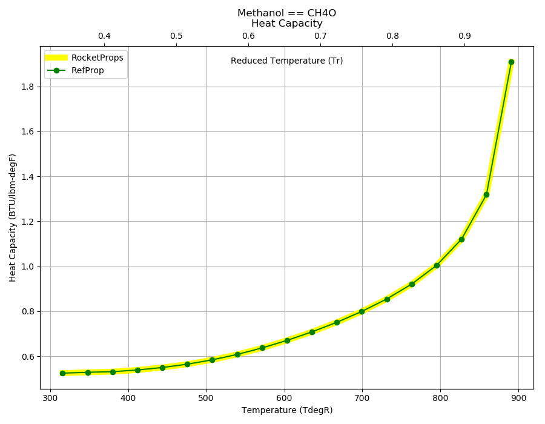
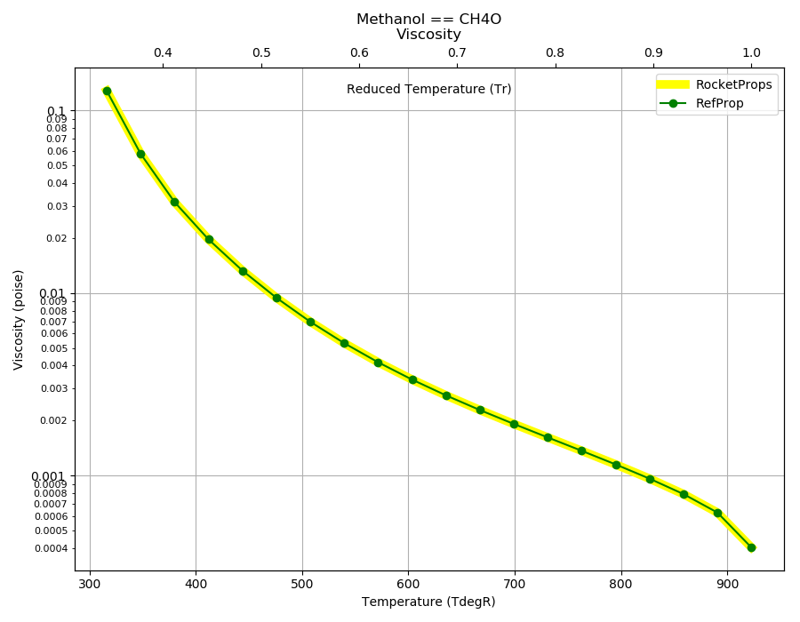
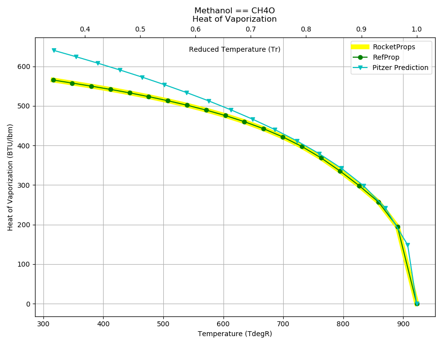
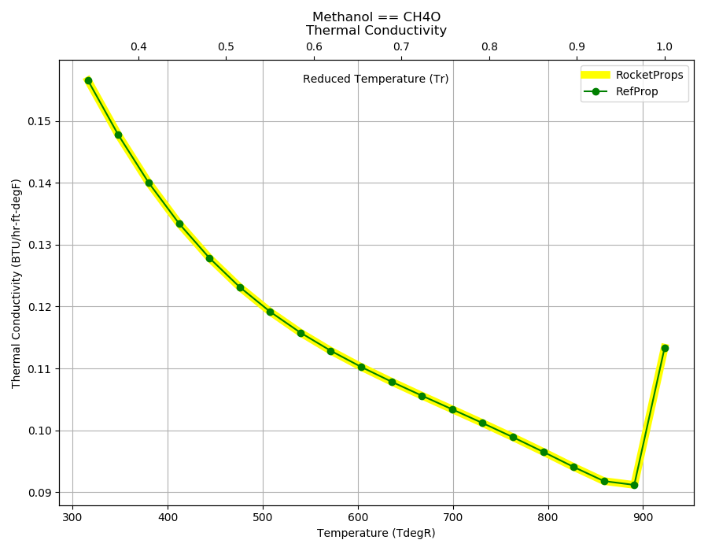

.. methanol_prop

Methanol
========

Reference Points
----------------

Methanol == CH4O

`Hover over column headers to see definitions, values to see alternate units`

.. raw:: html

    <table width="100%">
    <tr><th></th>
        <th title="Reference Temperature">Tref</th>
        <th title="Reference Pressure">Pref</th>
        <th title="Specific Gravity">SG</th>
        <th title="Specific Heat">Cp</th>
        <th title="Heat of Vaporization">dHvap</th>
        <th title="Viscosity">Visc</th>
        <th title="Thermal Conductivity">Cond</th>
        <th title="Surface Tension">Surf</th>
    <tr><th>Source</th><th>R</th><th>psia</th><th>g/ml</th><th>BTU/lbm-R</th><th>BTU/lbm</th><th>poise</th><th>BTU/hr-ft-R</th><th>lbf/in</th></tr>

    <tr  style="background-color:#FFFF00"><td><a class="reference external" href="https://pypi.python.org/pypi/rocketprops">RocketProps</a></td><td  title="527.67 degR
    293.15 degK
    68 degF
    20 degC">527.7</td><td  title="1.89009 psia
    0.128613 atm
    0.130317 bar
    0.0130317 MPa">1.9</td><td  title="0.790928 SG
    49.376 lbm/ft**3
    0.0285741 lbm/inch**3
    790.928 kg/m**3">0.7909</td><td  title="0.598637 BTU/lbm/F
    0.599038 cal/g/C
    0.000599038 kcal/g/C
    2506.38 J/kg/K">0.599</td><td  title="506.175 BTU/lbm
    281.396 cal/g
    0.281396 kcal/g
    1177.36 J/g">506.2</td><td  title="0.00584984 poise
    0.584984 cpoise
    0.000584984 Pa*s
    3.27576e-05 lbm/s/inch
    0.117927 lbm/hr/inch
    2.10594 kg/hr/m
    0.0210594 kg/hr/cm">5.850e-03</td><td  title="0.116984 BTU/hr/ft/delF
    2.70797e-06 BTU/s/inch/delF
    0.000483912 cal/s/cm/delC
    0.0483912 cal/s/m/delC
    0.00202469 W/cm/delC">0.1170</td><td  title="0.000129471 lbf/in
    0.0226738 N/m
    22.6738 mN/m
    22.6738 dyne/cm">1.295e-04</td></tr>
    <tr ><td><a class="reference external" href="https://www.nist.gov/srd/refprop">RefProp</a></td><td  title="527.67 degR
    293.15 degK
    68 degF
    20 degC">527.7</td><td  title="1.89009 psia
    0.128613 atm
    0.130317 bar
    0.0130317 MPa">1.9</td><td  title="0.790928 SG
    49.376 lbm/ft**3
    0.0285741 lbm/inch**3
    790.928 kg/m**3">0.7909</td><td  title="0.598637 BTU/lbm/F
    0.599038 cal/g/C
    0.000599038 kcal/g/C
    2506.38 J/kg/K">0.599</td><td  title="506.175 BTU/lbm
    281.396 cal/g
    0.281396 kcal/g
    1177.36 J/g">506.2</td><td  title="0.00584984 poise
    0.584984 cpoise
    0.000584984 Pa*s
    3.27576e-05 lbm/s/inch
    0.117927 lbm/hr/inch
    2.10594 kg/hr/m
    0.0210594 kg/hr/cm">5.850e-03</td><td  title="0.116984 BTU/hr/ft/delF
    2.70797e-06 BTU/s/inch/delF
    0.000483912 cal/s/cm/delC
    0.0483912 cal/s/m/delC
    0.00202469 W/cm/delC">0.1170</td><td  title="0.000129471 lbf/in
    0.0226738 N/m
    22.6738 mN/m
    22.6738 dyne/cm">1.295e-04</td></tr>

    </table>

Fluid Properties
----------------

Methanol == CH4O

`Hover over column headers to see definitions, values to see alternate units`

.. raw:: html

    <table width="100%">
    <tr><th></th>
        <th title="Molecular Weight">MolWt</th>
        <th title="Critical Temperature">Tc</th>
        <th title="Critical Pressure">Pc</th>
        <th title="Critical Density">SGc</th>
        <th title="Critical Compressibility Factor">Zc</th>
        <th title="Normal Boiling Point">Tnbp</th>
        <th title="Melting/Freezing Point">Tmelt</th>
        <th title="Pitzer Acentric Factor">omega</th></tr>
    <tr><th>Source</th><th>g/gmole</th><th>R</th><th>psia</th><th>g/ml</th><th>(-)</th><th>R</th><th>R</th><th>(-)</th></tr>

    <tr  style="background-color:#FFFF00"><td><a class="reference external" href="https://pypi.python.org/pypi/rocketprops">RocketProps</a></td><td>32.042</td><td  title="922.68 degR
    512.6 degK
    463.01 degF
    239.45 degC">922.7</td><td  title="1175.31 psia
    79.9753 atm
    81.035 bar
    8.1035 MPa">1175.3</td><td  title="0.275559 SG
    17.2026 lbm/ft**3
    0.00995519 lbm/inch**3
    275.559 kg/m**3">0.2756</td><td>0.2211</td><td  title="607.738 degR
    337.632 degK
    148.068 degF
    64.482 degC">607.7</td><td  title="316.098 degR
    175.61 degK
    -143.572 degF
    -97.54 degC">316.1</td><td>0.56463</td></tr>
    <tr ><td><a class="reference external" href="https://www.nist.gov/srd/refprop">RefProp</a></td><td>32.042</td><td  title="922.68 degR
    512.6 degK
    463.01 degF
    239.45 degC">922.7</td><td  title="1175.31 psia
    79.9753 atm
    81.035 bar
    8.1035 MPa">1175.3</td><td  title="0.275559 SG
    17.2026 lbm/ft**3
    0.00995519 lbm/inch**3
    275.559 kg/m**3">0.2756</td><td>0.2211</td><td  title="607.738 degR
    337.632 degK
    148.068 degF
    64.482 degC">607.7</td><td  title="316.098 degR
    175.61 degK
    -143.572 degF
    -97.54 degC">316.1</td><td>0.56463</td></tr>
    <tr ><td><a class="reference external" href="./sources.html#gas&liq-5th-ed">Gas&Liq 5th Ed</a></td><td>32.042</td><td  title="922.752 degR
    512.64 degK
    463.082 degF
    239.49 degC">922.8</td><td  title="1174.37 psia
    79.9112 atm
    80.97 bar
    8.097 MPa">1174.4</td><td  title="0.271542 SG
    16.9518 lbm/ft**3
    0.00981009 lbm/inch**3
    271.542 kg/m**3">0.2715</td><td>0.2242</td><td  title="607.842 degR
    337.69 degK
    148.172 degF
    64.54 degC">607.8</td><td  title="315.882 degR
    175.49 degK
    -143.788 degF
    -97.66 degC">315.9</td><td>0.56500</td></tr>

    </table>

Vapor Pressure
--------------

.. raw:: html

    

        

    
.. image:: ./_static/Methanol_Psat.png
   :target: ./_static/Methanol_Psat.png
    

.. raw:: html

    

  

| RocketProps Selected Curve
| :ref:`RefProp Source`
| :ref:`Wagner Fit Source`

.. raw:: html

    

    

    
`Click Image to View Fill Size`

Density
-------

.. raw:: html

    

        

    
.. image:: ./_static/Methanol_SG.png
   :target: ./_static/Methanol_SG.png
    

.. raw:: html

    

  

| RocketProps Selected Curve
| :ref:`RefProp Source`
| :ref:`Rackett Scaling Source`
| :ref:`Gas&Liq 5th Ed Source`

.. raw:: html

    

    

    
`Click Image to View Fill Size`

Heat Capacity
-------------

.. raw:: html

    

        

    

    

.. raw:: html

    

  

| RocketProps Selected Curve
| :ref:`RefProp Source`

.. raw:: html

    

    

    
`Click Image to View Fill Size`

Viscosity
---------

.. raw:: html

    

        

    

    

.. raw:: html

    

  

| RocketProps Selected Curve
| :ref:`RefProp Source`

.. raw:: html

    

    

    
`Click Image to View Fill Size`

Heat of Vaporization
--------------------

.. raw:: html

    

        

    

    

.. raw:: html

    

  

| RocketProps Selected Curve
| :ref:`RefProp Source`
| :ref:`Pitzer Hvap Source`

.. raw:: html

    

    

    
`Click Image to View Fill Size`

Thermal Conductivity
--------------------

.. raw:: html

    

        

    

    

.. raw:: html

    

  

| RocketProps Selected Curve
| :ref:`RefProp Source`

.. raw:: html

    

    

    
`Click Image to View Fill Size`

Surface Tension
---------------

    

.. raw:: html

    

        

    
.. image:: ./_static/Methanol_Surf.png
   :target: ./_static/Methanol_Surf.png
    

.. raw:: html

    

  

| RocketProps Selected Curve
| :ref:`RefProp Source`
| :ref:`Pitzer Surf Source`

.. raw:: html

    

    

    
`Click Image to View Fill Size`

