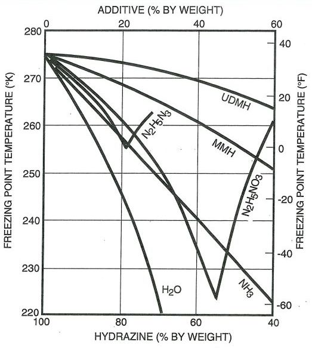

.. mixture_freeze

Mixture freezing Points
=======================

The freezing points of the mixtures included in RocketProps were determined from the following
data sources.

For mixtures with hydrazine, 

The above data for additive percentage from 0 to 60% was curve fit for both MMH and UDMH.
The tail of the curve at 100% was anchored with the pure additive's freezing point.

In the case of MMH, the freezing point of MHF3 (86% MMH) was also added.
(MHF3 is a eutectic, or minimum freezing point, for the MMH/N2H4 mixture)

.. image:: ./_static/n2h4_mixture_freeze_pts.png
