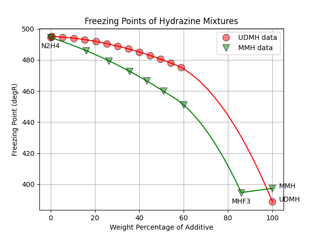

.. mixture_freeze

.. _Mixture Freezing Points:

Mixture Freezing Points
=======================

The freezing points of the mixtures included in RocketProps were determined from the following
data sources.

- Hydrazine Mixtures: `NASA-CR-132921 <https://ntrs.nasa.gov/citations/19740009381>`_
- Mixed Oxides of Nitrogen:  `AFRPL-TR-76-76 PDF  <./_static/AFRPL-TR_76-76_MON_propellants.pdf>`_
- FLOX: No source. Assumed linear with weight percent. (96.3 degR to 97.8 degR)

Hydrazine Mixtures
------------------

For mixtures of hydrazine with MMH and UDMH, the freezing point data was taken from 
Volume 1 of 
`Hydrazine and its Derivatives : Preparation, Properties, Applications 2nd Edition by Eckart Walter Schmidt <https://www.wiley.com/en-us/search?pq=Hydrazine%20and%20its%20Derivatives%20Eckart%20Schmidt%7Crelevance>`_

Very similar data is obtained from
`NASA-CR-132921 <https://ntrs.nasa.gov/citations/19740009381>`_
*Study of monopropellants for electrothermal thrusters: Analytical task summary report*

Plots from both publications are shown below.

.. image:: ./_static/comp_freeze_pt_additives.jpg
    :width: 54%

The above data for additive percentage from 0 to 60% was curve fit for both MMH and UDMH.
The tail of the curve at 100% was anchored with the pure additive's freezing point.

In the case of MMH, the freezing point of MHF3 (86% MMH) was also added.

Note that MHF3 is a eutectic, or minimum freezing point, for the MMH/N2H4 mixture.

Mixed Oxides of Nitrogen
------------------------

The freezing point correlation for MON in RocketProps is limited to 30 percent NO since MON30 is 
the highest NO percent normally considered in practical usage.

The MON freezing point data, below, is from the 
USAF Propellant Handbooks Nitric Acid/Nitrogen Tetroxide Oxidizers Vol II.
See: `AFRPL-TR-76-76 PDF  <./_static/AFRPL-TR_76-76_MON_propellants.pdf>`_

The USAF Propellant Handbook data was digitized and interpolated within RocketProps to produce the plot below.

FLOX
----

This author could find no freezing point data for mixtures of LF2 and LOX.

Since the freezing points of both propellants are virtually identical
(i.e. 96.3 degR and 97.8 degR), RocketProps simply linearly interpolates the freezing
point of FLOX based on the weight fraction of fluorine added to oxygen.

In general, the freezing point of cryogenic propellants is not of great interest.

A typical reason to be concerned with propellant freezing point is in the case of common dome tanks where a 
cold propellant on one side of the common dome might freeze the propellant on the other side.

Less typical, there have been some studies that looked at the use of slush cryogenic propellants in order to 
gain some propellant density advantage.

If this type of requirement applies to your FLOX design, then a more thorough investigation of freezing point might be warranted.
