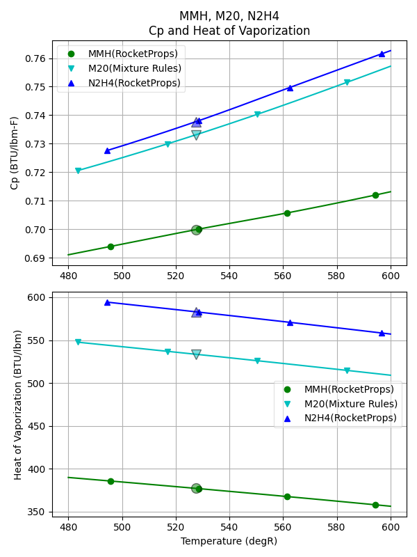
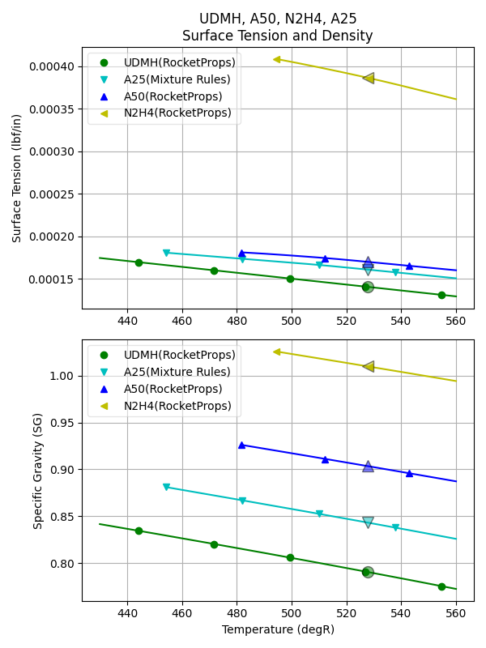
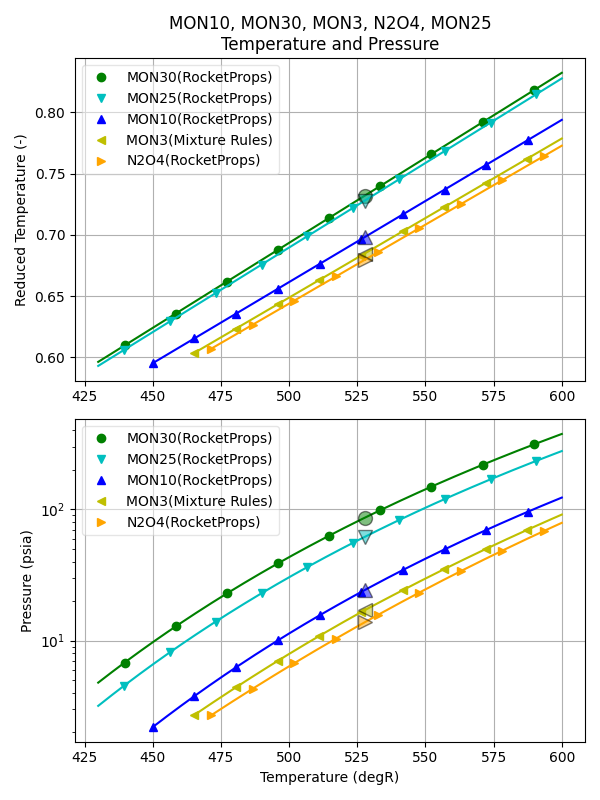

.. mixtures

Mixtures
========

There are a number of propellant mixtures in use today, some of which have sufficient
data to be included in RocketProps by default. 
The included mixtures are A50, MHF3, MON10, MON25 and MON30.

A number of mixtures, not included in RocketProps, are of interest, 
but must be estimated using "mixing rules".
Examples include:

.. code-block:: python

    M20    = (20% MMH + 80%N2H4)
    MON3   = (3% NO + 97% N2O4) 
    FLOX70 = (70% LF2 + 30% LOX)

Note that all percentages are by weight.

MMH + N2H4
----------

To create a mixture of MMH (monomethyl hydrazine) and N2H4 (hydrazine) in RocketProps, use a propellant name such as "M20".

The number following th "M" indicates the weight percentage of MMH added to N2H4.

An advantage of adding MMH to N2H4 is a reduction in freezing point.

The following python code will create an M20 mixture.

.. _Example Mixture Summary:

.. code-block:: python 

    from rocketprops.rocket_prop import get_prop
    Pm20 = get_prop( 'M20' )
    Pm20.summ_print()

and create the following output.

.. code-block:: python 

    ====== RocketProps State Point of Liquid M20 =====
    Name    =       M20  (20.0% MMH + 80.0% N2H4)
    T       =       527.67 degR
    P       =      14.6959 psia
    Pvap    =     0.300351 psia
    Pc      =      1931.86 psia
    Tc      =      1150.96 degR
    SGliq   =     0.980694 g/cc
    SGvap   =  3.16643e-05 g/cc
    visc    =    0.0100714 poise
    cond    =     0.270383 BTU/hr/ft/delF
    Tnbp    =       686.45 degR
    Tfreeze =       483.55 degR
    Cp      =     0.733093 BTU/lbm/delF
    MolWt   =      34.1231 g/gmole
    Hvap    =      533.465 BTU/lbm
    surf    =  0.000359821 lbf/in

Plots of M20 can be compared to MMH and N2H4 with the following code:

.. code-block:: python 

    from rocketprops.plot_multi_props import make_plots
    make_plots( ['MMH', 'M20', 'N2H4'], abs_T=True, Tmin=480, Tmax=600)

Aerozine 
--------

The most common mixture of UDMH and N2H4 is A50, a 50-50 mixture by weight.
A50 has a long flight history on Titan vehicles.

A somewhat similar mixture, UH25 (75% UDMH + 25% hydrazine hydrate) was developed for the European Ariane launch vehicles.

As with MMH/N2H4 mixtures, an advantage of adding UDMH to N2H4 is a reduction in freezing point.

.. code-block:: python 

    from rocketprops.plot_multi_props import make_plots

    make_plots( ['UDMH','A25', 'A50', 'N2H4'], abs_T=1,
                Tmin=130, Tmax=170, save_figures=True)

Mixed Oxides of Nitrogen
------------------------

Solutions of NO in nitrogen tetroxide sharply depress its freezing point.
These solutions are called mixed oxides of nitrogen (MON).
The mechanism of suppression is believed to involve the formation of N2O3.

Another side effect of adding NO is increased vapor pressure.

The following plot can be made with the code below.

.. code-block:: python 

    from rocketprops.plot_multi_props import make_plots
    make_plots( ['MON30', 'MON25', 'MON10', 'MON3', 'N2O4'], abs_T=True, 
                Tmin=480, Tmax=600, save_figures=False)

FLOX 
----

Mixtures of liquid fluorine and liquid oxygen have been studied and tested in the past.
For example FLOX70 with Kerosene was tested in Atlas rocket engines in the 1950's and 1960's.

The fluorine adds Isp performance and increases propellant density. 
Ideally, the LOX combines with carbon in the fuel to make CO and the LF2 combines with hydrogen to make HF.
A comparative plot of LF2, FLOX70 and LOX is created by the code below.

.. code-block:: python 

    from rocketprops.plot_multi_props import make_plots

    make_plots( ['LF2', 'FLOX70', 'LOX'], abs_T=1,
                Tmin=130, Tmax=170, save_figures=True)

