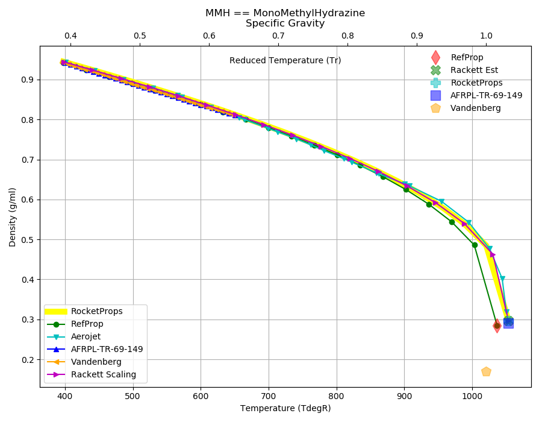
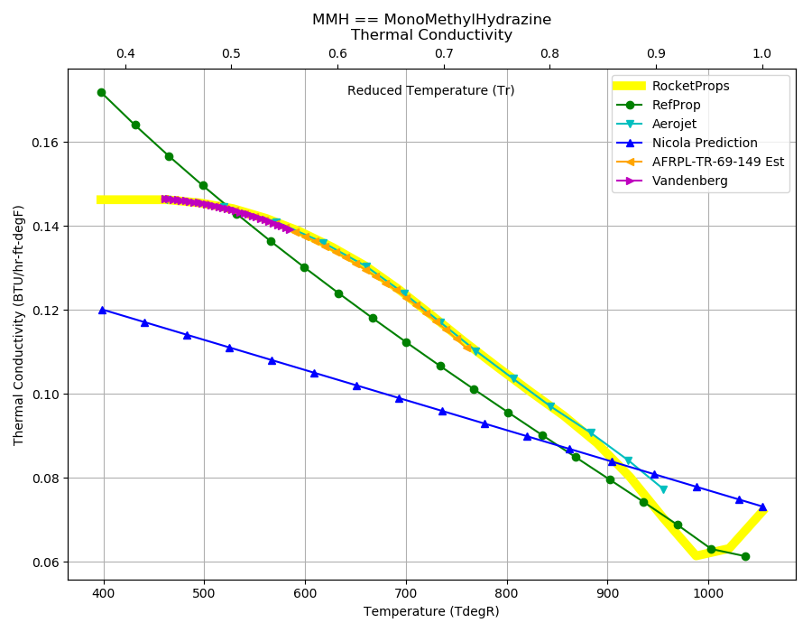
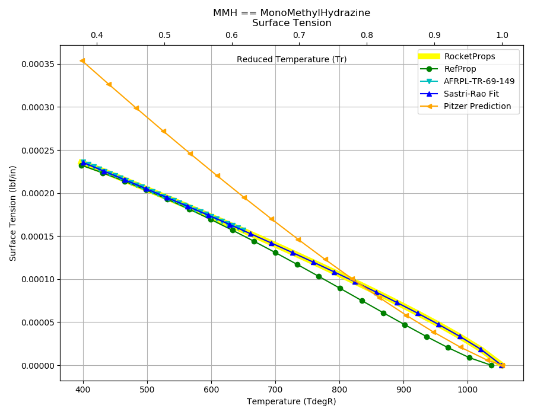

.. mmh_prop

MMH
===

`MMH <http://www.astronautix.com/m/mmh.html>`_ or Monomethylhydrazine (CH3NHNH2) 
is a storable liquid fuel that found favor in the United States for use in 
orbital spacecraft engines. Its advantages in comparison to 
`UDMH <http://www.astronautix.com/u/udmh.html>`_
are higher density and slightly higher performance.

Reference Points
----------------

MMH == MonoMethylHydrazine

`Hover over column headers to see definitions, values to see alternate units`

.. raw:: html

    <table width="100%">
    <tr><th></th>
        <th title="Reference Temperature">Tref</th>
        <th title="Reference Pressure">Pref</th>
        <th title="Specific Gravity">SG</th>
        <th title="Specific Heat">Cp</th>
        <th title="Heat of Vaporization">dHvap</th>
        <th title="Viscosity">Visc</th>
        <th title="Thermal Conductivity">Cond</th>
        <th title="Surface Tension">Surf</th>
    <tr><th>Source</th><th>R</th><th>psia</th><th>g/ml</th><th>BTU/lbm-R</th><th>BTU/lbm</th><th>poise</th><th>BTU/hr-ft-R</th><th>lbf/in</th></tr>

    <tr  style="background-color:#FFFF00"><td><a class="reference external" href="https://pypi.python.org/pypi/rocketprops">RocketProps</a></td><td  title="527.67 degR
    293.15 degK
    68 degF
    20 degC">527.7</td><td  title="14.6959 psia
    0.999997 atm
    1.01325 bar
    0.101325 MPa">14.7</td><td  title="0.879839 SG
    54.9266 lbm/ft**3
    0.0317862 lbm/inch**3
    879.839 kg/m**3">0.8798</td><td  title="0.69986 BTU/lbm/F
    0.700328 cal/g/C
    0.000700328 kcal/g/C
    2930.17 J/kg/K">0.700</td><td  title="377 BTU/lbm
    209.585 cal/g
    0.209585 kcal/g
    876.902 J/g">377.0</td><td  title="0.00844866 poise
    0.844866 cpoise
    0.000844866 Pa*s
    4.73103e-05 lbm/s/inch
    0.170317 lbm/hr/inch
    3.04152 kg/hr/m
    0.0304152 kg/hr/cm">8.449e-03</td><td  title="0.144158 BTU/hr/ft/delF
    3.33698e-06 BTU/s/inch/delF
    0.000596316 cal/s/cm/delC
    0.0596316 cal/s/m/delC
    0.00249499 W/cm/delC">0.1442</td><td  title="0.000195877 lbf/in
    0.0343033 N/m
    34.3033 mN/m
    34.3033 dyne/cm">1.959e-04</td></tr>
    <tr ><td><a class="reference external" href="./_static/AFRPL-TR-69-149Hydrazine fuels.pdf">AFRPL-TR-69-149</a></td><td  title="536.4 degR
    298 degK
    76.73 degF
    24.85 degC">536.4</td><td  title="14.7 psia
    1.00028 atm
    1.01353 bar
    0.101353 MPa">14.7</td><td  title="0.8702 SG
    54.3248 lbm/ft**3
    0.031438 lbm/inch**3
    870.2 kg/m**3">0.8702</td><td  title="0.6998 BTU/lbm/F
    0.700268 cal/g/C
    0.000700268 kcal/g/C
    2929.92 J/kg/K">0.700</td><td  title="376.9 BTU/lbm
    209.529 cal/g
    0.209529 kcal/g
    876.669 J/g">376.9</td><td  title="0.00775 poise
    0.775 cpoise
    0.000775 Pa*s
    4.3398e-05 lbm/s/inch
    0.156233 lbm/hr/inch
    2.79 kg/hr/m
    0.0279 kg/hr/cm">7.750e-03</td><td  title="0.143114 BTU/hr/ft/delF
    3.31283e-06 BTU/s/inch/delF
    0.000592 cal/s/cm/delC
    0.0592 cal/s/m/delC
    0.00247693 W/cm/delC">0.1431</td><td  title="0.000193167 lbf/in
    0.0338287 N/m
    33.8287 mN/m
    33.8287 dyne/cm">1.932e-04</td></tr>
    <tr ><td><a class="reference external" href="https://www.nist.gov/srd/refprop">RefProp</a></td><td  title="527.67 degR
    293.15 degK
    68 degF
    20 degC">527.7</td><td  title="0.727689 psia
    0.0495163 atm
    0.0501724 bar
    0.00501724 MPa">0.7</td><td  title="0.875575 SG
    54.6604 lbm/ft**3
    0.0316322 lbm/inch**3
    875.575 kg/m**3">0.8756</td><td  title="0.68944 BTU/lbm/F
    0.689902 cal/g/C
    0.000689902 kcal/g/C
    2886.55 J/kg/K">0.689</td><td  title="384.137 BTU/lbm
    213.552 cal/g
    0.213552 kcal/g
    893.503 J/g">384.1</td><td  title="0.00523457 poise
    0.523457 cpoise
    0.000523457 Pa*s
    2.93123e-05 lbm/s/inch
    0.105524 lbm/hr/inch
    1.88445 kg/hr/m
    0.0188445 kg/hr/cm">5.235e-03</td><td  title="0.143735 BTU/hr/ft/delF
    3.32721e-06 BTU/s/inch/delF
    0.00059457 cal/s/cm/delC
    0.059457 cal/s/m/delC
    0.00248768 W/cm/delC">0.1437</td><td  title="0.000194153 lbf/in
    0.0340014 N/m
    34.0014 mN/m
    34.0014 dyne/cm">1.942e-04</td></tr>
    <tr ><td><a class="reference external" href="./_static/Aerojet_Propellant_Properties.pdf">Aerojet</a></td><td  title="527.67 degR
    293.15 degK
    68 degF
    20 degC">527.7</td><td  title="14.6959 psia
    0.999997 atm
    1.01325 bar
    0.101325 MPa">14.7</td><td  title="0.879839 SG
    54.9266 lbm/ft**3
    0.0317862 lbm/inch**3
    879.839 kg/m**3">0.8798</td><td  title="0.699863 BTU/lbm/F
    0.700331 cal/g/C
    0.000700331 kcal/g/C
    2930.18 J/kg/K">0.700</td><td  title="377 BTU/lbm
    209.585 cal/g
    0.209585 kcal/g
    876.902 J/g">377.0</td><td  title="0.00845407 poise
    0.845407 cpoise
    0.000845407 Pa*s
    4.73406e-05 lbm/s/inch
    0.170426 lbm/hr/inch
    3.04347 kg/hr/m
    0.0304347 kg/hr/cm">8.454e-03</td><td  title="0.14416 BTU/hr/ft/delF
    3.33704e-06 BTU/s/inch/delF
    0.000596326 cal/s/cm/delC
    0.0596326 cal/s/m/delC
    0.00249503 W/cm/delC">0.1442</td><td >---</td></tr>
    <tr ><td><a class="reference external" href="./_static/Vandenberg_Corrected_Properties.pdf">Vandenberg</a></td><td  title="527.67 degR
    293.15 degK
    68 degF
    20 degC">527.7</td><td  title="14.7 psia
    1.00028 atm
    1.01353 bar
    0.101353 MPa">14.7</td><td  title="0.874929 SG
    54.62 lbm/ft**3
    0.0316088 lbm/inch**3
    874.929 kg/m**3">0.8749</td><td >---</td><td  title="391.113 BTU/lbm
    217.43 cal/g
    0.21743 kcal/g
    909.728 J/g">391.1</td><td >---</td><td  title="0.143843 BTU/hr/ft/delF
    3.3297e-06 BTU/s/inch/delF
    0.000595015 cal/s/cm/delC
    0.0595015 cal/s/m/delC
    0.00248954 W/cm/delC">0.1438</td><td >---</td></tr>

    </table>

Fluid Properties
----------------

MMH == MonoMethylHydrazine

`Hover over column headers to see definitions, values to see alternate units`

.. raw:: html

    <table width="100%">
    <tr><th></th>
        <th title="Molecular Weight">MolWt</th>
        <th title="Critical Temperature">Tc</th>
        <th title="Critical Pressure">Pc</th>
        <th title="Critical Density">SGc</th>
        <th title="Critical Compressibility Factor">Zc</th>
        <th title="Normal Boiling Point">Tnbp</th>
        <th title="Melting/Freezing Point">Tmelt</th>
        <th title="Pitzer Acentric Factor">omega</th></tr>
    <tr><th>Source</th><th>g/gmole</th><th>R</th><th>psia</th><th>g/ml</th><th>(-)</th><th>R</th><th>R</th><th>(-)</th></tr>

    <tr  style="background-color:#FFFF00"><td><a class="reference external" href="https://pypi.python.org/pypi/rocketprops">RocketProps</a></td><td>46.072</td><td  title="1053.67 degR
    585.372 degK
    594 degF
    312.222 degC">1053.7</td><td  title="1195 psia
    81.3149 atm
    82.3923 bar
    8.23923 MPa">1195.0</td><td  title="0.296183 SG
    18.4901 lbm/ft**3
    0.0107003 lbm/inch**3
    296.183 kg/m**3">0.2962</td><td>0.2634</td><td  title="649.47 degR
    360.817 degK
    189.8 degF
    87.6667 degC">649.5</td><td  title="397.37 degR
    220.761 degK
    -62.3 degF
    -52.3889 degC">397.4</td><td>0.28680</td></tr>
    <tr ><td><a class="reference external" href="./_static/AFRPL-TR-69-149Hydrazine fuels.pdf">AFRPL-TR-69-149</a></td><td>46.072</td><td  title="1053 degR
    585 degK
    593.33 degF
    311.85 degC">1053.0</td><td  title="1195 psia
    81.3149 atm
    82.3923 bar
    8.23923 MPa">1195.0</td><td  title="0.29 SG
    18.1041 lbm/ft**3
    0.0104769 lbm/inch**3
    290 kg/m**3">0.2900</td><td>0.2692</td><td  title="649.44 degR
    360.8 degK
    189.77 degF
    87.65 degC">649.4</td><td  title="397.4 degR
    220.778 degK
    -62.27 degF
    -52.3722 degC">397.4</td><td>---</td></tr>
    <tr ><td><a class="reference external" href="https://www.nist.gov/srd/refprop">RefProp</a></td><td>46.072</td><td  title="1036.8 degR
    576 degK
    577.13 degF
    302.85 degC">1036.8</td><td  title="1046.16 psia
    71.1868 atm
    72.13 bar
    7.213 MPa">1046.2</td><td  title="0.284719 SG
    17.7745 lbm/ft**3
    0.0102861 lbm/inch**3
    284.719 kg/m**3">0.2847</td><td>0.2438</td><td  title="649.044 degR
    360.58 degK
    189.374 degF
    87.43 degC">649.0</td><td  title="397.494 degR
    220.83 degK
    -62.176 degF
    -52.32 degC">397.5</td><td>0.30081</td></tr>
    <tr ><td><a class="reference external" href="./_static/Aerojet_Propellant_Properties.pdf">Aerojet</a></td><td>46.072</td><td  title="1053.67 degR
    585.372 degK
    594 degF
    312.222 degC">1053.7</td><td  title="1195 psia
    81.3149 atm
    82.3923 bar
    8.23923 MPa">1195.0</td><td  title="0.296183 SG
    18.4901 lbm/ft**3
    0.0107003 lbm/inch**3
    296.183 kg/m**3">0.2962</td><td>0.2634</td><td  title="649.47 degR
    360.817 degK
    189.8 degF
    87.6667 degC">649.5</td><td  title="397.37 degR
    220.761 degK
    -62.3 degF
    -52.3889 degC">397.4</td><td>0.28423</td></tr>
    <tr ><td><a class="reference external" href="./_static/Vandenberg_Corrected_Properties.pdf">Vandenberg</a></td><td>46.072</td><td  title="1020.6 degR
    567 degK
    560.93 degF
    293.85 degC">1020.6</td><td  title="1210.95 psia
    82.4 atm
    83.4918 bar
    8.34918 MPa">1210.9</td><td  title="0.17 SG
    10.6128 lbm/ft**3
    0.00614164 lbm/inch**3
    170 kg/m**3">0.1700</td><td>0.4801</td><td  title="649.17 degR
    360.65 degK
    189.5 degF
    87.5 degC">649.2</td><td  title="397.35 degR
    220.75 degK
    -62.32 degF
    -52.4 degC">397.4</td><td>0.42500</td></tr>

    </table>

Vapor Pressure
--------------

.. raw:: html

    

        

    
.. image:: ./_static/MMH_Psat.png
   :target: ./_static/MMH_Psat.png
    

.. raw:: html

    

  

| RocketProps Selected Curve
| :ref:`RefProp Source`
| :ref:`Aerojet Source`
| :ref:`AFRPL-TR-69-149 Source`
| :ref:`Vandenberg Source`
| :ref:`Wagner Fit Source`

.. raw:: html

    

    

    
`Click Image to View Fill Size`

Density
-------

.. raw:: html

    

        

    

    

.. raw:: html

    

  

| RocketProps Selected Curve
| :ref:`RefProp Source`
| :ref:`Aerojet Source`
| :ref:`AFRPL-TR-69-149 Source`
| :ref:`Vandenberg Source`
| :ref:`Rackett Scaling Source`

.. raw:: html

    

    

    
`Click Image to View Fill Size`

Heat Capacity
-------------

.. raw:: html

    

        

    
.. image:: ./_static/MMH_Cp.png
   :target: ./_static/MMH_Cp.png
    

.. raw:: html

    

  

| RocketProps Selected Curve
| :ref:`RefProp Source`
| :ref:`Aerojet Source`
| :ref:`Joback Source`
| :ref:`AFRPL-TR-69-149 Source`

.. raw:: html

    

    

    
`Click Image to View Fill Size`

Viscosity
---------

.. raw:: html

    

        

    
.. image:: ./_static/MMH_Visc.png
   :target: ./_static/MMH_Visc.png
    

.. raw:: html

    

  

| RocketProps Selected Curve
| :ref:`RefProp Source`
| :ref:`Aerojet Source`
| :ref:`Squires Source`
| :ref:`AFRPL-TR-69-149 Source`

.. raw:: html

    

    

    
`Click Image to View Fill Size`

Heat of Vaporization
--------------------

.. raw:: html

    

        

    
.. image:: ./_static/MMH_Hvap.png
   :target: ./_static/MMH_Hvap.png
    

.. raw:: html

    

  

| RocketProps Selected Curve
| :ref:`RefProp Source`
| :ref:`Aerojet Source`
| :ref:`Pitzer Hvap Source`
| :ref:`Vandenberg Source`

.. raw:: html

    

    

    
`Click Image to View Fill Size`

Thermal Conductivity
--------------------

.. raw:: html

    

        

    

    

.. raw:: html

    

  

| RocketProps Selected Curve
| :ref:`RefProp Source`
| :ref:`Aerojet Source`
| :ref:`Nicola Source`
| :ref:`AFRPL-TR-69-149 Source`
| :ref:`Vandenberg Source`

.. raw:: html

    

    

    
`Click Image to View Fill Size`

Surface Tension
---------------

    

.. raw:: html

    

        

    

    

.. raw:: html

    

  

| RocketProps Selected Curve
| :ref:`RefProp Source`
| :ref:`AFRPL-TR-69-149 Source`
| :ref:`Sastri-Rao Source`
| :ref:`Pitzer Surf Source`

.. raw:: html

    

    

    
`Click Image to View Fill Size`

