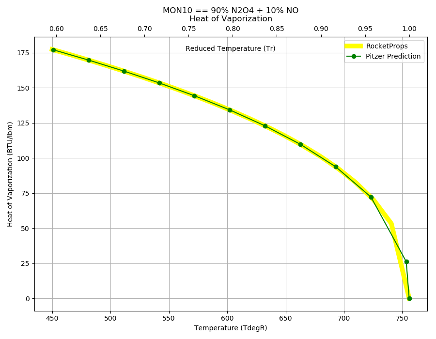

.. mon10_prop

MON10
=====

MON10 is in the family of 
`Mixed Oxides of Nitrogen <http://www.astronautix.com/m/mon.html>`_ , 
in which Nitric oxide (NO),  a low boiling point cryogenic gas, is added to Nitrogen Tetroxide (N2O4).

Solutions of NO in nitrogen tetroxide sharply depress the freezing point of N2O4. 
The mechanism of depression is believed to involve the formation of N2O3, 
which is soluble in nitrogen tetroxide. 

Various MON concentrations have been considered,
however, the high vapor pressure of MON limits the concentration of 
NO in N2O4 to about 30 per cent. Aside from the high vapor pressure, MON
is quite similar to nitrogen tetroxide.

Reference Points
----------------

MON10 == 90% N2O4 + 10% NO

`Hover over column headers to see definitions, values to see alternate units`

.. raw:: html

    <table width="100%">
    <tr><th></th>
        <th title="Reference Temperature">Tref</th>
        <th title="Reference Pressure">Pref</th>
        <th title="Specific Gravity">SG</th>
        <th title="Specific Heat">Cp</th>
        <th title="Heat of Vaporization">dHvap</th>
        <th title="Viscosity">Visc</th>
        <th title="Thermal Conductivity">Cond</th>
        <th title="Surface Tension">Surf</th>
    <tr><th>Source</th><th>R</th><th>psia</th><th>g/ml</th><th>BTU/lbm-R</th><th>BTU/lbm</th><th>poise</th><th>BTU/hr-ft-R</th><th>lbf/in</th></tr>

    <tr  style="background-color:#FFFF00"><td><a class="reference external" href="https://pypi.python.org/pypi/rocketprops">RocketProps</a></td><td  title="527.7 degR
    293.167 degK
    68.03 degF
    20.0167 degC">527.7</td><td  title="24.2732 psia
    1.65169 atm
    1.67358 bar
    0.167358 MPa">24.3</td><td  title="1.41848 SG
    88.5529 lbm/ft**3
    0.0512459 lbm/inch**3
    1418.48 kg/m**3">1.4185</td><td  title="0.463742 BTU/lbm/F
    0.464052 cal/g/C
    0.000464052 kcal/g/C
    1941.6 J/kg/K">0.464</td><td  title="157.438 BTU/lbm
    87.5241 cal/g
    0.0875241 kcal/g
    366.201 J/g">157.4</td><td  title="0.00379652 poise
    0.379652 cpoise
    0.000379652 Pa*s
    2.12595e-05 lbm/s/inch
    0.0765343 lbm/hr/inch
    1.36675 kg/hr/m
    0.0136675 kg/hr/cm">3.797e-03</td><td  title="0.102461 BTU/hr/ft/delF
    2.37179e-06 BTU/s/inch/delF
    0.000423836 cal/s/cm/delC
    0.0423836 cal/s/m/delC
    0.00177333 W/cm/delC">0.1025</td><td  title="0.000199149 lbf/in
    0.0348763 N/m
    34.8763 mN/m
    34.8763 dyne/cm">1.991e-04</td></tr>
    <tr ><td><a class="reference external" href="./_static/MON-Mixed_Oxides_of_Nitrogen.pdf">CPIA-LPM</a></td><td  title="527.67 degR
    293.15 degK
    68 degF
    20 degC">527.7</td><td  title="24.2334 psia
    1.64898 atm
    1.67083 bar
    0.167083 MPa">24.2</td><td  title="1.4197 SG
    88.6287 lbm/ft**3
    0.0512898 lbm/inch**3
    1419.7 kg/m**3">1.4197</td><td >---</td><td >---</td><td  title="0.00379731 poise
    0.379731 cpoise
    0.000379731 Pa*s
    2.1264e-05 lbm/s/inch
    0.0765503 lbm/hr/inch
    1.36703 kg/hr/m
    0.0136703 kg/hr/cm">3.797e-03</td><td >---</td><td >---</td></tr>
    <tr ><td><a class="reference external" href="./_static/AFRPL-TR_76-76_MON_propellants.pdf">AFRPL-TR-76-76</a></td><td  title="527.67 degR
    293.15 degK
    68 degF
    20 degC">527.7</td><td  title="24.2327 psia
    1.64894 atm
    1.67079 bar
    0.167079 MPa">24.2</td><td  title="1.41977 SG
    88.6331 lbm/ft**3
    0.0512923 lbm/inch**3
    1419.77 kg/m**3">1.4198</td><td >---</td><td >---</td><td >---</td><td >---</td><td >---</td></tr>

    </table>

Fluid Properties
----------------

MON10 == 90% N2O4 + 10% NO

`Hover over column headers to see definitions, values to see alternate units`

.. raw:: html

    <table width="100%">
    <tr><th></th>
        <th title="Molecular Weight">MolWt</th>
        <th title="Critical Temperature">Tc</th>
        <th title="Critical Pressure">Pc</th>
        <th title="Critical Density">SGc</th>
        <th title="Critical Compressibility Factor">Zc</th>
        <th title="Normal Boiling Point">Tnbp</th>
        <th title="Melting/Freezing Point">Tmelt</th>
        <th title="Pitzer Acentric Factor">omega</th></tr>
    <tr><th>Source</th><th>g/gmole</th><th>R</th><th>psia</th><th>g/ml</th><th>(-)</th><th>R</th><th>R</th><th>(-)</th></tr>

    <tr  style="background-color:#FFFF00"><td><a class="reference external" href="https://pypi.python.org/pypi/rocketprops">RocketProps</a></td><td>87.353</td><td  title="755.877 degR
    419.932 degK
    296.207 degF
    146.782 degC">755.9</td><td  title="1303.33 psia
    88.6863 atm
    89.8614 bar
    8.98614 MPa">1303.3</td><td  title="0.537332 SG
    33.5446 lbm/ft**3
    0.0194124 lbm/inch**3
    537.332 kg/m**3">0.5373</td><td>0.4185</td><td  title="509.07 degR
    282.817 degK
    49.4 degF
    9.66667 degC">509.1</td><td  title="450 degR
    250 degK
    -9.67 degF
    -23.15 degC">450.0</td><td>0.71408</td></tr>
    <tr ><td><a class="reference external" href="./_static/AFRPL-TR_76-76_MON_propellants.pdf">AFRPL-TR-76-76</a></td><td>87.353</td><td  title="755.877 degR
    419.932 degK
    296.207 degF
    146.782 degC">755.9</td><td  title="1303.33 psia
    88.6863 atm
    89.8614 bar
    8.98614 MPa">1303.3</td><td  title="0.537332 SG
    33.5446 lbm/ft**3
    0.0194124 lbm/inch**3
    537.332 kg/m**3">0.5373</td><td>0.4185</td><td  title="509.07 degR
    282.817 degK
    49.4 degF
    9.66667 degC">509.1</td><td  title="450 degR
    250 degK
    -9.67 degF
    -23.15 degC">450.0</td><td>0.71444</td></tr>

    </table>

.. note::

    Psudocritical properties are estimated from a molar mixing rules for critical temperature
    and molecular weight (see :ref:`Tc Mixture`).
    The :ref:`Wagner` vapor pressure correlation is used for critical pressure, critical specific gravity,
    and critical compressibility.
    
    Because of the complex temperature-dependent
    equilibrium concentrations of N2O4, N2O3, NO2 and NO, using pseudocritical properties
    results in considerable uncertainty in corresponding states correlations.

Vapor Pressure
--------------

.. raw:: html

    

        

    
.. image:: ./_static/MON10_Psat.png
   :target: ./_static/MON10_Psat.png
    

.. raw:: html

    

  

| RocketProps Selected Curve
| :ref:`AFRPL-TR-76-76 Source`
| :ref:`CPIA-LPM Source`
| :ref:`Wagner Fit Source`

.. raw:: html

    

    

    
`Click Image to View Fill Size`

Density
-------

.. note::

    Notice that critical specific gravity from 
    :ref:`Daubert`
    equation differs significantly from 
    the estimate made with mixing equations. This is likely due to complex temperature-dependent
    equilibrium concentrations of N2O4, N2O3, NO2 and NO

.. raw:: html

    

        

    
.. image:: ./_static/MON10_SG.png
   :target: ./_static/MON10_SG.png
    

.. raw:: html

    

  

| RocketProps Selected Curve
| :ref:`AFRPL-TR-76-76 Source`
| :ref:`CPIA-LPM Source`
| :ref:`Daubert Source`

.. raw:: html

    

    

    
`Click Image to View Fill Size`

Heat Capacity
-------------

.. raw:: html

    

        

    
.. image:: ./_static/MON10_Cp.png
   :target: ./_static/MON10_Cp.png
    

.. raw:: html

    

  

| RocketProps Selected Curve
| :ref:`Joback Source`

.. raw:: html

    

    

    
`Click Image to View Fill Size`

Viscosity
---------

.. raw:: html

    

        

    
.. image:: ./_static/MON10_Visc.png
   :target: ./_static/MON10_Visc.png
    

.. raw:: html

    

  

| RocketProps Selected Curve
| :ref:`Squires Source`
| :ref:`CPIA-LPM Source`

.. raw:: html

    

    

    
`Click Image to View Fill Size`

Heat of Vaporization
--------------------

.. raw:: html

    

        

    

    

.. raw:: html

    

  

| RocketProps Selected Curve
| :ref:`Pitzer Hvap Source`

.. raw:: html

    

    

    
`Click Image to View Fill Size`

Thermal Conductivity
--------------------

.. raw:: html

    

        

    
.. image:: ./_static/MON10_Cond.png
   :target: ./_static/MON10_Cond.png
    

.. raw:: html

    

  

| RocketProps Selected Curve
| :ref:`Nicola Source`

.. raw:: html

    

    

    
`Click Image to View Fill Size`

Surface Tension
---------------

    

.. raw:: html

    

        

    
.. image:: ./_static/MON10_Surf.png
   :target: ./_static/MON10_Surf.png
    

.. raw:: html

    

  

| RocketProps Selected Curve
| :ref:`Pitzer Surf Source`

.. raw:: html

    

    

    
`Click Image to View Fill Size`

