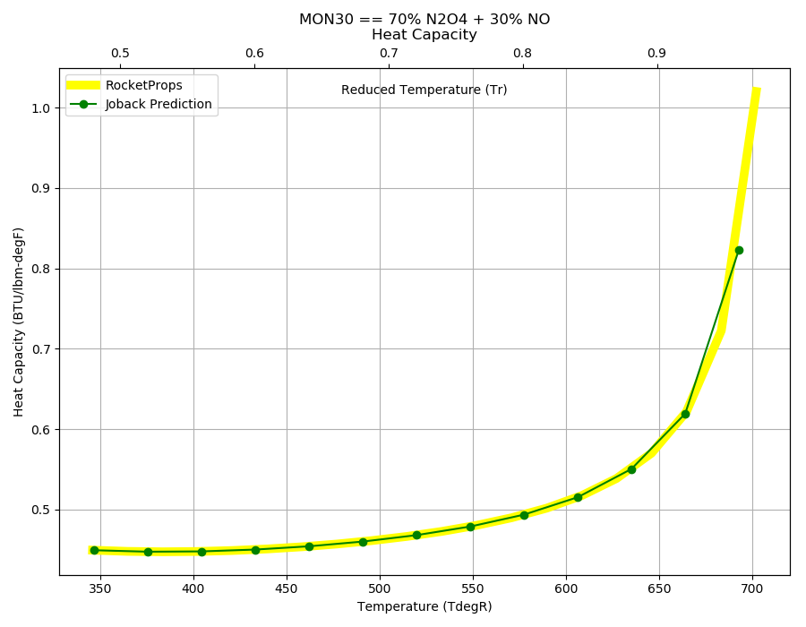
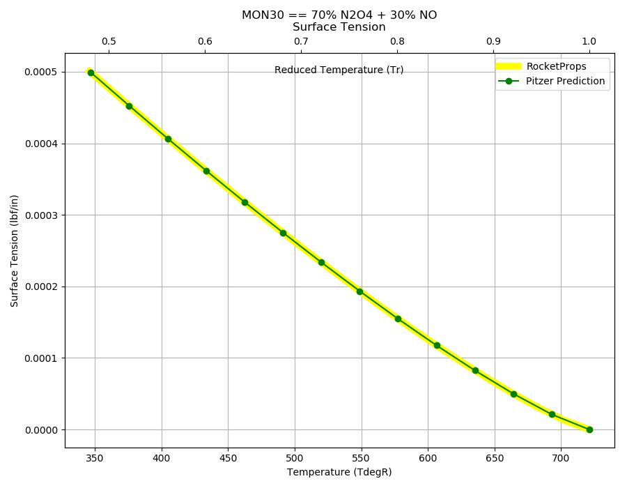

.. mon30_prop

MON30
=====

MON30 is in the family of 
`Mixed Oxides of Nitrogen <http://www.astronautix.com/m/mon.html>`_ , 
in which Nitric oxide (NO),  a low boiling point cryogenic gas, is added to Nitrogen Tetroxide (N2O4).

Solutions of NO in nitrogen tetroxide sharply depress the freezing point of N2O4. 
The mechanism of depression is believed to involve the formation of N2O3, 
which is soluble in nitrogen tetroxide. 

Various MON concentrations have been considered,
however, the high vapor pressure of MON limits the concentration of 
NO in N2O4 to about 30 per cent. Aside from the high vapor pressure, MON
is quite similar to nitrogen tetroxide.

Reference Points
----------------

MON30 == 70% N2O4 + 30% NO

`Hover over column headers to see definitions, values to see alternate units`

.. raw:: html

    <table width="100%">
    <tr><th></th>
        <th title="Reference Temperature">Tref</th>
        <th title="Reference Pressure">Pref</th>
        <th title="Specific Gravity">SG</th>
        <th title="Specific Heat">Cp</th>
        <th title="Heat of Vaporization">dHvap</th>
        <th title="Viscosity">Visc</th>
        <th title="Thermal Conductivity">Cond</th>
        <th title="Surface Tension">Surf</th>
    <tr><th>Source</th><th>R</th><th>psia</th><th>g/ml</th><th>BTU/lbm-R</th><th>BTU/lbm</th><th>poise</th><th>BTU/hr-ft-R</th><th>lbf/in</th></tr>

    <tr  style="background-color:#FFFF00"><td><a class="reference external" href="https://pypi.python.org/pypi/rocketprops">RocketProps</a></td><td  title="527.7 degR
    293.167 degK
    68.03 degF
    20.0167 degC">527.7</td><td  title="86.3444 psia
    5.87539 atm
    5.95324 bar
    0.595324 MPa">86.3</td><td  title="1.38132 SG
    86.233 lbm/ft**3
    0.0499034 lbm/inch**3
    1381.32 kg/m**3">1.3813</td><td  title="0.470751 BTU/lbm/F
    0.471066 cal/g/C
    0.000471066 kcal/g/C
    1970.94 J/kg/K">0.471</td><td  title="149.728 BTU/lbm
    83.238 cal/g
    0.083238 kcal/g
    348.268 J/g">149.7</td><td  title="0.00485107 poise
    0.485107 cpoise
    0.000485107 Pa*s
    2.71647e-05 lbm/s/inch
    0.097793 lbm/hr/inch
    1.74638 kg/hr/m
    0.0174638 kg/hr/cm">4.851e-03</td><td  title="0.128195 BTU/hr/ft/delF
    2.96747e-06 BTU/s/inch/delF
    0.000530284 cal/s/cm/delC
    0.0530284 cal/s/m/delC
    0.00221871 W/cm/delC">0.1282</td><td  title="0.000222687 lbf/in
    0.0389985 N/m
    38.9985 mN/m
    38.9985 dyne/cm">2.227e-04</td></tr>
    <tr ><td><a class="reference external" href="./_static/MON-Mixed_Oxides_of_Nitrogen.pdf">CPIA-LPM</a></td><td  title="527.67 degR
    293.15 degK
    68 degF
    20 degC">527.7</td><td  title="86.2996 psia
    5.87234 atm
    5.95015 bar
    0.595015 MPa">86.3</td><td  title="1.38188 SG
    86.2677 lbm/ft**3
    0.0499234 lbm/inch**3
    1381.88 kg/m**3">1.3819</td><td >---</td><td >---</td><td  title="0.00485335 poise
    0.485335 cpoise
    0.000485335 Pa*s
    2.71775e-05 lbm/s/inch
    0.097839 lbm/hr/inch
    1.74721 kg/hr/m
    0.0174721 kg/hr/cm">4.853e-03</td><td >---</td><td >---</td></tr>
    <tr ><td><a class="reference external" href="./_static/AFRPL-TR_76-76_MON_propellants.pdf">AFRPL-TR-76-76</a></td><td  title="527.67 degR
    293.15 degK
    68 degF
    20 degC">527.7</td><td  title="86.3122 psia
    5.8732 atm
    5.95102 bar
    0.595102 MPa">86.3</td><td  title="1.38184 SG
    86.2656 lbm/ft**3
    0.0499222 lbm/inch**3
    1381.84 kg/m**3">1.3818</td><td >---</td><td >---</td><td >---</td><td >---</td><td >---</td></tr>

    </table>

Fluid Properties
----------------

MON30 == 70% N2O4 + 30% NO

`Hover over column headers to see definitions, values to see alternate units`

.. raw:: html

    <table width="100%">
    <tr><th></th>
        <th title="Molecular Weight">MolWt</th>
        <th title="Critical Temperature">Tc</th>
        <th title="Critical Pressure">Pc</th>
        <th title="Critical Density">SGc</th>
        <th title="Critical Compressibility Factor">Zc</th>
        <th title="Normal Boiling Point">Tnbp</th>
        <th title="Melting/Freezing Point">Tmelt</th>
        <th title="Pitzer Acentric Factor">omega</th></tr>
    <tr><th>Source</th><th>g/gmole</th><th>R</th><th>psia</th><th>g/ml</th><th>(-)</th><th>R</th><th>R</th><th>(-)</th></tr>

    <tr  style="background-color:#FFFF00"><td><a class="reference external" href="https://pypi.python.org/pypi/rocketprops">RocketProps</a></td><td>79.321</td><td  title="721 degR
    400.556 degK
    261.33 degF
    127.406 degC">721.0</td><td  title="2142.52 psia
    145.79 atm
    147.722 bar
    14.7722 MPa">2142.5</td><td  title="0.674145 SG
    42.0855 lbm/ft**3
    0.024355 lbm/inch**3
    674.145 kg/m**3">0.6741</td><td>0.5220</td><td  title="462.67 degR
    257.039 degK
    3 degF
    -16.1111 degC">462.7</td><td  title="345.87 degR
    192.15 degK
    -113.8 degF
    -81 degC">345.9</td><td>0.64117</td></tr>
    <tr ><td><a class="reference external" href="./_static/AFRPL-TR_76-76_MON_propellants.pdf">AFRPL-TR-76-76</a></td><td>79.321</td><td  title="721 degR
    400.556 degK
    261.33 degF
    127.406 degC">721.0</td><td  title="2142.52 psia
    145.79 atm
    147.722 bar
    14.7722 MPa">2142.5</td><td  title="0.674145 SG
    42.0855 lbm/ft**3
    0.024355 lbm/inch**3
    674.145 kg/m**3">0.6741</td><td>0.5220</td><td  title="462.67 degR
    257.039 degK
    3 degF
    -16.1111 degC">462.7</td><td  title="345.87 degR
    192.15 degK
    -113.8 degF
    -81 degC">345.9</td><td>0.64111</td></tr>

    </table>

.. note::

    Psudocritical properties are estimated from a molar mixing rules for critical temperature
    and molecular weight (see :ref:`Tc Mixture`).
    The :ref:`Wagner` vapor pressure correlation is used for critical pressure, critical specific gravity,
    and critical compressibility.
    
    Because of the complex temperature-dependent
    equilibrium concentrations of N2O4, N2O3, NO2 and NO, using pseudocritical properties
    results in considerable uncertainty in corresponding states correlations.

Vapor Pressure
--------------

.. raw:: html

    

        

    
.. image:: ./_static/MON30_Psat.png
   :target: ./_static/MON30_Psat.png
    

.. raw:: html

    

  

| RocketProps Selected Curve
| :ref:`AFRPL-TR-76-76 Source`
| :ref:`CPIA-LPM Source`
| :ref:`Wagner Fit Source`

.. raw:: html

    

    

    
`Click Image to View Fill Size`

Density
-------

.. note::

    Notice that critical specific gravity from 
    :ref:`Daubert`
    equation differs significantly from 
    the estimate made with mixing equations. This is likely due to complex temperature-dependent
    equilibrium concentrations of N2O4, N2O3, NO2 and NO

.. raw:: html

    

        

    
.. image:: ./_static/MON30_SG.png
   :target: ./_static/MON30_SG.png
    

.. raw:: html

    

  

| RocketProps Selected Curve
| :ref:`AFRPL-TR-76-76 Source`
| :ref:`CPIA-LPM Source`
| :ref:`Daubert Source`

.. raw:: html

    

    

    
`Click Image to View Fill Size`

Heat Capacity
-------------

.. raw:: html

    

        

    

    

.. raw:: html

    

  

| RocketProps Selected Curve
| :ref:`Joback Source`

.. raw:: html

    

    

    
`Click Image to View Fill Size`

Viscosity
---------

.. raw:: html

    

        

    
.. image:: ./_static/MON30_Visc.png
   :target: ./_static/MON30_Visc.png
    

.. raw:: html

    

  

| RocketProps Selected Curve
| :ref:`Squires Source`
| :ref:`CPIA-LPM Source`

.. raw:: html

    

    

    
`Click Image to View Fill Size`

Heat of Vaporization
--------------------

.. raw:: html

    

        

    
.. image:: ./_static/MON30_Hvap.png
   :target: ./_static/MON30_Hvap.png
    

.. raw:: html

    

  

| RocketProps Selected Curve
| :ref:`Pitzer Hvap Source`

.. raw:: html

    

    

    
`Click Image to View Fill Size`

Thermal Conductivity
--------------------

.. raw:: html

    

        

    
.. image:: ./_static/MON30_Cond.png
   :target: ./_static/MON30_Cond.png
    

.. raw:: html

    

  

| RocketProps Selected Curve
| :ref:`Nicola Source`

.. raw:: html

    

    

    
`Click Image to View Fill Size`

Surface Tension
---------------

    

.. raw:: html

    

        

    

    

.. raw:: html

    

  

| RocketProps Selected Curve
| :ref:`Pitzer Surf Source`

.. raw:: html

    

    

    
`Click Image to View Fill Size`

