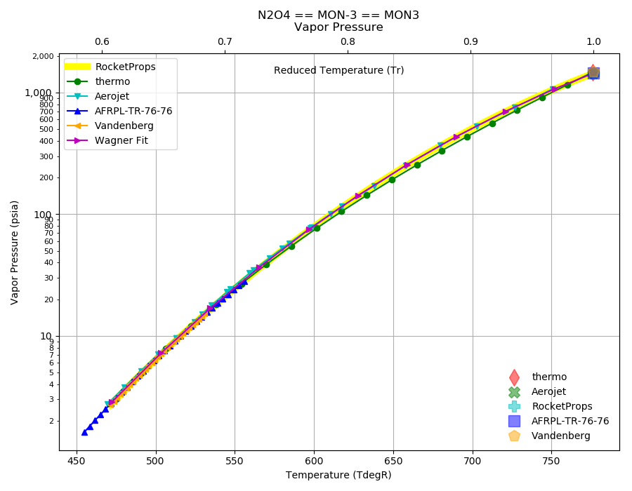
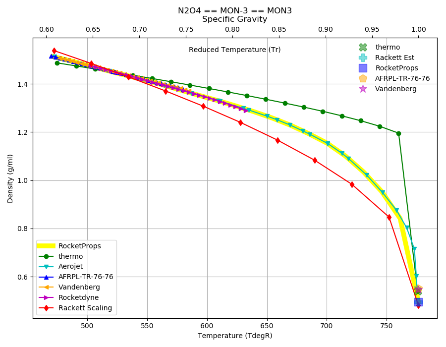

.. n2o4_prop

N2O4
====

`N2O4 <http://www.astronautix.com/n/n2o4.html>`_ or
Nitrogen tetroxide became the storable liquid propellant of choice from the late 1950's.

Typical combinations are: `N2O4/MMH <http://www.astronautix.com/n/n2o4mmh.html>`_,
`N2O4/UDMH <http://www.astronautix.com/n/n2o4udmh.html>`_ and
`N2O4/A50 <http://www.astronautix.com/n/n2o4aerozine-50.html>`_

Reference Points
----------------

N2O4 == MON-3 == MON3

`Hover over column headers to see definitions, values to see alternate units`

.. raw:: html

    <table width="100%">
    <tr><th></th>
        <th title="Reference Temperature">Tref</th>
        <th title="Reference Pressure">Pref</th>
        <th title="Specific Gravity">SG</th>
        <th title="Specific Heat">Cp</th>
        <th title="Heat of Vaporization">dHvap</th>
        <th title="Viscosity">Visc</th>
        <th title="Thermal Conductivity">Cond</th>
        <th title="Surface Tension">Surf</th>
    <tr><th>Source</th><th>R</th><th>psia</th><th>g/ml</th><th>BTU/lbm-R</th><th>BTU/lbm</th><th>poise</th><th>BTU/hr-ft-R</th><th>lbf/in</th></tr>

    <tr  style="background-color:#FFFF00"><td><a class="reference external" href="https://pypi.python.org/pypi/rocketprops">RocketProps</a></td><td  title="527.67 degR
    293.15 degK
    68 degF
    20 degC">527.7</td><td  title="14.6959 psia
    0.999997 atm
    1.01325 bar
    0.101325 MPa">14.7</td><td  title="1.44144 SG
    89.986 lbm/ft**3
    0.0520752 lbm/inch**3
    1441.44 kg/m**3">1.4414</td><td  title="0.374677 BTU/lbm/F
    0.374928 cal/g/C
    0.000374928 kcal/g/C
    1568.7 J/kg/K">0.375</td><td  title="178.2 BTU/lbm
    99.0663 cal/g
    0.0990663 kcal/g
    414.493 J/g">178.2</td><td  title="0.00420093 poise
    0.420093 cpoise
    0.000420093 Pa*s
    2.35241e-05 lbm/s/inch
    0.0846868 lbm/hr/inch
    1.51233 kg/hr/m
    0.0151233 kg/hr/cm">4.201e-03</td><td  title="0.0766961 BTU/hr/ft/delF
    1.77537e-06 BTU/s/inch/delF
    0.000317258 cal/s/cm/delC
    0.0317258 cal/s/m/delC
    0.00132741 W/cm/delC">0.0767</td><td  title="0.000149673 lbf/in
    0.0262117 N/m
    26.2117 mN/m
    26.2117 dyne/cm">1.497e-04</td></tr>
    <tr ><td><a class="reference external" href="./_static/AFRPL-TR_76-76_MON_propellants.pdf">AFRPL-TR-76-76</a></td><td  title="536.67 degR
    298.15 degK
    77 degF
    25 degC">536.7</td><td  title="17.45 psia
    1.1874 atm
    1.20314 bar
    0.120314 MPa">17.4</td><td  title="1.433 SG
    89.4593 lbm/ft**3
    0.0517704 lbm/inch**3
    1433 kg/m**3">1.4330</td><td  title="0.378 BTU/lbm/F
    0.378253 cal/g/C
    0.000378253 kcal/g/C
    1582.61 J/kg/K">0.378</td><td  title="178.2 BTU/lbm
    99.0663 cal/g
    0.0990663 kcal/g
    414.493 J/g">178.2</td><td  title="0.00396 poise
    0.396 cpoise
    0.000396 Pa*s
    2.2175e-05 lbm/s/inch
    0.0798299 lbm/hr/inch
    1.4256 kg/hr/m
    0.014256 kg/hr/cm">3.960e-03</td><td  title="0.0756668 BTU/hr/ft/delF
    1.75155e-06 BTU/s/inch/delF
    0.000313 cal/s/cm/delC
    0.0313 cal/s/m/delC
    0.00130959 W/cm/delC">0.0757</td><td  title="0.000143333 lbf/in
    0.0251015 N/m
    25.1015 mN/m
    25.1015 dyne/cm">1.433e-04</td></tr>
    <tr ><td><a class="reference external" href="./_static/Aerojet_Propellant_Properties.pdf">Aerojet</a></td><td  title="527.67 degR
    293.15 degK
    68 degF
    20 degC">527.7</td><td  title="14.6959 psia
    0.999997 atm
    1.01325 bar
    0.101325 MPa">14.7</td><td  title="1.44144 SG
    89.986 lbm/ft**3
    0.0520752 lbm/inch**3
    1441.44 kg/m**3">1.4414</td><td  title="0.374659 BTU/lbm/F
    0.37491 cal/g/C
    0.00037491 kcal/g/C
    1568.62 J/kg/K">0.375</td><td  title="178.2 BTU/lbm
    99.0663 cal/g
    0.0990663 kcal/g
    414.493 J/g">178.2</td><td  title="0.00420153 poise
    0.420153 cpoise
    0.000420153 Pa*s
    2.35275e-05 lbm/s/inch
    0.0846989 lbm/hr/inch
    1.51255 kg/hr/m
    0.0151255 kg/hr/cm">4.202e-03</td><td  title="0.0766777 BTU/hr/ft/delF
    1.77495e-06 BTU/s/inch/delF
    0.000317182 cal/s/cm/delC
    0.0317182 cal/s/m/delC
    0.00132709 W/cm/delC">0.0767</td><td >---</td></tr>
    <tr ><td><a class="reference external" href="https://pypi.org/project/thermo/">thermo</a></td><td  title="527.67 degR
    293.15 degK
    68 degF
    20 degC">527.7</td><td  title="13.86 psia
    0.943118 atm
    0.955615 bar
    0.0955615 MPa">13.9</td><td  title="1.44452 SG
    90.1785 lbm/ft**3
    0.0521866 lbm/inch**3
    1444.52 kg/m**3">1.4445</td><td  title="0.201545 BTU/lbm/F
    0.20168 cal/g/C
    0.00020168 kcal/g/C
    843.827 J/kg/K">0.202</td><td  title="154.141 BTU/lbm
    85.6914 cal/g
    0.0856914 kcal/g
    358.533 J/g">154.1</td><td  title="0.00425364 poise
    0.425364 cpoise
    0.000425364 Pa*s
    2.38193e-05 lbm/s/inch
    0.0857493 lbm/hr/inch
    1.53131 kg/hr/m
    0.0153131 kg/hr/cm">4.254e-03</td><td  title="0.08197 BTU/hr/ft/delF
    1.89745e-06 BTU/s/inch/delF
    0.000339073 cal/s/cm/delC
    0.0339073 cal/s/m/delC
    0.00141868 W/cm/delC">0.0820</td><td  title="0.000239206 lbf/in
    0.0418913 N/m
    41.8913 mN/m
    41.8913 dyne/cm">2.392e-04</td></tr>
    <tr ><td><a class="reference external" href="./_static/Vandenberg_Corrected_Properties.pdf">Vandenberg</a></td><td  title="527.67 degR
    293.15 degK
    68 degF
    20 degC">527.7</td><td  title="14.7 psia
    1.00028 atm
    1.01353 bar
    0.101353 MPa">14.7</td><td  title="1.44438 SG
    90.1699 lbm/ft**3
    0.0521816 lbm/inch**3
    1444.38 kg/m**3">1.4444</td><td >---</td><td  title="178.875 BTU/lbm
    99.4415 cal/g
    0.0994415 kcal/g
    416.063 J/g">178.9</td><td >---</td><td  title="0.0766608 BTU/hr/ft/delF
    1.77456e-06 BTU/s/inch/delF
    0.000317112 cal/s/cm/delC
    0.0317112 cal/s/m/delC
    0.0013268 W/cm/delC">0.0767</td><td >---</td></tr>

    </table>

Fluid Properties
----------------

N2O4 == MON-3 == MON3

`Hover over column headers to see definitions, values to see alternate units`

.. raw:: html

    <table width="100%">
    <tr><th></th>
        <th title="Molecular Weight">MolWt</th>
        <th title="Critical Temperature">Tc</th>
        <th title="Critical Pressure">Pc</th>
        <th title="Critical Density">SGc</th>
        <th title="Critical Compressibility Factor">Zc</th>
        <th title="Normal Boiling Point">Tnbp</th>
        <th title="Melting/Freezing Point">Tmelt</th>
        <th title="Pitzer Acentric Factor">omega</th></tr>
    <tr><th>Source</th><th>g/gmole</th><th>R</th><th>psia</th><th>g/ml</th><th>(-)</th><th>R</th><th>R</th><th>(-)</th></tr>

    <tr  style="background-color:#FFFF00"><td><a class="reference external" href="https://pypi.python.org/pypi/rocketprops">RocketProps</a></td><td>92.011</td><td  title="776.47 degR
    431.372 degK
    316.8 degF
    158.222 degC">776.5</td><td  title="1441.3 psia
    98.0746 atm
    99.3741 bar
    9.93741 MPa">1441.3</td><td  title="0.496222 SG
    30.9781 lbm/ft**3
    0.0179272 lbm/inch**3
    496.222 kg/m**3">0.4962</td><td>0.5139</td><td  title="530.07 degR
    294.483 degK
    70.4 degF
    21.3333 degC">530.1</td><td  title="471.42 degR
    261.9 degK
    11.75 degF
    -11.25 degC">471.4</td><td>0.83906</td></tr>
    <tr ><td><a class="reference external" href="./_static/AFRPL-TR_76-76_MON_propellants.pdf">AFRPL-TR-76-76</a></td><td>92.016</td><td  title="776.47 degR
    431.372 degK
    316.8 degF
    158.222 degC">776.5</td><td  title="1440.2 psia
    97.9998 atm
    99.2983 bar
    9.92983 MPa">1440.2</td><td  title="0.5504 SG
    34.3603 lbm/ft**3
    0.0198845 lbm/inch**3
    550.4 kg/m**3">0.5504</td><td>0.4630</td><td  title="529.77 degR
    294.317 degK
    70.1 degF
    21.1667 degC">529.8</td><td  title="471.47 degR
    261.928 degK
    11.8 degF
    -11.2222 degC">471.5</td><td>---</td></tr>
    <tr ><td><a class="reference external" href="./_static/Aerojet_Propellant_Properties.pdf">Aerojet</a></td><td>92.011</td><td  title="776.47 degR
    431.372 degK
    316.8 degF
    158.222 degC">776.5</td><td  title="1441.3 psia
    98.0746 atm
    99.3741 bar
    9.93741 MPa">1441.3</td><td  title="0.496222 SG
    30.9781 lbm/ft**3
    0.0179272 lbm/inch**3
    496.222 kg/m**3">0.4962</td><td>0.5139</td><td  title="530.07 degR
    294.483 degK
    70.4 degF
    21.3333 degC">530.1</td><td  title="471.42 degR
    261.9 degK
    11.75 degF
    -11.25 degC">471.4</td><td>0.81555</td></tr>
    <tr ><td><a class="reference external" href="https://pypi.org/project/thermo/">thermo</a></td><td>92.011</td><td  title="775.8 degR
    431 degK
    316.13 degF
    157.85 degC">775.8</td><td  title="1469.59 psia
    100 atm
    101.325 bar
    10.1325 MPa">1469.6</td><td  title="0.541362 SG
    33.7961 lbm/ft**3
    0.019558 lbm/inch**3
    541.362 kg/m**3">0.5414</td><td>0.4807</td><td  title="529.74 degR
    294.3 degK
    70.07 degF
    21.15 degC">529.7</td><td  title="474.93 degR
    263.85 degK
    15.26 degF
    -9.3 degC">474.9</td><td>0.85584</td></tr>
    <tr ><td><a class="reference external" href="./_static/Vandenberg_Corrected_Properties.pdf">Vandenberg</a></td><td>92.011</td><td  title="776.52 degR
    431.4 degK
    316.85 degF
    158.25 degC">776.5</td><td  title="1484.29 psia
    101 atm
    102.338 bar
    10.2338 MPa">1484.3</td><td  title="0.548 SG
    34.2105 lbm/ft**3
    0.0197978 lbm/inch**3
    548 kg/m**3">0.5480</td><td>0.4792</td><td  title="529.65 degR
    294.25 degK
    69.98 degF
    21.1 degC">529.6</td><td  title="471.51 degR
    261.95 degK
    11.84 degF
    -11.2 degC">471.5</td><td>0.83400</td></tr>

    </table>

Vapor Pressure
--------------

.. raw:: html

    

        

    

    

.. raw:: html

    

  

| RocketProps Selected Curve
| :ref:`thermo Source`
| :ref:`Aerojet Source`
| :ref:`AFRPL-TR-76-76 Source`
| :ref:`Vandenberg Source`
| :ref:`Wagner Fit Source`

.. raw:: html

    

    

    
`Click Image to View Fill Size`

Density
-------

.. raw:: html

    

        

    

    

.. raw:: html

    

  

| RocketProps Selected Curve
| :ref:`thermo Source`
| :ref:`Aerojet Source`
| :ref:`AFRPL-TR-76-76 Source`
| :ref:`Vandenberg Source`
| :ref:`Rocketdyne Source`
| :ref:`Rackett Scaling Source`

.. raw:: html

    

    

    
`Click Image to View Fill Size`

Heat Capacity
-------------

.. raw:: html

    

        

    
.. image:: ./_static/N2O4_Cp.png
   :target: ./_static/N2O4_Cp.png
    

.. raw:: html

    

  

| RocketProps Selected Curve
| :ref:`thermo Source`
| :ref:`Aerojet Source`
| :ref:`Joback Source`
| :ref:`AFRPL-TR-76-76 Source`

.. raw:: html

    

    

    
`Click Image to View Fill Size`

Viscosity
---------

.. raw:: html

    

        

    
.. image:: ./_static/N2O4_Visc.png
   :target: ./_static/N2O4_Visc.png
    

.. raw:: html

    

  

| RocketProps Selected Curve
| :ref:`thermo Source`
| :ref:`Aerojet Source`
| :ref:`Squires Source`
| :ref:`AFRPL-TR-76-76 Source`

.. raw:: html

    

    

    
`Click Image to View Fill Size`

Heat of Vaporization
--------------------

.. raw:: html

    

        

    
.. image:: ./_static/N2O4_Hvap.png
   :target: ./_static/N2O4_Hvap.png
    

.. raw:: html

    

  

| RocketProps Selected Curve
| :ref:`thermo Source`
| :ref:`Aerojet Source`
| :ref:`Pitzer Hvap Source`
| :ref:`Vandenberg Source`

.. raw:: html

    

    

    
`Click Image to View Fill Size`

Thermal Conductivity
--------------------

.. raw:: html

    

        

    
.. image:: ./_static/N2O4_Cond.png
   :target: ./_static/N2O4_Cond.png
    

.. raw:: html

    

  

| RocketProps Selected Curve
| :ref:`thermo Source`
| :ref:`Aerojet Source`
| :ref:`Nicola Source`
| :ref:`AFRPL-TR-76-76 Source`
| :ref:`Vandenberg Source`

.. raw:: html

    

    

    
`Click Image to View Fill Size`

Surface Tension
---------------

    

.. raw:: html

    

        

    
.. image:: ./_static/N2O4_Surf.png
   :target: ./_static/N2O4_Surf.png
    

.. raw:: html

    

  

| RocketProps Selected Curve
| :ref:`thermo Source`
| :ref:`AFRPL-TR-76-76 Source`
| :ref:`Sastri-Rao Source`
| :ref:`Pitzer Surf Source`

.. raw:: html

    

    

    
`Click Image to View Fill Size`

