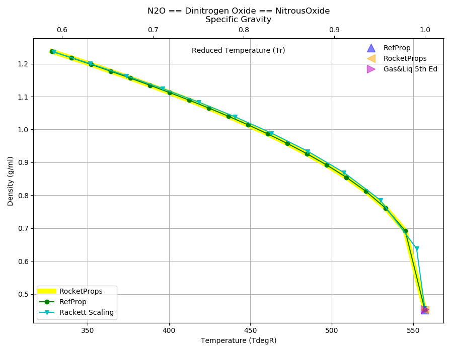
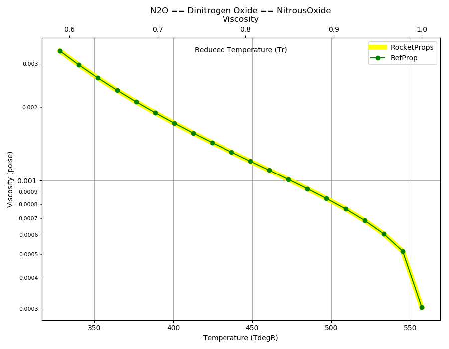
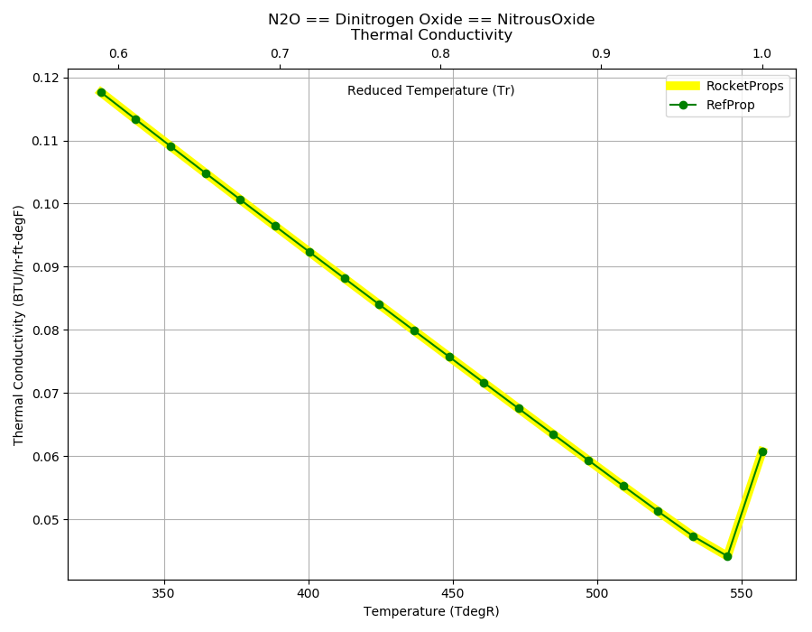
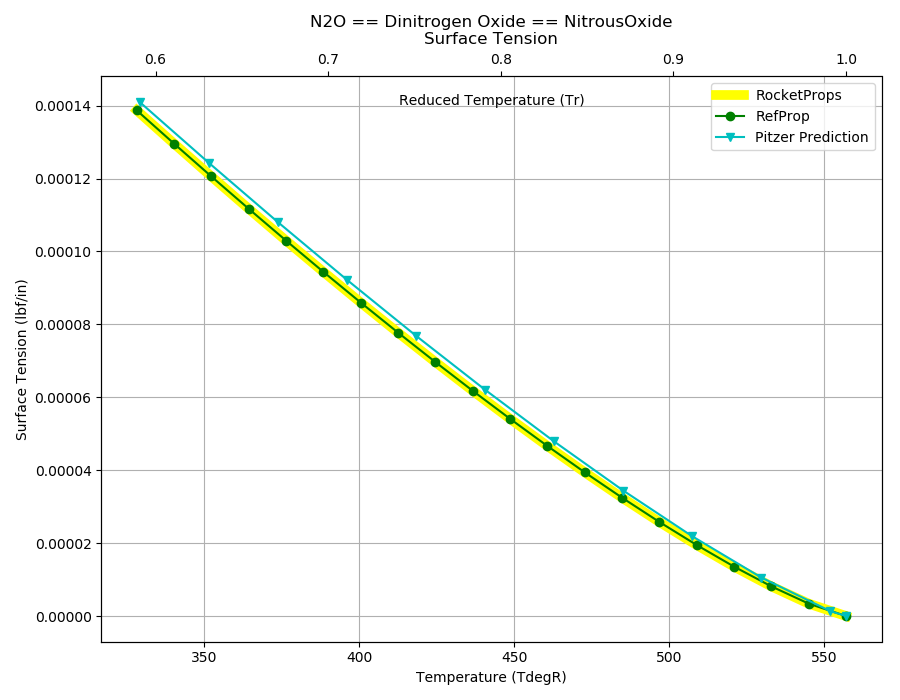

.. n2o_prop

N2O
===

`N2O <http://www.astronautix.com/n/n2o.html>`_ or
Liquid nitrous oxide (N2O / dinitrogen monoxide / 'laughing gas') is the oxidizer 
of choice for hybrid rocket motors because it is benign, storable, and 
self-pressurizing.

Reference Points
----------------

N2O == Dinitrogen Oxide == NitrousOxide

`Hover over column headers to see definitions, values to see alternate units`

.. raw:: html

    <table width="100%">
    <tr><th></th>
        <th title="Reference Temperature">Tref</th>
        <th title="Reference Pressure">Pref</th>
        <th title="Specific Gravity">SG</th>
        <th title="Specific Heat">Cp</th>
        <th title="Heat of Vaporization">dHvap</th>
        <th title="Viscosity">Visc</th>
        <th title="Thermal Conductivity">Cond</th>
        <th title="Surface Tension">Surf</th>
    <tr><th>Source</th><th>R</th><th>psia</th><th>g/ml</th><th>BTU/lbm-R</th><th>BTU/lbm</th><th>poise</th><th>BTU/hr-ft-R</th><th>lbf/in</th></tr>

    <tr  style="background-color:#FFFF00"><td><a class="reference external" href="https://pypi.python.org/pypi/rocketprops">RocketProps</a></td><td  title="332.424 degR
    184.68 degK
    -127.246 degF
    -88.47 degC">332.4</td><td  title="14.6959 psia
    0.999997 atm
    1.01325 bar
    0.101325 MPa">14.7</td><td  title="1.23046 SG
    76.8151 lbm/ft**3
    0.0444532 lbm/inch**3
    1230.46 kg/m**3">1.2305</td><td  title="0.41086 BTU/lbm/F
    0.411135 cal/g/C
    0.000411135 kcal/g/C
    1720.19 J/kg/K">0.411</td><td  title="161.022 BTU/lbm
    89.5164 cal/g
    0.0895164 kcal/g
    374.536 J/g">161.0</td><td  title="0.00323728 poise
    0.323728 cpoise
    0.000323728 Pa*s
    1.81279e-05 lbm/s/inch
    0.0652605 lbm/hr/inch
    1.16542 kg/hr/m
    0.0116542 kg/hr/cm">3.237e-03</td><td  title="0.116128 BTU/hr/ft/delF
    2.68816e-06 BTU/s/inch/delF
    0.000480371 cal/s/cm/delC
    0.0480371 cal/s/m/delC
    0.00200987 W/cm/delC">0.1161</td><td  title="0.000135501 lbf/in
    0.0237298 N/m
    23.7298 mN/m
    23.7298 dyne/cm">1.355e-04</td></tr>
    <tr ><td><a class="reference external" href="https://www.nist.gov/srd/refprop">RefProp</a></td><td  title="332.424 degR
    184.68 degK
    -127.246 degF
    -88.47 degC">332.4</td><td  title="14.6959 psia
    0.999997 atm
    1.01325 bar
    0.101325 MPa">14.7</td><td  title="1.23046 SG
    76.8151 lbm/ft**3
    0.0444532 lbm/inch**3
    1230.46 kg/m**3">1.2305</td><td  title="0.41086 BTU/lbm/F
    0.411135 cal/g/C
    0.000411135 kcal/g/C
    1720.19 J/kg/K">0.411</td><td  title="161.022 BTU/lbm
    89.5164 cal/g
    0.0895164 kcal/g
    374.536 J/g">161.0</td><td  title="0.00323728 poise
    0.323728 cpoise
    0.000323728 Pa*s
    1.81279e-05 lbm/s/inch
    0.0652605 lbm/hr/inch
    1.16542 kg/hr/m
    0.0116542 kg/hr/cm">3.237e-03</td><td  title="0.116128 BTU/hr/ft/delF
    2.68816e-06 BTU/s/inch/delF
    0.000480371 cal/s/cm/delC
    0.0480371 cal/s/m/delC
    0.00200987 W/cm/delC">0.1161</td><td  title="0.000135501 lbf/in
    0.0237298 N/m
    23.7298 mN/m
    23.7298 dyne/cm">1.355e-04</td></tr>

    </table>

Fluid Properties
----------------

N2O == Dinitrogen Oxide == NitrousOxide

`Hover over column headers to see definitions, values to see alternate units`

.. raw:: html

    <table width="100%">
    <tr><th></th>
        <th title="Molecular Weight">MolWt</th>
        <th title="Critical Temperature">Tc</th>
        <th title="Critical Pressure">Pc</th>
        <th title="Critical Density">SGc</th>
        <th title="Critical Compressibility Factor">Zc</th>
        <th title="Normal Boiling Point">Tnbp</th>
        <th title="Melting/Freezing Point">Tmelt</th>
        <th title="Pitzer Acentric Factor">omega</th></tr>
    <tr><th>Source</th><th>g/gmole</th><th>R</th><th>psia</th><th>g/ml</th><th>(-)</th><th>R</th><th>R</th><th>(-)</th></tr>

    <tr  style="background-color:#FFFF00"><td><a class="reference external" href="https://pypi.python.org/pypi/rocketprops">RocketProps</a></td><td>44.013</td><td  title="557.136 degR
    309.52 degK
    97.466 degF
    36.37 degC">557.1</td><td  title="1050.8 psia
    71.5026 atm
    72.45 bar
    7.245 MPa">1050.8</td><td  title="0.452005 SG
    28.2178 lbm/ft**3
    0.0163297 lbm/inch**3
    452.005 kg/m**3">0.4520</td><td>0.2742</td><td  title="332.424 degR
    184.68 degK
    -127.246 degF
    -88.47 degC">332.4</td><td  title="328.221 degR
    182.345 degK
    -131.449 degF
    -90.805 degC">328.2</td><td>0.16219</td></tr>
    <tr ><td><a class="reference external" href="https://www.nist.gov/srd/refprop">RefProp</a></td><td>44.013</td><td  title="557.136 degR
    309.52 degK
    97.466 degF
    36.37 degC">557.1</td><td  title="1050.8 psia
    71.5026 atm
    72.45 bar
    7.245 MPa">1050.8</td><td  title="0.452005 SG
    28.2178 lbm/ft**3
    0.0163297 lbm/inch**3
    452.005 kg/m**3">0.4520</td><td>0.2742</td><td  title="332.424 degR
    184.68 degK
    -127.246 degF
    -88.47 degC">332.4</td><td  title="328.221 degR
    182.345 degK
    -131.449 degF
    -90.805 degC">328.2</td><td>0.16219</td></tr>
    <tr ><td><a class="reference external" href="./sources.html#gas&liq-5th-ed">Gas&Liq 5th Ed</a></td><td>44.013</td><td  title="557.28 degR
    309.6 degK
    97.61 degF
    36.45 degC">557.3</td><td  title="1052.25 psia
    71.6013 atm
    72.55 bar
    7.255 MPa">1052.2</td><td  title="0.453742 SG
    28.3262 lbm/ft**3
    0.0163925 lbm/inch**3
    453.742 kg/m**3">0.4537</td><td>0.2734</td><td  title="332.406 degR
    184.67 degK
    -127.264 degF
    -88.48 degC">332.4</td><td  title="328.194 degR
    182.33 degK
    -131.476 degF
    -90.82 degC">328.2</td><td>---</td></tr>

    </table>

Vapor Pressure
--------------

.. raw:: html

    

        

    
.. image:: ./_static/N2O_Psat.png
   :target: ./_static/N2O_Psat.png
    

.. raw:: html

    

  

| RocketProps Selected Curve
| :ref:`RefProp Source`
| :ref:`Edalat Source`

.. raw:: html

    

    

    
`Click Image to View Fill Size`

Density
-------

.. raw:: html

    

        

    

    

.. raw:: html

    

  

| RocketProps Selected Curve
| :ref:`RefProp Source`
| :ref:`Rackett Scaling Source`
| :ref:`Gas&Liq 5th Ed Source`

.. raw:: html

    

    

    
`Click Image to View Fill Size`

Heat Capacity
-------------

.. raw:: html

    

        

    
.. image:: ./_static/N2O_Cp.png
   :target: ./_static/N2O_Cp.png
    

.. raw:: html

    

  

| RocketProps Selected Curve
| :ref:`RefProp Source`

.. raw:: html

    

    

    
`Click Image to View Fill Size`

Viscosity
---------

.. raw:: html

    

        

    

    

.. raw:: html

    

  

| RocketProps Selected Curve
| :ref:`RefProp Source`

.. raw:: html

    

    

    
`Click Image to View Fill Size`

Heat of Vaporization
--------------------

.. raw:: html

    

        

    
.. image:: ./_static/N2O_Hvap.png
   :target: ./_static/N2O_Hvap.png
    

.. raw:: html

    

  

| RocketProps Selected Curve
| :ref:`RefProp Source`
| :ref:`Pitzer Hvap Source`

.. raw:: html

    

    

    
`Click Image to View Fill Size`

Thermal Conductivity
--------------------

.. raw:: html

    

        

    

    

.. raw:: html

    

  

| RocketProps Selected Curve
| :ref:`RefProp Source`

.. raw:: html

    

    

    
`Click Image to View Fill Size`

Surface Tension
---------------

    

.. raw:: html

    

        

    

    

.. raw:: html

    

  

| RocketProps Selected Curve
| :ref:`RefProp Source`
| :ref:`Pitzer Surf Source`

.. raw:: html

    

    

    
`Click Image to View Fill Size`

