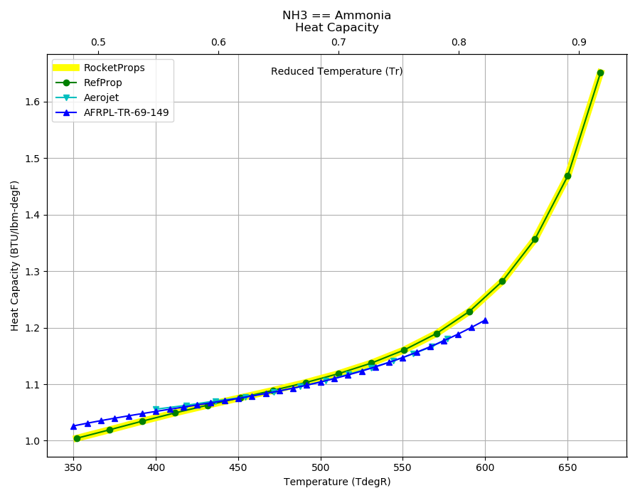

.. nh3_prop

NH3
===

Ammonia (NH3) was used as the fuel in the 
`XLR-99 <http://www.astronautix.com/x/index.html>`_ 
engine that powered the X-15 manned spaceplane; 
used as the propellant in some electric engine designs; 
developed as the propellant in Russian nuclear-powered ICBM designs of the 1950's.

Reference Points
----------------

NH3 == Ammonia

`Hover over column headers to see definitions, values to see alternate units`

.. raw:: html

    <table width="100%">
    <tr><th></th>
        <th title="Reference Temperature">Tref</th>
        <th title="Reference Pressure">Pref</th>
        <th title="Specific Gravity">SG</th>
        <th title="Specific Heat">Cp</th>
        <th title="Heat of Vaporization">dHvap</th>
        <th title="Viscosity">Visc</th>
        <th title="Thermal Conductivity">Cond</th>
        <th title="Surface Tension">Surf</th>
    <tr><th>Source</th><th>R</th><th>psia</th><th>g/ml</th><th>BTU/lbm-R</th><th>BTU/lbm</th><th>poise</th><th>BTU/hr-ft-R</th><th>lbf/in</th></tr>

    <tr  style="background-color:#FFFF00"><td><a class="reference external" href="https://pypi.python.org/pypi/rocketprops">RocketProps</a></td><td  title="431.681 degR
    239.823 degK
    -27.9886 degF
    -33.327 degC">431.7</td><td  title="14.6959 psia
    0.999997 atm
    1.01325 bar
    0.101325 MPa">14.7</td><td  title="0.681973 SG
    42.5742 lbm/ft**3
    0.0246378 lbm/inch**3
    681.973 kg/m**3">0.6820</td><td  title="1.06307 BTU/lbm/F
    1.06378 cal/g/C
    0.00106378 kcal/g/C
    4450.84 J/kg/K">1.063</td><td  title="589.173 BTU/lbm
    327.537 cal/g
    0.327537 kcal/g
    1370.42 J/g">589.2</td><td  title="0.00255484 poise
    0.255484 cpoise
    0.000255484 Pa*s
    1.43064e-05 lbm/s/inch
    0.0515032 lbm/hr/inch
    0.919742 kg/hr/m
    0.00919742 kg/hr/cm">2.555e-03</td><td  title="0.384883 BTU/hr/ft/delF
    8.90932e-06 BTU/s/inch/delF
    0.00159209 cal/s/cm/delC
    0.159209 cal/s/m/delC
    0.0066613 W/cm/delC">0.3849</td><td  title="0.000255547 lbf/in
    0.0447532 N/m
    44.7532 mN/m
    44.7532 dyne/cm">2.555e-04</td></tr>
    <tr ><td><a class="reference external" href="./_static/AFRPL-TR-69-149Hydrazine fuels.pdf">AFRPL-TR-69-149</a></td><td  title="431.64 degR
    239.8 degK
    -28.03 degF
    -33.35 degC">431.6</td><td  title="14.6959 psia
    0.999997 atm
    1.01325 bar
    0.101325 MPa">14.7</td><td  title="0.6819 SG
    42.5696 lbm/ft**3
    0.0246352 lbm/inch**3
    681.9 kg/m**3">0.6819</td><td  title="1.065 BTU/lbm/F
    1.06571 cal/g/C
    0.00106571 kcal/g/C
    4458.94 J/kg/K">1.065</td><td  title="588.16 BTU/lbm
    326.974 cal/g
    0.326974 kcal/g
    1368.06 J/g">588.2</td><td  title="0.002527 poise
    0.2527 cpoise
    0.0002527 Pa*s
    1.41505e-05 lbm/s/inch
    0.050942 lbm/hr/inch
    0.90972 kg/hr/m
    0.0090972 kg/hr/cm">2.527e-03</td><td  title="0.32778 BTU/hr/ft/delF
    7.5875e-06 BTU/s/inch/delF
    0.00135588 cal/s/cm/delC
    0.135588 cal/s/m/delC
    0.005673 W/cm/delC">0.3278</td><td  title="0.000194167 lbf/in
    0.0340038 N/m
    34.0038 mN/m
    34.0038 dyne/cm">1.942e-04</td></tr>
    <tr ><td><a class="reference external" href="https://www.nist.gov/srd/refprop">RefProp</a></td><td  title="431.681 degR
    239.823 degK
    -27.9886 degF
    -33.327 degC">431.7</td><td  title="14.6959 psia
    0.999997 atm
    1.01325 bar
    0.101325 MPa">14.7</td><td  title="0.681973 SG
    42.5742 lbm/ft**3
    0.0246378 lbm/inch**3
    681.973 kg/m**3">0.6820</td><td  title="1.06307 BTU/lbm/F
    1.06378 cal/g/C
    0.00106378 kcal/g/C
    4450.84 J/kg/K">1.063</td><td  title="589.173 BTU/lbm
    327.537 cal/g
    0.327537 kcal/g
    1370.42 J/g">589.2</td><td  title="0.00255484 poise
    0.255484 cpoise
    0.000255484 Pa*s
    1.43064e-05 lbm/s/inch
    0.0515032 lbm/hr/inch
    0.919742 kg/hr/m
    0.00919742 kg/hr/cm">2.555e-03</td><td  title="0.384883 BTU/hr/ft/delF
    8.90932e-06 BTU/s/inch/delF
    0.00159209 cal/s/cm/delC
    0.159209 cal/s/m/delC
    0.0066613 W/cm/delC">0.3849</td><td  title="0.000255547 lbf/in
    0.0447532 N/m
    44.7532 mN/m
    44.7532 dyne/cm">2.555e-04</td></tr>
    <tr ><td><a class="reference external" href="./_static/Aerojet_Propellant_Properties.pdf">Aerojet</a></td><td  title="431.573 degR
    239.763 degK
    -28.0969 degF
    -33.3871 degC">431.6</td><td  title="14.6959 psia
    0.999997 atm
    1.01325 bar
    0.101325 MPa">14.7</td><td  title="0.684902 SG
    42.757 lbm/ft**3
    0.0247437 lbm/inch**3
    684.902 kg/m**3">0.6849</td><td  title="1.06836 BTU/lbm/F
    1.06908 cal/g/C
    0.00106908 kcal/g/C
    4473.02 J/kg/K">1.068</td><td  title="596.2 BTU/lbm
    331.444 cal/g
    0.331444 kcal/g
    1386.76 J/g">596.2</td><td  title="0.00245291 poise
    0.245291 cpoise
    0.000245291 Pa*s
    1.37356e-05 lbm/s/inch
    0.0494483 lbm/hr/inch
    0.883046 kg/hr/m
    0.00883046 kg/hr/cm">2.453e-03</td><td  title="0.21709 BTU/hr/ft/delF
    5.02523e-06 BTU/s/inch/delF
    0.000898004 cal/s/cm/delC
    0.0898004 cal/s/m/delC
    0.00375725 W/cm/delC">0.2171</td><td >---</td></tr>

    </table>

Fluid Properties
----------------

NH3 == Ammonia

`Hover over column headers to see definitions, values to see alternate units`

.. raw:: html

    <table width="100%">
    <tr><th></th>
        <th title="Molecular Weight">MolWt</th>
        <th title="Critical Temperature">Tc</th>
        <th title="Critical Pressure">Pc</th>
        <th title="Critical Density">SGc</th>
        <th title="Critical Compressibility Factor">Zc</th>
        <th title="Normal Boiling Point">Tnbp</th>
        <th title="Melting/Freezing Point">Tmelt</th>
        <th title="Pitzer Acentric Factor">omega</th></tr>
    <tr><th>Source</th><th>g/gmole</th><th>R</th><th>psia</th><th>g/ml</th><th>(-)</th><th>R</th><th>R</th><th>(-)</th></tr>

    <tr  style="background-color:#FFFF00"><td><a class="reference external" href="https://pypi.python.org/pypi/rocketprops">RocketProps</a></td><td>17.030</td><td  title="729.72 degR
    405.4 degK
    270.05 degF
    132.25 degC">729.7</td><td  title="1643.71 psia
    111.848 atm
    113.33 bar
    11.333 MPa">1643.7</td><td  title="0.224997 SG
    14.0461 lbm/ft**3
    0.00812854 lbm/inch**3
    224.997 kg/m**3">0.2250</td><td>0.2545</td><td  title="431.681 degR
    239.823 degK
    -27.9886 degF
    -33.327 degC">431.7</td><td  title="351.891 degR
    195.495 degK
    -107.779 degF
    -77.655 degC">351.9</td><td>0.25601</td></tr>
    <tr ><td><a class="reference external" href="./_static/AFRPL-TR-69-149Hydrazine fuels.pdf">AFRPL-TR-69-149</a></td><td>17.032</td><td  title="730.1 degR
    405.611 degK
    270.43 degF
    132.461 degC">730.1</td><td  title="1647.5 psia
    112.106 atm
    113.591 bar
    11.3591 MPa">1647.5</td><td  title="0.235 SG
    14.6706 lbm/ft**3
    0.00848991 lbm/inch**3
    235 kg/m**3">0.2350</td><td>0.2442</td><td  title="431.64 degR
    239.8 degK
    -28.03 degF
    -33.35 degC">431.6</td><td  title="351.72 degR
    195.4 degK
    -107.95 degF
    -77.75 degC">351.7</td><td>---</td></tr>
    <tr ><td><a class="reference external" href="./sources.html#gas&liq-5th-ed">Gas&Liq 5th Ed</a></td><td>17.031</td><td  title="729.72 degR
    405.4 degK
    270.05 degF
    132.25 degC">729.7</td><td  title="1646.61 psia
    112.045 atm
    113.53 bar
    11.353 MPa">1646.6</td><td  title="0.235008 SG
    14.671 lbm/ft**3
    0.00849019 lbm/inch**3
    235.008 kg/m**3">0.2350</td><td>0.2441</td><td  title="431.676 degR
    239.82 degK
    -27.994 degF
    -33.33 degC">431.7</td><td  title="351.738 degR
    195.41 degK
    -107.932 degF
    -77.74 degC">351.7</td><td>0.25700</td></tr>
    <tr ><td><a class="reference external" href="https://www.nist.gov/srd/refprop">RefProp</a></td><td>17.030</td><td  title="729.72 degR
    405.4 degK
    270.05 degF
    132.25 degC">729.7</td><td  title="1643.71 psia
    111.848 atm
    113.33 bar
    11.333 MPa">1643.7</td><td  title="0.224997 SG
    14.0461 lbm/ft**3
    0.00812854 lbm/inch**3
    224.997 kg/m**3">0.2250</td><td>0.2545</td><td  title="431.681 degR
    239.823 degK
    -27.9886 degF
    -33.327 degC">431.7</td><td  title="351.891 degR
    195.495 degK
    -107.779 degF
    -77.655 degC">351.9</td><td>0.25601</td></tr>
    <tr ><td><a class="reference external" href="./_static/Aerojet_Propellant_Properties.pdf">Aerojet</a></td><td>17.032</td><td  title="729.77 degR
    405.428 degK
    270.1 degF
    132.278 degC">729.8</td><td  title="1636 psia
    111.323 atm
    112.798 bar
    11.2798 MPa">1636.0</td><td  title="0.248112 SG
    15.4891 lbm/ft**3
    0.00896362 lbm/inch**3
    248.112 kg/m**3">0.2481</td><td>0.2298</td><td  title="431.62 degR
    239.789 degK
    -28.05 degF
    -33.3611 degC">431.6</td><td  title="351.77 degR
    195.428 degK
    -107.9 degF
    -77.7222 degC">351.8</td><td>0.23259</td></tr>

    </table>

Vapor Pressure
--------------

.. raw:: html

    

        

    
.. image:: ./_static/NH3_Psat.png
   :target: ./_static/NH3_Psat.png
    

.. raw:: html

    

  

| RocketProps Selected Curve
| :ref:`RefProp Source`
| :ref:`Aerojet Source`
| :ref:`AFRPL-TR-69-149 Source`
| :ref:`Wagner Fit Source`

.. raw:: html

    

    

    
`Click Image to View Fill Size`

Density
-------

.. raw:: html

    

        

    
.. image:: ./_static/NH3_SG.png
   :target: ./_static/NH3_SG.png
    

.. raw:: html

    

  

| RocketProps Selected Curve
| :ref:`RefProp Source`
| :ref:`Aerojet Source`
| :ref:`Rackett Scaling Source`
| :ref:`AFRPL-TR-69-149 Source`
| :ref:`Gas&Liq 5th Ed Source`

.. raw:: html

    

    

    
`Click Image to View Fill Size`

Heat Capacity
-------------

.. raw:: html

    

        

    

    

.. raw:: html

    

  

| RocketProps Selected Curve
| :ref:`RefProp Source`
| :ref:`Aerojet Source`
| :ref:`AFRPL-TR-69-149 Source`

.. raw:: html

    

    

    
`Click Image to View Fill Size`

Viscosity
---------

.. raw:: html

    

        

    
.. image:: ./_static/NH3_Visc.png
   :target: ./_static/NH3_Visc.png
    

.. raw:: html

    

  

| RocketProps Selected Curve
| :ref:`RefProp Source`
| :ref:`Aerojet Source`
| :ref:`Squires Source`
| :ref:`AFRPL-TR-69-149 Source`

.. raw:: html

    

    

    
`Click Image to View Fill Size`

Heat of Vaporization
--------------------

.. raw:: html

    

        

    
.. image:: ./_static/NH3_Hvap.png
   :target: ./_static/NH3_Hvap.png
    

.. raw:: html

    

  

| RocketProps Selected Curve
| :ref:`RefProp Source`
| :ref:`Aerojet Source`
| :ref:`Pitzer Hvap Source`
| :ref:`AFRPL-TR-69-149 Source`

.. raw:: html

    

    

    
`Click Image to View Fill Size`

Thermal Conductivity
--------------------

.. raw:: html

    

        

    
.. image:: ./_static/NH3_Cond.png
   :target: ./_static/NH3_Cond.png
    

.. raw:: html

    

  

| RocketProps Selected Curve
| :ref:`RefProp Source`
| :ref:`Aerojet Source`
| :ref:`Nicola Source`
| :ref:`AFRPL-TR-69-149 Source`

.. raw:: html

    

    

    
`Click Image to View Fill Size`

Surface Tension
---------------

    

.. raw:: html

    

        

    
.. image:: ./_static/NH3_Surf.png
   :target: ./_static/NH3_Surf.png
    

.. raw:: html

    

  

| RocketProps Selected Curve
| :ref:`RefProp Source`
| :ref:`AFRPL-TR-69-149 Source`
| :ref:`Pitzer Surf Source`

.. raw:: html

    

    

    
`Click Image to View Fill Size`

