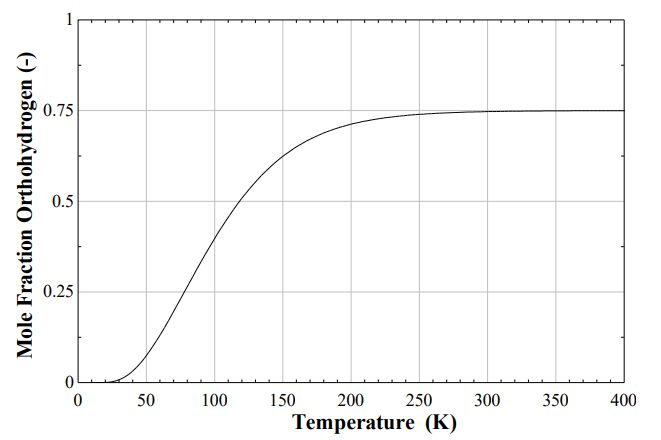
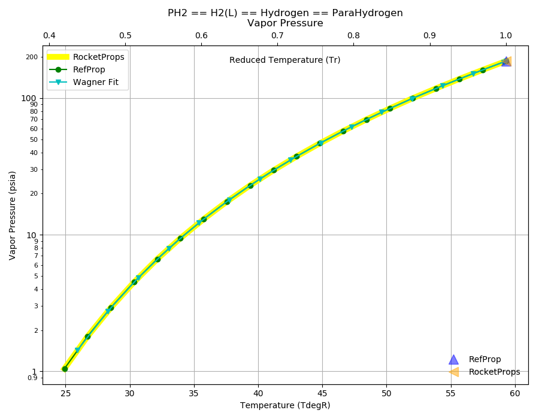
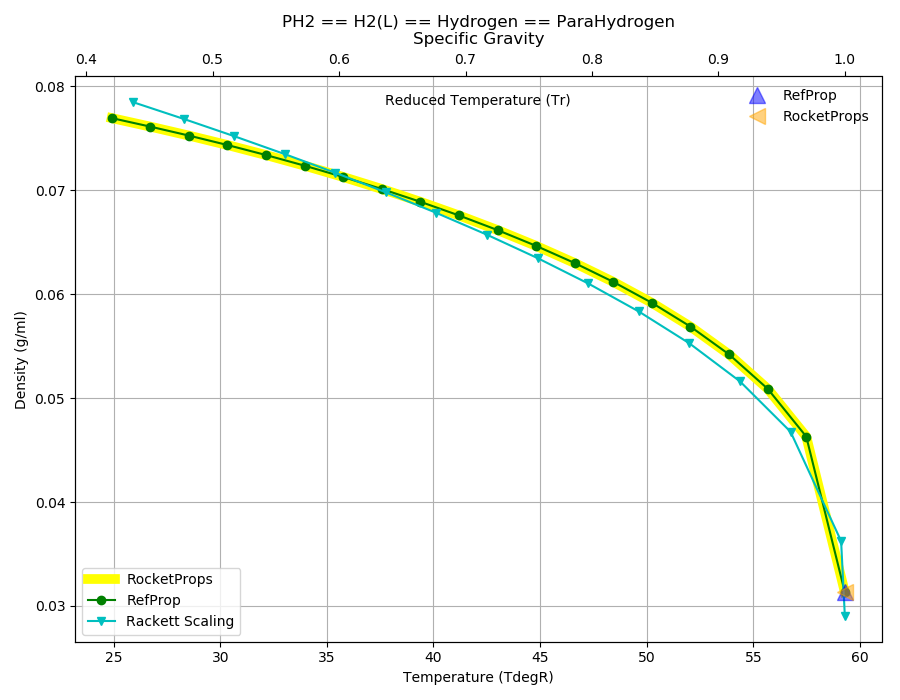
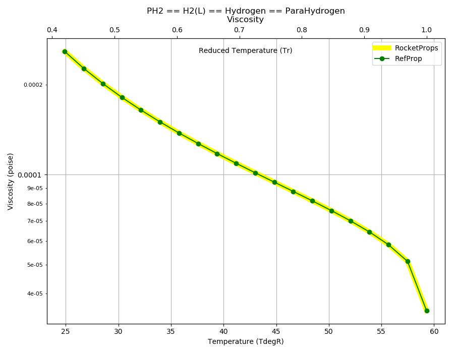
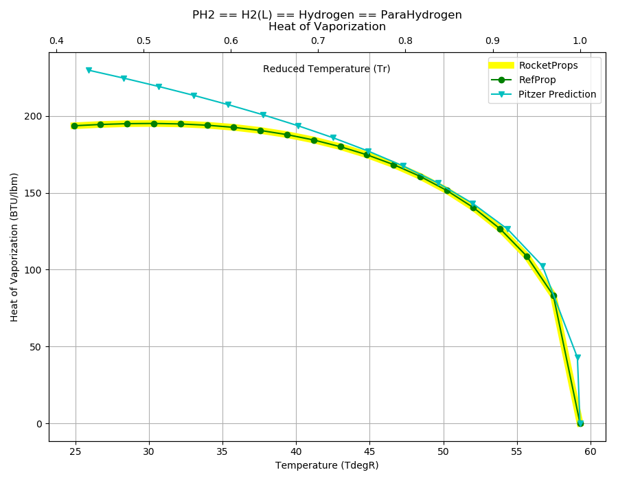

.. ph2_prop

PH2
===

Parahydrogen is the 
`spin isomer of hydrogen <https://en.wikipedia.org/wiki/Liquid_hydrogen>`_ 
used in cryogenic liquid rocket fuel.

Ordinary H2 is an equilibrium mixture of ortho and para hydrogen.
See `Wikipedia Spin isomers of hydrogen <https://en.wikipedia.org/wiki/Spin_isomers_of_hydrogen>`_

The equilibrium balance varies with temperature.
Liquid hydrogen consists of 99.79% parahydrogen and 0.21% orthohydrogen mole percent.
At the room temperature, it is about 25% parahydrogen and 75% orthohydrogen

Parahydrogen has been and is currently used in the 
`Centaur Stage Series <http://www.astronautix.com/c/centaurstageseries.html>`_
as well as the main propulsion for the `Space Shuttle <http://www.astronautix.com/s/shuttle.html>`_.

Reference Points
----------------

PH2 == H2(L) == Hydrogen == ParaHydrogen

`Hover over column headers to see definitions, values to see alternate units`

.. raw:: html

    <table width="100%">
    <tr><th></th>
        <th title="Reference Temperature">Tref</th>
        <th title="Reference Pressure">Pref</th>
        <th title="Specific Gravity">SG</th>
        <th title="Specific Heat">Cp</th>
        <th title="Heat of Vaporization">dHvap</th>
        <th title="Viscosity">Visc</th>
        <th title="Thermal Conductivity">Cond</th>
        <th title="Surface Tension">Surf</th>
    <tr><th>Source</th><th>R</th><th>psia</th><th>g/ml</th><th>BTU/lbm-R</th><th>BTU/lbm</th><th>poise</th><th>BTU/hr-ft-R</th><th>lbf/in</th></tr>

    <tr  style="background-color:#FFFF00"><td><a class="reference external" href="https://pypi.python.org/pypi/rocketprops">RocketProps</a></td><td  title="36.4878 degR
    20.271 degK
    -423.182 degF
    -252.879 degC">36.5</td><td  title="14.6959 psia
    0.999997 atm
    1.01325 bar
    0.101325 MPa">14.7</td><td  title="0.0708306 SG
    4.42181 lbm/ft**3
    0.00255892 lbm/inch**3
    70.8306 kg/m**3">0.0708</td><td  title="2.32517 BTU/lbm/F
    2.32673 cal/g/C
    0.00232673 kcal/g/C
    9735.04 J/kg/K">2.325</td><td  title="191.897 BTU/lbm
    106.681 cal/g
    0.106681 kcal/g
    446.352 J/g">191.9</td><td  title="0.000133306 poise
    0.0133306 cpoise
    1.33306e-05 Pa*s
    7.46477e-07 lbm/s/inch
    0.00268732 lbm/hr/inch
    0.04799 kg/hr/m
    0.0004799 kg/hr/cm">1.333e-04</td><td  title="0.0598114 BTU/hr/ft/delF
    1.38452e-06 BTU/s/inch/delF
    0.000247413 cal/s/cm/delC
    0.0247413 cal/s/m/delC
    0.00103518 W/cm/delC">0.0598</td><td  title="1.09954e-05 lbf/in
    0.00192559 N/m
    1.92559 mN/m
    1.92559 dyne/cm">1.100e-05</td></tr>
    <tr ><td><a class="reference external" href="https://www.nist.gov/srd/refprop">RefProp</a></td><td  title="36.4878 degR
    20.271 degK
    -423.182 degF
    -252.879 degC">36.5</td><td  title="14.6959 psia
    0.999997 atm
    1.01325 bar
    0.101325 MPa">14.7</td><td  title="0.0708306 SG
    4.42181 lbm/ft**3
    0.00255892 lbm/inch**3
    70.8306 kg/m**3">0.0708</td><td  title="2.32517 BTU/lbm/F
    2.32673 cal/g/C
    0.00232673 kcal/g/C
    9735.04 J/kg/K">2.325</td><td  title="191.897 BTU/lbm
    106.681 cal/g
    0.106681 kcal/g
    446.352 J/g">191.9</td><td  title="0.000133306 poise
    0.0133306 cpoise
    1.33306e-05 Pa*s
    7.46477e-07 lbm/s/inch
    0.00268732 lbm/hr/inch
    0.04799 kg/hr/m
    0.0004799 kg/hr/cm">1.333e-04</td><td  title="0.0598114 BTU/hr/ft/delF
    1.38452e-06 BTU/s/inch/delF
    0.000247413 cal/s/cm/delC
    0.0247413 cal/s/m/delC
    0.00103518 W/cm/delC">0.0598</td><td  title="1.09954e-05 lbf/in
    0.00192559 N/m
    1.92559 mN/m
    1.92559 dyne/cm">1.100e-05</td></tr>

    </table>

Fluid Properties
----------------

PH2 == H2(L) == Hydrogen == ParaHydrogen

`Hover over column headers to see definitions, values to see alternate units`

.. raw:: html

    <table width="100%">
    <tr><th></th>
        <th title="Molecular Weight">MolWt</th>
        <th title="Critical Temperature">Tc</th>
        <th title="Critical Pressure">Pc</th>
        <th title="Critical Density">SGc</th>
        <th title="Critical Compressibility Factor">Zc</th>
        <th title="Normal Boiling Point">Tnbp</th>
        <th title="Melting/Freezing Point">Tmelt</th>
        <th title="Pitzer Acentric Factor">omega</th></tr>
    <tr><th>Source</th><th>g/gmole</th><th>R</th><th>psia</th><th>g/ml</th><th>(-)</th><th>R</th><th>R</th><th>(-)</th></tr>

    <tr  style="background-color:#FFFF00"><td><a class="reference external" href="https://pypi.python.org/pypi/rocketprops">RocketProps</a></td><td>2.016</td><td  title="59.2884 degR
    32.938 degK
    -400.382 degF
    -240.212 degC">59.3</td><td  title="186.489 psia
    12.6899 atm
    12.858 bar
    1.2858 MPa">186.5</td><td  title="0.0313232 SG
    1.95545 lbm/ft**3
    0.00113162 lbm/inch**3
    31.3232 kg/m**3">0.0313</td><td>0.3022</td><td  title="36.4878 degR
    20.271 degK
    -423.182 degF
    -252.879 degC">36.5</td><td  title="24.912 degR
    13.84 degK
    -434.758 degF
    -259.31 degC">24.9</td><td>-0.21861</td></tr>
    <tr ><td><a class="reference external" href="https://www.nist.gov/srd/refprop">RefProp</a></td><td>2.016</td><td  title="59.2884 degR
    32.938 degK
    -400.382 degF
    -240.212 degC">59.3</td><td  title="186.489 psia
    12.6899 atm
    12.858 bar
    1.2858 MPa">186.5</td><td  title="0.0313232 SG
    1.95545 lbm/ft**3
    0.00113162 lbm/inch**3
    31.3232 kg/m**3">0.0313</td><td>0.3022</td><td  title="36.4878 degR
    20.271 degK
    -423.182 degF
    -252.879 degC">36.5</td><td  title="24.912 degR
    13.84 degK
    -434.758 degF
    -259.31 degC">24.9</td><td>-0.21861</td></tr>

    </table>

Vapor Pressure
--------------

.. raw:: html

    

        

    

    

.. raw:: html

    

  

| RocketProps Selected Curve
| :ref:`RefProp Source`
| :ref:`Wagner Fit Source`

.. raw:: html

    

    

    
`Click Image to View Fill Size`

Density
-------

.. raw:: html

    

        

    

    

.. raw:: html

    

  

| RocketProps Selected Curve
| :ref:`RefProp Source`
| :ref:`Rackett Scaling Source`

.. raw:: html

    

    

    
`Click Image to View Fill Size`

Heat Capacity
-------------

.. raw:: html

    

        

    
.. image:: ./_static/PH2_Cp.png
   :target: ./_static/PH2_Cp.png
    

.. raw:: html

    

  

| RocketProps Selected Curve
| :ref:`RefProp Source`

.. raw:: html

    

    

    
`Click Image to View Fill Size`

Viscosity
---------

.. raw:: html

    

        

    

    

.. raw:: html

    

  

| RocketProps Selected Curve
| :ref:`RefProp Source`

.. raw:: html

    

    

    
`Click Image to View Fill Size`

Heat of Vaporization
--------------------

.. raw:: html

    

        

    

    

.. raw:: html

    

  

| RocketProps Selected Curve
| :ref:`RefProp Source`
| :ref:`Pitzer Hvap Source`

.. raw:: html

    

    

    
`Click Image to View Fill Size`

Thermal Conductivity
--------------------

.. raw:: html

    

        

    
.. image:: ./_static/PH2_Cond.png
   :target: ./_static/PH2_Cond.png
    

.. raw:: html

    

  

| RocketProps Selected Curve
| :ref:`RefProp Source`

.. raw:: html

    

    

    
`Click Image to View Fill Size`

Surface Tension
---------------

    

.. raw:: html

    

        

    
.. image:: ./_static/PH2_Surf.png
   :target: ./_static/PH2_Surf.png
    

.. raw:: html

    

  

| RocketProps Selected Curve
| :ref:`RefProp Source`
| :ref:`Pitzer Surf Source`

.. raw:: html

    

    

    
`Click Image to View Fill Size`

