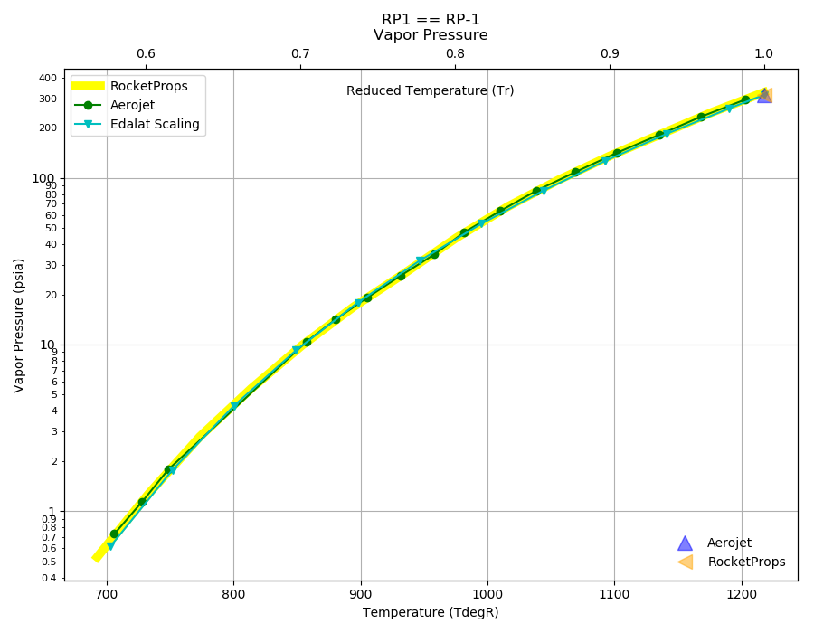
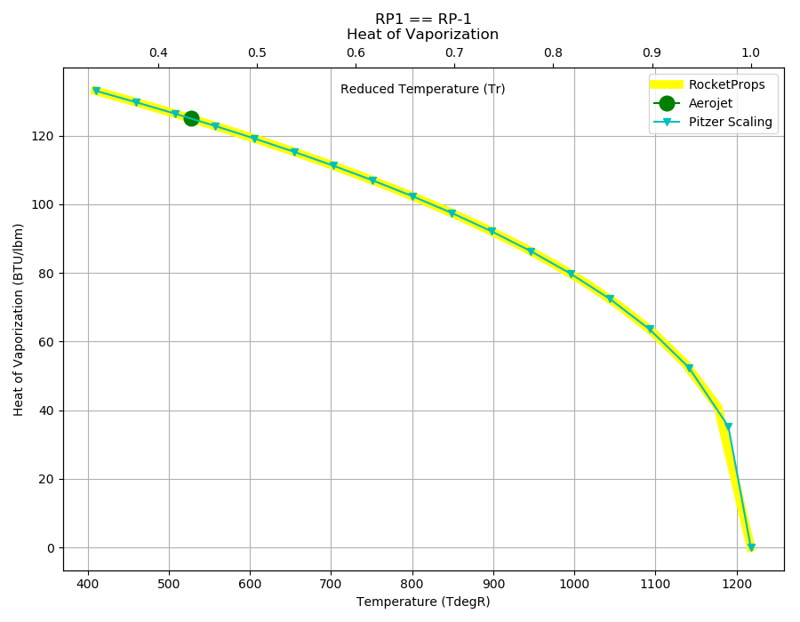

.. rp1_prop

RP1
===

Reference Points
----------------

RP1 == RP-1

`Hover over column headers to see definitions, values to see alternate units`

.. raw:: html

    <table width="100%">
    <tr><th></th>
        <th title="Reference Temperature">Tref</th>
        <th title="Reference Pressure">Pref</th>
        <th title="Specific Gravity">SG</th>
        <th title="Specific Heat">Cp</th>
        <th title="Heat of Vaporization">dHvap</th>
        <th title="Viscosity">Visc</th>
        <th title="Thermal Conductivity">Cond</th>
        <th title="Surface Tension">Surf</th>
    <tr><th>Source</th><th>R</th><th>psia</th><th>g/ml</th><th>BTU/lbm-R</th><th>BTU/lbm</th><th>poise</th><th>BTU/hr-ft-R</th><th>lbf/in</th></tr>

    <tr  style="background-color:#FFFF00"><td><a class="reference external" href="https://pypi.python.org/pypi/rocketprops">RocketProps</a></td><td  title="527.67 degR
    293.15 degK
    68 degF
    20 degC">527.7</td><td  title="14.6959 psia
    0.999997 atm
    1.01325 bar
    0.101325 MPa">14.7</td><td  title="0.809954 SG
    50.5638 lbm/ft**3
    0.0292614 lbm/inch**3
    809.954 kg/m**3">0.8100</td><td  title="0.475379 BTU/lbm/F
    0.475697 cal/g/C
    0.000475697 kcal/g/C
    1990.32 J/kg/K">0.475</td><td  title="125 BTU/lbm
    69.4909 cal/g
    0.0694909 kcal/g
    290.75 J/g">125.0</td><td  title="0.0166858 poise
    1.66858 cpoise
    0.00166858 Pa*s
    9.34361e-05 lbm/s/inch
    0.33637 lbm/hr/inch
    6.00688 kg/hr/m
    0.0600688 kg/hr/cm">1.669e-02</td><td  title="0.0786879 BTU/hr/ft/delF
    1.82148e-06 BTU/s/inch/delF
    0.000325497 cal/s/cm/delC
    0.0325497 cal/s/m/delC
    0.00136188 W/cm/delC">0.0787</td><td  title="0.000165813 lbf/in
    0.0290383 N/m
    29.0383 mN/m
    29.0383 dyne/cm">1.658e-04</td></tr>
    <tr ><td><a class="reference external" href="./_static/Aerojet_Propellant_Properties.pdf">Aerojet</a></td><td  title="527.67 degR
    293.15 degK
    68 degF
    20 degC">527.7</td><td  title="14.6959 psia
    0.999997 atm
    1.01325 bar
    0.101325 MPa">14.7</td><td  title="0.809954 SG
    50.5638 lbm/ft**3
    0.0292614 lbm/inch**3
    809.954 kg/m**3">0.8100</td><td  title="0.475414 BTU/lbm/F
    0.475732 cal/g/C
    0.000475732 kcal/g/C
    1990.46 J/kg/K">0.475</td><td  title="125 BTU/lbm
    69.4909 cal/g
    0.0694909 kcal/g
    290.75 J/g">125.0</td><td  title="0.0166854 poise
    1.66854 cpoise
    0.00166854 Pa*s
    9.34341e-05 lbm/s/inch
    0.336363 lbm/hr/inch
    6.00675 kg/hr/m
    0.0600675 kg/hr/cm">1.669e-02</td><td  title="0.0786885 BTU/hr/ft/delF
    1.82149e-06 BTU/s/inch/delF
    0.000325499 cal/s/cm/delC
    0.0325499 cal/s/m/delC
    0.00136189 W/cm/delC">0.0787</td><td >---</td></tr>

    </table>

Fluid Properties
----------------

RP1 == RP-1

`Hover over column headers to see definitions, values to see alternate units`

.. raw:: html

    <table width="100%">
    <tr><th></th>
        <th title="Molecular Weight">MolWt</th>
        <th title="Critical Temperature">Tc</th>
        <th title="Critical Pressure">Pc</th>
        <th title="Critical Density">SGc</th>
        <th title="Critical Compressibility Factor">Zc</th>
        <th title="Normal Boiling Point">Tnbp</th>
        <th title="Melting/Freezing Point">Tmelt</th>
        <th title="Pitzer Acentric Factor">omega</th></tr>
    <tr><th>Source</th><th>g/gmole</th><th>R</th><th>psia</th><th>g/ml</th><th>(-)</th><th>R</th><th>R</th><th>(-)</th></tr>

    <tr  style="background-color:#FFFF00"><td><a class="reference external" href="https://pypi.python.org/pypi/rocketprops">RocketProps</a></td><td>172.000</td><td  title="1217.67 degR
    676.483 degK
    758 degF
    403.333 degC">1217.7</td><td  title="315 psia
    21.4345 atm
    21.7185 bar
    2.17185 MPa">315.0</td><td  title="0.247745 SG
    15.4662 lbm/ft**3
    0.00895036 lbm/inch**3
    247.745 kg/m**3">0.2477</td><td>0.2681</td><td  title="881.67 degR
    489.817 degK
    422 degF
    216.667 degC">881.7</td><td  title="409.67 degR
    227.594 degK
    -50 degF
    -45.5556 degC">409.7</td><td>0.51236</td></tr>
    <tr ><td><a class="reference external" href="./_static/Aerojet_Propellant_Properties.pdf">Aerojet</a></td><td>172.000</td><td  title="1217.67 degR
    676.483 degK
    758 degF
    403.333 degC">1217.7</td><td  title="315 psia
    21.4345 atm
    21.7185 bar
    2.17185 MPa">315.0</td><td  title="0.247745 SG
    15.4662 lbm/ft**3
    0.00895036 lbm/inch**3
    247.745 kg/m**3">0.2477</td><td>0.2681</td><td  title="881.67 degR
    489.817 degK
    422 degF
    216.667 degC">881.7</td><td  title="409.67 degR
    227.594 degK
    -50 degF
    -45.5556 degC">409.7</td><td>0.51236</td></tr>

    </table>

Vapor Pressure
--------------

.. raw:: html

    

        

    

    

.. raw:: html

    

  

| RocketProps Selected Curve
| :ref:`Aerojet Source`
| :ref:`Edalat Source`

.. raw:: html

    

    

    
`Click Image to View Fill Size`

Density
-------

.. raw:: html

    

        

    
.. image:: ./_static/RP1_SG.png
   :target: ./_static/RP1_SG.png
    

.. raw:: html

    

  

| RocketProps Selected Curve
| :ref:`Aerojet Source`
| :ref:`NIST Webbook`
| :ref:`Rackett Scaling Source`

.. raw:: html

    

    

    
`Click Image to View Fill Size`

Heat Capacity
-------------

.. raw:: html

    

        

    
.. image:: ./_static/RP1_Cp.png
   :target: ./_static/RP1_Cp.png
    

.. raw:: html

    

  

| RocketProps Selected Curve
| :ref:`Aerojet Source`

.. raw:: html

    

    

    
`Click Image to View Fill Size`

Viscosity
---------

.. raw:: html

    

        

    
.. image:: ./_static/RP1_Visc.png
   :target: ./_static/RP1_Visc.png
    

.. raw:: html

    

  

| RocketProps Selected Curve
| :ref:`Aerojet Source`
| :ref:`Squires Source`

.. raw:: html

    

    

    
`Click Image to View Fill Size`

Heat of Vaporization
--------------------

.. raw:: html

    

        

    

    

.. raw:: html

    

  

| RocketProps Selected Curve
| :ref:`Aerojet Source`
| :ref:`Pitzer Hvap Source`

.. raw:: html

    

    

    
`Click Image to View Fill Size`

Thermal Conductivity
--------------------

.. raw:: html

    

        

    
.. image:: ./_static/RP1_Cond.png
   :target: ./_static/RP1_Cond.png
    

.. raw:: html

    

  

| RocketProps Selected Curve
| :ref:`Aerojet Source`
| :ref:`Nicola Source`

.. raw:: html

    

    

    
`Click Image to View Fill Size`

Surface Tension
---------------

    

.. raw:: html

    

        

    
.. image:: ./_static/RP1_Surf.png
   :target: ./_static/RP1_Surf.png
    

.. raw:: html

    

  

| RocketProps Selected Curve
| :ref:`Pitzer Surf Source`

.. raw:: html

    

    

    
`Click Image to View Fill Size`

