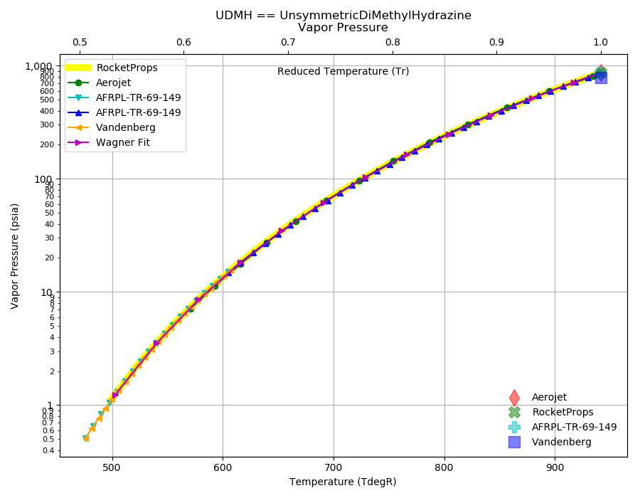
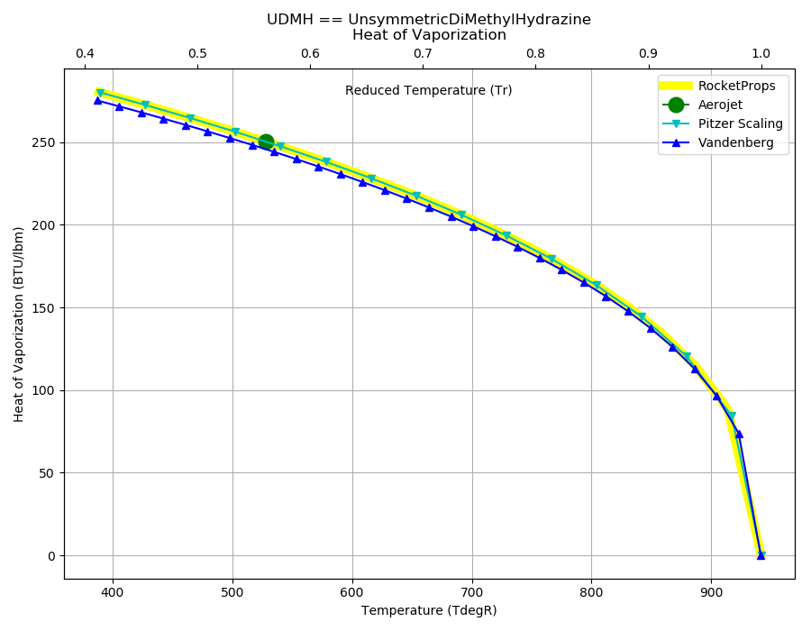
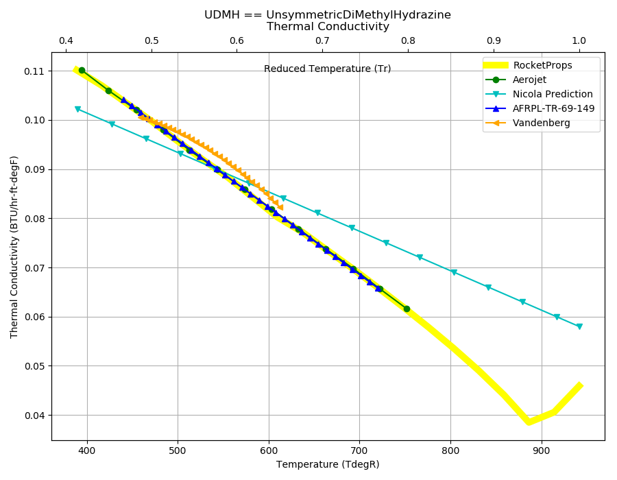

.. udmh_prop

UDMH
====

`UDMH <http://www.astronautix.com/u/udmh.html>`_ or Unsymmetrical Dimethylhydrazine ((CH3)2NNH2) 
became the storable liquid fuel of choice by the mid-1950's. 
Development of UDMH in the Soviet Union began in 1949. 
It is used in virtually all storable liquid rocket engines except 
for some orbital maneuvering engines in the United States, where 
`MMH <http://www.astronautix.com/m/mmh.html>`_
has been preferred due to a slightly higher density and performance.

Reference Points
----------------

UDMH == UnsymmetricDiMethylHydrazine

`Hover over column headers to see definitions, values to see alternate units`

.. raw:: html

    <table width="100%">
    <tr><th></th>
        <th title="Reference Temperature">Tref</th>
        <th title="Reference Pressure">Pref</th>
        <th title="Specific Gravity">SG</th>
        <th title="Specific Heat">Cp</th>
        <th title="Heat of Vaporization">dHvap</th>
        <th title="Viscosity">Visc</th>
        <th title="Thermal Conductivity">Cond</th>
        <th title="Surface Tension">Surf</th>
    <tr><th>Source</th><th>R</th><th>psia</th><th>g/ml</th><th>BTU/lbm-R</th><th>BTU/lbm</th><th>poise</th><th>BTU/hr-ft-R</th><th>lbf/in</th></tr>

    <tr  style="background-color:#FFFF00"><td><a class="reference external" href="https://pypi.python.org/pypi/rocketprops">RocketProps</a></td><td  title="527.67 degR
    293.15 degK
    68 degF
    20 degC">527.7</td><td  title="14.6959 psia
    0.999997 atm
    1.01325 bar
    0.101325 MPa">14.7</td><td  title="0.790444 SG
    49.3458 lbm/ft**3
    0.0285566 lbm/inch**3
    790.444 kg/m**3">0.7904</td><td  title="0.665112 BTU/lbm/F
    0.665557 cal/g/C
    0.000665557 kcal/g/C
    2784.69 J/kg/K">0.665</td><td  title="250.55 BTU/lbm
    139.288 cal/g
    0.139288 kcal/g
    582.779 J/g">250.5</td><td  title="0.00553308 poise
    0.553308 cpoise
    0.000553308 Pa*s
    3.09838e-05 lbm/s/inch
    0.111542 lbm/hr/inch
    1.99191 kg/hr/m
    0.0199191 kg/hr/cm">5.533e-03</td><td  title="0.0918907 BTU/hr/ft/delF
    2.1271e-06 BTU/s/inch/delF
    0.000380111 cal/s/cm/delC
    0.0380111 cal/s/m/delC
    0.00159038 W/cm/delC">0.0919</td><td  title="0.000140655 lbf/in
    0.0246325 N/m
    24.6325 mN/m
    24.6325 dyne/cm">1.407e-04</td></tr>
    <tr ><td><a class="reference external" href="./_static/AFRPL-TR-69-149Hydrazine fuels.pdf">AFRPL-TR-69-149</a></td><td  title="536.4 degR
    298 degK
    76.73 degF
    24.85 degC">536.4</td><td  title="14.7 psia
    1.00028 atm
    1.01353 bar
    0.101353 MPa">14.7</td><td  title="0.7861 SG
    49.0746 lbm/ft**3
    0.0283997 lbm/inch**3
    786.1 kg/m**3">0.7861</td><td  title="0.704 BTU/lbm/F
    0.704471 cal/g/C
    0.000704471 kcal/g/C
    2947.51 J/kg/K">0.704</td><td  title="233.51 BTU/lbm
    129.815 cal/g
    0.129815 kcal/g
    543.144 J/g">233.5</td><td  title="0.00492 poise
    0.492 cpoise
    0.000492 Pa*s
    2.75507e-05 lbm/s/inch
    0.0991826 lbm/hr/inch
    1.7712 kg/hr/m
    0.017712 kg/hr/cm">4.920e-03</td><td  title="0.0908969 BTU/hr/ft/delF
    2.10409e-06 BTU/s/inch/delF
    0.000376 cal/s/cm/delC
    0.0376 cal/s/m/delC
    0.00157318 W/cm/delC">0.0909</td><td  title="0.0001375 lbf/in
    0.0240799 N/m
    24.0799 mN/m
    24.0799 dyne/cm">1.375e-04</td></tr>
    <tr ><td><a class="reference external" href="./_static/Aerojet_Propellant_Properties.pdf">Aerojet</a></td><td  title="527.67 degR
    293.15 degK
    68 degF
    20 degC">527.7</td><td  title="14.6959 psia
    0.999997 atm
    1.01325 bar
    0.101325 MPa">14.7</td><td  title="0.790444 SG
    49.3458 lbm/ft**3
    0.0285566 lbm/inch**3
    790.444 kg/m**3">0.7904</td><td  title="0.665108 BTU/lbm/F
    0.665553 cal/g/C
    0.000665553 kcal/g/C
    2784.67 J/kg/K">0.665</td><td  title="250.55 BTU/lbm
    139.288 cal/g
    0.139288 kcal/g
    582.779 J/g">250.6</td><td  title="0.00553354 poise
    0.553354 cpoise
    0.000553354 Pa*s
    3.09864e-05 lbm/s/inch
    0.111551 lbm/hr/inch
    1.99207 kg/hr/m
    0.0199207 kg/hr/cm">5.534e-03</td><td  title="0.0918947 BTU/hr/ft/delF
    2.12719e-06 BTU/s/inch/delF
    0.000380128 cal/s/cm/delC
    0.0380128 cal/s/m/delC
    0.00159045 W/cm/delC">0.0919</td><td >---</td></tr>
    <tr ><td><a class="reference external" href="./_static/Vandenberg_Corrected_Properties.pdf">Vandenberg</a></td><td  title="527.67 degR
    293.15 degK
    68 degF
    20 degC">527.7</td><td  title="14.7 psia
    1.00028 atm
    1.01353 bar
    0.101353 MPa">14.7</td><td  title="0.791295 SG
    49.3989 lbm/ft**3
    0.0285873 lbm/inch**3
    791.295 kg/m**3">0.7913</td><td >---</td><td  title="245.89 BTU/lbm
    136.697 cal/g
    0.136697 kcal/g
    571.941 J/g">245.9</td><td >---</td><td  title="0.0947106 BTU/hr/ft/delF
    2.19237e-06 BTU/s/inch/delF
    0.000391776 cal/s/cm/delC
    0.0391776 cal/s/m/delC
    0.00163919 W/cm/delC">0.0947</td><td >---</td></tr>

    </table>

Fluid Properties
----------------

UDMH == UnsymmetricDiMethylHydrazine

`Hover over column headers to see definitions, values to see alternate units`

.. raw:: html

    <table width="100%">
    <tr><th></th>
        <th title="Molecular Weight">MolWt</th>
        <th title="Critical Temperature">Tc</th>
        <th title="Critical Pressure">Pc</th>
        <th title="Critical Density">SGc</th>
        <th title="Critical Compressibility Factor">Zc</th>
        <th title="Normal Boiling Point">Tnbp</th>
        <th title="Melting/Freezing Point">Tmelt</th>
        <th title="Pitzer Acentric Factor">omega</th></tr>
    <tr><th>Source</th><th>g/gmole</th><th>R</th><th>psia</th><th>g/ml</th><th>(-)</th><th>R</th><th>R</th><th>(-)</th></tr>

    <tr  style="background-color:#FFFF00"><td><a class="reference external" href="https://pypi.python.org/pypi/rocketprops">RocketProps</a></td><td>60.099</td><td  title="941.67 degR
    523.15 degK
    482 degF
    250 degC">941.7</td><td  title="867 psia
    58.9959 atm
    59.7775 bar
    5.97775 MPa">867.0</td><td  title="0.276748 SG
    17.2768 lbm/ft**3
    0.00999814 lbm/inch**3
    276.748 kg/m**3">0.2767</td><td>0.2985</td><td  title="603.85 degR
    335.472 degK
    144.18 degF
    62.3222 degC">603.9</td><td  title="388.73 degR
    215.961 degK
    -70.94 degF
    -57.1889 degC">388.7</td><td>0.34992</td></tr>
    <tr ><td><a class="reference external" href="./_static/AFRPL-TR-69-149Hydrazine fuels.pdf">AFRPL-TR-69-149</a></td><td>60.102</td><td  title="941 degR
    522.778 degK
    481.33 degF
    249.628 degC">941.0</td><td  title="867 psia
    58.9959 atm
    59.7775 bar
    5.97775 MPa">867.0</td><td  title="0.275 SG
    17.1677 lbm/ft**3
    0.00993501 lbm/inch**3
    275 kg/m**3">0.2750</td><td>0.3006</td><td  title="603.84 degR
    335.467 degK
    144.17 degF
    62.3167 degC">603.8</td><td  title="388.7 degR
    215.944 degK
    -70.97 degF
    -57.2056 degC">388.7</td><td>---</td></tr>
    <tr ><td><a class="reference external" href="./_static/Aerojet_Propellant_Properties.pdf">Aerojet</a></td><td>60.099</td><td  title="941.67 degR
    523.15 degK
    482 degF
    250 degC">941.7</td><td  title="867 psia
    58.9959 atm
    59.7775 bar
    5.97775 MPa">867.0</td><td  title="0.276748 SG
    17.2768 lbm/ft**3
    0.00999814 lbm/inch**3
    276.748 kg/m**3">0.2767</td><td>0.2985</td><td  title="603.85 degR
    335.472 degK
    144.18 degF
    62.3222 degC">603.9</td><td  title="388.73 degR
    215.961 degK
    -70.94 degF
    -57.1889 degC">388.7</td><td>0.36186</td></tr>
    <tr ><td><a class="reference external" href="./_static/Vandenberg_Corrected_Properties.pdf">Vandenberg</a></td><td>60.099</td><td  title="941.4 degR
    523 degK
    481.73 degF
    249.85 degC">941.4</td><td  title="787.703 psia
    53.6 atm
    54.3102 bar
    5.43102 MPa">787.7</td><td  title="0.261 SG
    16.2937 lbm/ft**3
    0.00942922 lbm/inch**3
    261 kg/m**3">0.2610</td><td>0.2877</td><td  title="606.69 degR
    337.05 degK
    147.02 degF
    63.9 degC">606.7</td><td  title="387.27 degR
    215.15 degK
    -72.4 degF
    -58 degC">387.3</td><td>0.34300</td></tr>

    </table>

Vapor Pressure
--------------

.. raw:: html

    

        

    

    

.. raw:: html

    

  

| RocketProps Selected Curve
| :ref:`Aerojet Source`
| :ref:`AFRPL-TR-69-149 Source`
| :ref:`Vandenberg Source`
| :ref:`Wagner Fit Source`

.. raw:: html

    

    

    
`Click Image to View Fill Size`

Density
-------

.. raw:: html

    

        

    
.. image:: ./_static/UDMH_SG.png
   :target: ./_static/UDMH_SG.png
    

.. raw:: html

    

  

| RocketProps Selected Curve
| :ref:`Aerojet Source`
| :ref:`AFRPL-TR-69-149 Source`
| :ref:`Vandenberg Source`
| :ref:`Rackett Scaling Source`

.. raw:: html

    

    

    
`Click Image to View Fill Size`

Heat Capacity
-------------

.. raw:: html

    

        

    
.. image:: ./_static/UDMH_Cp.png
   :target: ./_static/UDMH_Cp.png
    

.. raw:: html

    

  

| RocketProps Selected Curve
| :ref:`Aerojet Source`
| :ref:`Joback Source`
| :ref:`AFRPL-TR-69-149 Source`

.. raw:: html

    

    

    
`Click Image to View Fill Size`

Viscosity
---------

.. raw:: html

    

        

    
.. image:: ./_static/UDMH_Visc.png
   :target: ./_static/UDMH_Visc.png
    

.. raw:: html

    

  

| RocketProps Selected Curve
| :ref:`Aerojet Source`
| :ref:`Squires Source`
| :ref:`AFRPL-TR-69-149 Source`

.. raw:: html

    

    

    
`Click Image to View Fill Size`

Heat of Vaporization
--------------------

.. raw:: html

    

        

    

    

.. raw:: html

    

  

| RocketProps Selected Curve
| :ref:`Aerojet Source`
| :ref:`Pitzer Hvap Source`
| :ref:`Vandenberg Source`

.. raw:: html

    

    

    
`Click Image to View Fill Size`

Thermal Conductivity
--------------------

.. raw:: html

    

        

    

    

.. raw:: html

    

  

| RocketProps Selected Curve
| :ref:`Aerojet Source`
| :ref:`Nicola Source`
| :ref:`AFRPL-TR-69-149 Source`
| :ref:`Vandenberg Source`

.. raw:: html

    

    

    
`Click Image to View Fill Size`

Surface Tension
---------------

    

.. raw:: html

    

        

    
.. image:: ./_static/UDMH_Surf.png
   :target: ./_static/UDMH_Surf.png
    

.. raw:: html

    

  

| RocketProps Selected Curve
| :ref:`AFRPL-TR-69-149 Source`
| :ref:`Sastri-Rao Source`
| :ref:`Pitzer Surf Source`

.. raw:: html

    

    

    
`Click Image to View Fill Size`

